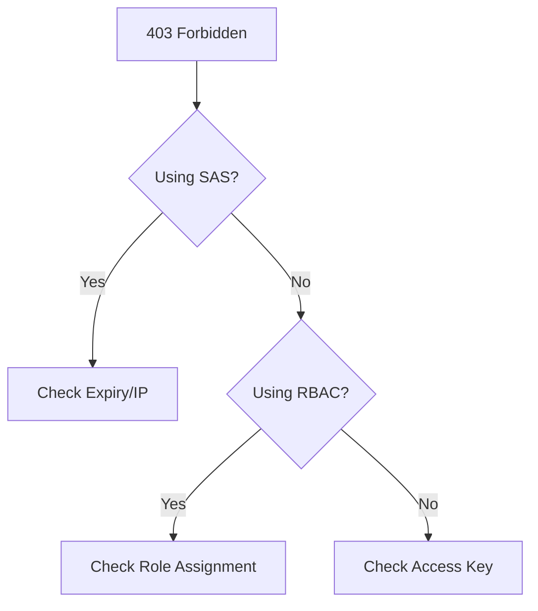

# Authorization Failures

Resolve 403 Forbidden and other authorization errors.

| Cause | Diagnosis | Resolution |
|-------|-----------|------------|
| RBAC Scope | `Get-AzRoleAssignment` | Assign role at account/container. |
| SAS Expired | Check `se` parameter in URL | Regenerate SAS token. |
| Key Disabled | Account setting: `Allow shared key` | Enable key or use Azure AD. |
| IP Restriction | Check storage firewall | Add client IP to whitelist. |

!!! note
    Distinguish between data plane permissions (e.g., Blob Data Reader) and control plane permissions (e.g., Contributor).

## Sources
- [Authorization troubleshooting](https://learn.microsoft.com/en-us/azure/storage/common/storage-auth-troubleshoot)
- [Debug RBAC errors](https://learn.microsoft.com/en-us/azure/role-based-access-control/troubleshooting)
