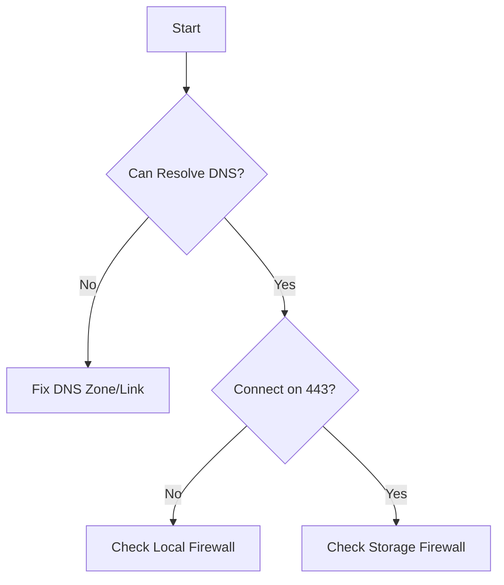

# Cannot Access Storage Account

Diagnose why a client cannot reach the storage account endpoint.

| Checklist | Diagnostic Step | Resolution |
|-----------|-----------------|------------|
| DNS | `nslookup <account>.blob.core.windows.net` | Fix CNAME/A records. |
| Network | `Test-NetConnection` on port 443 | Open outbound firewall. |
| Firewall | Check Storage Firewall settings | Add client IP to whitelist. |
| Endpoint | Verify URL path/scheme | Use `https://`. |
| Private | Check PE link status | Approve PE connection. |

## Sources
- [Troubleshoot connectivity](https://learn.microsoft.com/en-us/azure/storage/common/storage-network-security-troubleshoot)
- [Diagnostic checklist](https://learn.microsoft.com/en-us/azure/storage/common/storage-troubleshoot-account-access)
