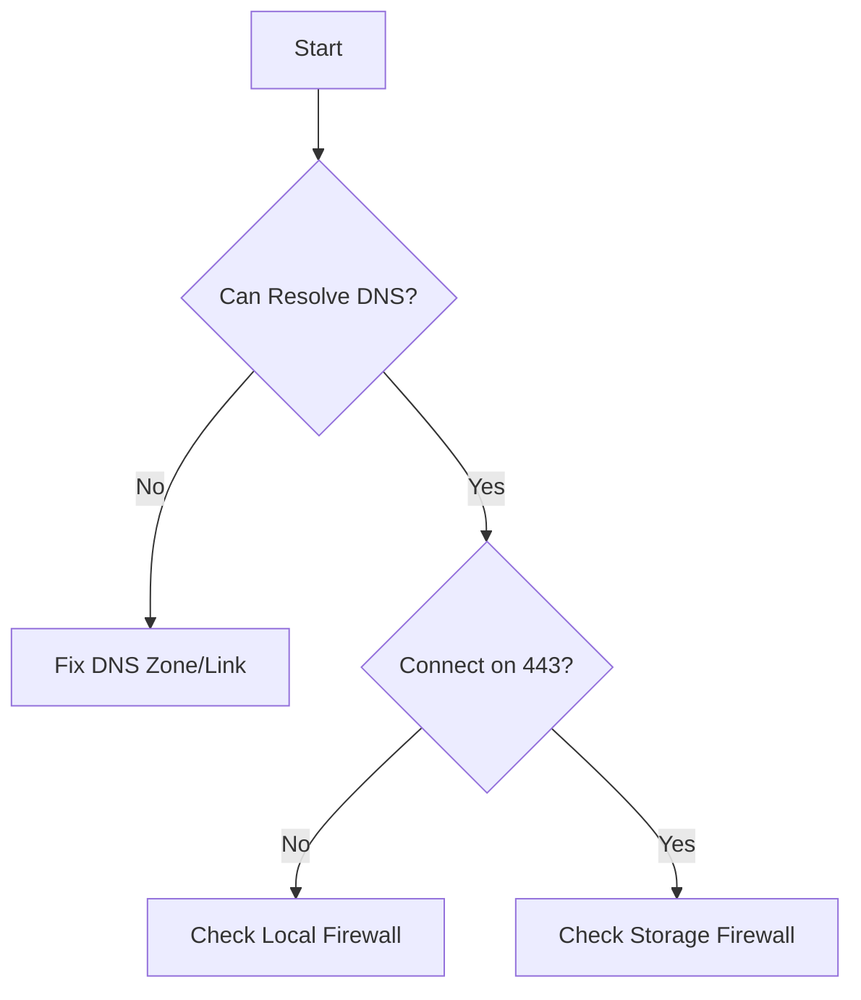

# Cannot Access Storage Account

Diagnose why a client cannot reach the storage account endpoint.

!!! warning
    Validate whether the client should use a public endpoint or a private endpoint before changing firewall rules.

| Checklist | Diagnostic Step | Resolution |
|-----------|-----------------|------------|
| DNS | `nslookup <account>.blob.core.windows.net` | Fix CNAME/A records. |
| Network | `Test-NetConnection` on port 443 | Open outbound firewall. |
| Firewall | Check Storage Firewall settings | Add client IP to whitelist. |
| Endpoint | Verify URL path/scheme | Use `https://`. |
| Private | Check PE link status | Approve PE connection. |

## Access Triage Checklist

- Confirm endpoint format for blob, file, queue, or table.
- Confirm DNS response matches intended access path.
- Confirm outbound port 443 access from the client network.
- Confirm storage firewall allow rules and default action.
- Confirm private endpoint approval and subnet routing.
- Confirm NSG and proxy rules do not block HTTPS.

## See Also

- [Networking and Private Access](../platform/networking-and-private-access.md)
- [Configure Network Rules](../operations/configure-network-rules.md)
- [Public vs Private Access Confusion](public-vs-private-access-confusion.md)

## Sources
- [Azure Storage firewall rules](https://learn.microsoft.com/en-us/azure/storage/common/storage-network-security)
- [Troubleshoot Azure Files connectivity](https://learn.microsoft.com/en-us/troubleshoot/azure/azure-storage/files/connectivity/files-troubleshoot)
