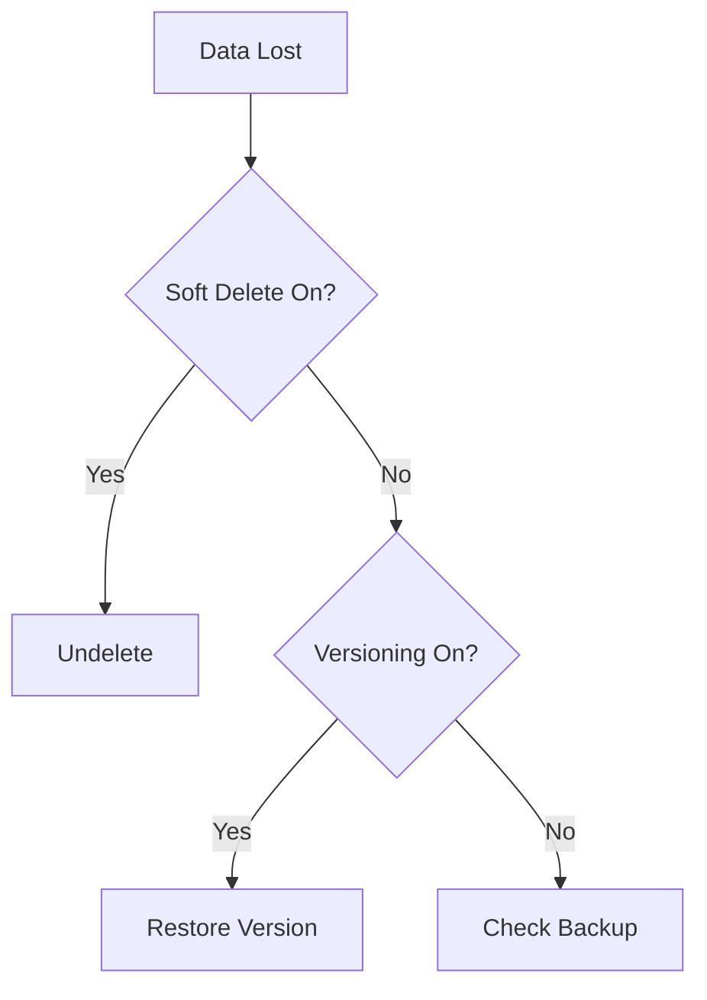

# Data Protection and Recovery Issues

Recover from accidental data deletion or corruption.

| Protection Feature | Recovery Capability | Recovery Tool |
|--------------------|---------------------|---------------|
| Soft Delete | Restore deleted objects. | Portal/PowerShell |
| Versioning | Rollback to previous state. | Portal/SDK |
| Backup | Point-in-time recovery for blob data. | Backup Center |
| Snapshot | Manual point-in-time state. | Storage Explorer |

!!! note
    Always verify which data protection features were enabled BEFORE the incident occurred.

Note: PITR requires standard GPv2 account, hot/cool tier, and is not supported with hierarchical namespace. Azure Backup supports both Azure Blobs and Azure Files.

## Recovery Triage Checklist

- Confirm incident timestamp and impacted object scope.
- Confirm feature state at incident time: soft delete, versioning, backup.
- Confirm retention window still includes recoverable state.
- Confirm restore target to avoid overwriting valid data.
- Confirm replication lag considerations for geo-redundant setups.
- Confirm post-recovery validation and audit logging.

## See Also

- [Backup and Data Protection](../operations/backup-and-data-protection.md)
- [Redundancy and DR Best Practices](../best-practices/redundancy-and-dr-best-practices.md)
- [Redundancy Options](../reference/redundancy-options.md)

## Sources
- [Recovering deleted blobs](https://learn.microsoft.com/en-us/azure/storage/blobs/soft-delete-blob-overview#restoring-soft-deleted-blobs)
- [Overview of Azure Blobs backup](https://learn.microsoft.com/en-us/azure/backup/blob-backup-overview)
