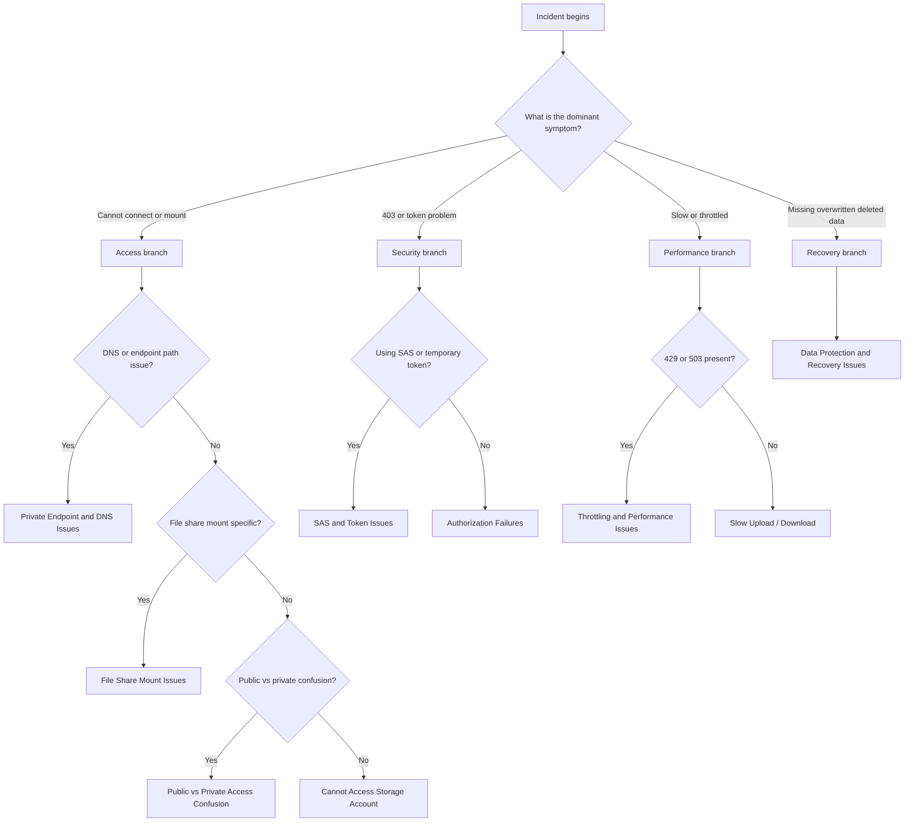

---
hide:
  - toc
---

# Troubleshooting Decision Tree

Use this page when you need to route from a storage symptom to the most relevant playbook in the first few minutes.

## Main triage tree

## Quick symptom matrix

| Symptom Pattern | Likely Category | Playbook |
|---|---|---|
| Endpoint unreachable, timeout, DNS mismatch | Access | [Cannot Access Storage Account](playbooks/access/cannot-access-storage-account.md) |
| Private endpoint exists but client still resolves public IP | Access | [Private Endpoint and DNS Issues](playbooks/access/private-endpoint-and-dns-issues.md) |
| SMB/NFS mount fails from client | Access | [File Share Mount Issues](playbooks/access/file-share-mount-issues.md) |
| 403 with Azure AD, shared key, or role confusion | Security | [Authorization Failures](playbooks/security/authorization-failures.md) |
| SAS rejected, expired, not-yet-valid, wrong scope | Security | [SAS and Token Issues](playbooks/security/sas-and-token-issues.md) |
| 429/503 and storage metrics show pressure | Performance | [Throttling and Performance Issues](playbooks/performance/throttling-and-performance-issues.md) |
| Transfer is slow but account not throttling | Performance | [Slow Upload / Download](playbooks/performance/slow-upload-download.md) |
| Blob/file was deleted or overwritten | Recovery | [Data Protection and Recovery Issues](playbooks/performance/data-protection-and-recovery-issues.md) |

## Branch prompts to ask in order

1. Is the request reaching the intended endpoint path at all?
2. Is the dominant error about connectivity, authorization, or throughput?
3. Is the failure isolated to private endpoint, file share protocol, or SAS/token flow?
4. Do metrics show throttling, or is the bottleneck outside the storage account?
5. If data is missing, which protection features were enabled before the incident?

## Minimal evidence before picking a branch

- Exact error code and timestamp.
- Storage service involved: Blob, Files, Queue, or Table.
- DNS answer and public/private endpoint expectation.
- Auth method in use: Azure AD, SAS, or shared key.
- Metrics snapshot for latency, success rate, and transaction volume.

## See Also

- [Architecture Overview](architecture-overview.md)
- [Evidence Map](evidence-map.md)
- [Mental Model](mental-model.md)
- [Quick Diagnosis Cards](quick-diagnosis-cards.md)
- [First 10 Minutes](first-10-minutes/index.md)

## Sources

- [Monitor and troubleshoot Azure Storage](https://learn.microsoft.com/en-us/troubleshoot/azure/azure-storage/blobs/alerts/storage-monitoring-diagnosing-troubleshooting)
- [Troubleshoot storage client application errors](https://learn.microsoft.com/en-us/troubleshoot/azure/azure-storage/blobs/alerts/troubleshoot-storage-client-application-errors)
- [Troubleshoot Azure Files connectivity and mounting](https://learn.microsoft.com/en-us/troubleshoot/azure/azure-storage/files/connectivity/files-troubleshoot)
