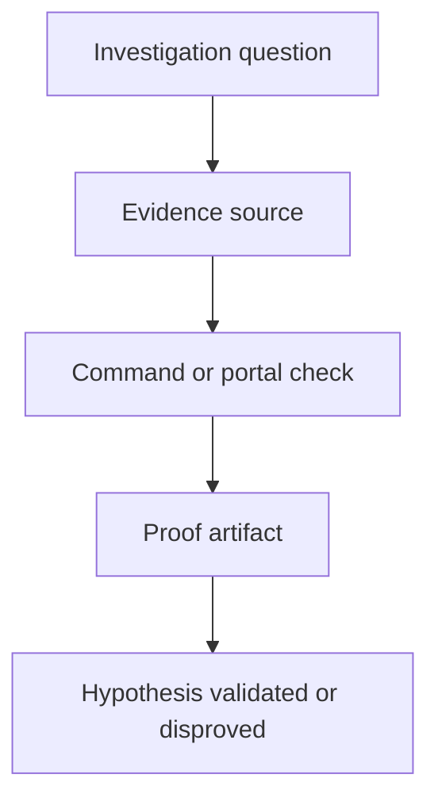

---
content_sources:
  diagrams:
    - id: troubleshooting-evidence-map
      type: flowchart
      source: mslearn-adapted
      mslearn_url: https://learn.microsoft.com/en-us/azure/storage/common/storage-network-security
content_validation:
  status: pending_review
  last_reviewed: '2026-07-25'
  reviewer: agent
  core_claims:
    - claim: Storage incident evidence often comes from network rules, private endpoints, authorization paths, and performance telemetry.
      source: https://learn.microsoft.com/en-us/azure/storage/common/authorize-data-access
      verified: false
    - claim: Blob recovery evidence depends on whether soft delete and related protection settings are enabled.
      source: https://learn.microsoft.com/en-us/azure/storage/blobs/soft-delete-blob-overview#restoring-soft-deleted-blobs
      verified: false
---

# Evidence Map for Storage Troubleshooting

This page maps common storage investigation questions to the best evidence source, the command to run, and the signal to interpret.

<!-- diagram-id: troubleshooting-evidence-map -->

```mermaid
flowchart TD
    A[Investigation question] --> B[Evidence source]
    B --> C[Command or portal check]
    C --> D[Proof artifact]
    D --> E[Hypothesis validated or disproved]
```

## Quick evidence matrix

| Question | Best Source | Command or Check | What Good Looks Like |
|---|---|---|---|
| Is DNS resolving the intended endpoint? | local DNS result | `nslookup <account>.blob.core.windows.net` | private IP for private path, public IP for public path |
| Is the account reachable on the expected port? | client connectivity test | `Test-NetConnection <account>.file.core.windows.net --port 445` | required port reachable from source network |
| Is the firewall blocking the request? | storage account network config | `az storage account show --name $STORAGE_NAME --resource-group $RG --query "networkRuleSet"` | source path allowed by rule set |
| Is the private endpoint healthy? | private endpoint connection state | `az network private-endpoint-connection list --id <storage-resource-id>` | connection approved and in expected state |
| Is auth failing because of RBAC scope? | role assignments | `az role assignment list --scope <scope>` | principal has correct data-plane role at correct scope |
| Is SAS invalid because of time or permissions? | SAS fields and system clock | inspect `st`, `se`, `sp`, `sip`, `spr` | valid time window and required permissions |
| Is the account being throttled? | Azure Monitor metrics | check Transactions, SuccessE2ELatency, SuccessServerLatency, Availability | throughput spike aligns with 429/503 or server latency growth |
| Is transfer slowness mostly client-side? | client throughput and RTT | compare local transfer test vs storage metrics | client latency/concurrency explains slow end-to-end path |
| Can deleted data be recovered? | account protection settings | check soft delete, versioning, backup, retention | feature was enabled before incident and retention window still open |

## Evidence recipes by category

### 1) Access evidence

```bash
nslookup <account>.blob.core.windows.net
nslookup <account>.privatelink.blob.core.windows.net
az storage account show --name $STORAGE_NAME --resource-group $RG --query "{publicNetworkAccess:publicNetworkAccess,networkRuleSet:networkRuleSet}"
az network private-endpoint-connection list --id <storage-resource-id>
```

| Command | Purpose |
| --- | --- |
| `az storage account show` | Show the storage account network posture. |
| `--name` | Name of the storage account to inspect. |
| `--resource-group` | Resource group that contains the account. |
| `--query` | JMESPath expression selecting public network access and the network rule set. |
| `az network private-endpoint-connection list` | List private endpoint connections on the storage account. |
| `--id` | Resource ID of the storage account. |


Look for mismatches between intended path and actual DNS answer. A private endpoint incident often starts as a DNS evidence problem, not a transport problem.

### 2) Security evidence

```bash
az role assignment list --scope <scope>
az storage account show --name $STORAGE_NAME --resource-group $RG --query "{allowSharedKeyAccess:allowSharedKeyAccess,defaultToOAuthAuthentication:defaultToOAuthAuthentication}"
```

| Command | Purpose |
| --- | --- |
| `az role assignment list` | List RBAC role assignments at a scope. |
| `--scope` | Resource scope whose assignments are listed. |
| `az storage account show` | Show the storage account authentication posture. |
| `--name` | Name of the storage account to inspect. |
| `--resource-group` | Resource group that contains the account. |
| `--query` | JMESPath expression selecting shared-key access and default OAuth settings. |


Also capture the sanitized error body or response code and record which auth path was used: Azure AD, SAS, or shared key.

### 3) Performance evidence

```bash
az monitor metrics list --resource <storage-resource-id> --metric "Transactions,SuccessE2ELatency,SuccessServerLatency,Availability,Ingress,Egress" --interval PT1M
```

| Command | Purpose |
| --- | --- |
| `az monitor metrics list` | List platform metric values for a resource. |
| `--resource` | Resource ID of the storage account. |
| `--metric` | Comma-separated metric names to return (transactions, latency, availability, ingress, egress). |
| `--interval` | Aggregation interval (`PT1M` = one minute). |


Separate **server-side pressure** from **client-side inefficiency**. If storage server latency stays low while end-to-end latency is high, the bottleneck usually sits in the client, network distance, object shape, or concurrency pattern.

### 4) Recovery evidence

```bash
az storage account blob-service-properties show --account-name $STORAGE_NAME --resource-group $RG
az backup vault backup-properties show --name <vault-name> --resource-group $RG
```

| Command | Purpose |
| --- | --- |
| `az storage account blob-service-properties show` | Show blob service properties such as soft delete and versioning. |
| `--account-name` | Name of the storage account to inspect. |
| `--resource-group` | Resource group that contains the account. |
| `az backup vault backup-properties show` | Show backup properties of a Recovery Services vault. |
| `--name` | Name of the Recovery Services vault. |
| `--resource-group` | Resource group that contains the Recovery Services vault. |


The critical question is historical: was the protection feature already enabled before the delete or overwrite event?

## Evidence anti-patterns

- Using only the portal summary without recording raw commands and outputs.
- Treating a 403 as pure identity failure before validating DNS and endpoint path.
- Treating slow upload as throttling without checking object size mix and concurrency.
- Assuming recovery is possible without confirming retention and feature state.

## See Also

- [Architecture Overview](architecture-overview.md)
- [Decision Tree](decision-tree.md)
- [Mental Model](mental-model.md)
- [First 10 Minutes](first-10-minutes/index.md)
- [Playbooks](playbooks/index.md)

## Sources

- [Azure Storage firewall rules](https://learn.microsoft.com/en-us/azure/storage/common/storage-network-security)
- [Use private endpoints for Azure Storage](https://learn.microsoft.com/en-us/azure/storage/common/storage-private-endpoints)
- [Authorize access to data in Azure Storage](https://learn.microsoft.com/en-us/azure/storage/common/authorize-data-access)
- [Azure Blob Storage performance checklist](https://learn.microsoft.com/en-us/azure/storage/blobs/storage-performance-checklist)
- [Recovering deleted blobs](https://learn.microsoft.com/en-us/azure/storage/blobs/soft-delete-blob-overview#restoring-soft-deleted-blobs)
