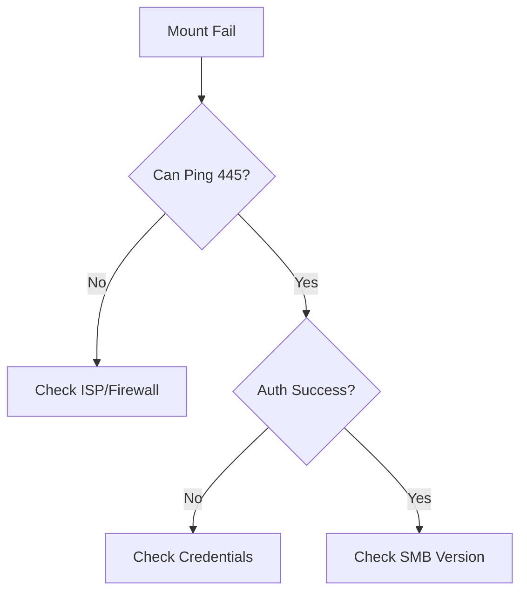

# File Share Mount Issues

Resolve connectivity and authentication problems with Azure File shares.

| Mount Failure | Cause | Resolution |
|---------------|-------|------------|
| Port 445 Blocked | ISP/Firewall | Use VPN or port 443 (NFS). |
| DNS Resolution | Wrong share FQDN | Fix client DNS server. |
| Auth Failure | Storage key wrong | Use correct key or RBAC. |
| Network Path | No path to Azure | ExpressRoute or S2S VPN. |
| OS Issue | Outdated client | Update OS/SMB version. |

!!! warning
    Port 445 is commonly blocked by residential ISPs to prevent SMB-based malware spreading.

## Sources
- [Troubleshoot Azure Files](https://learn.microsoft.com/en-us/azure/storage/files/storage-troubleshoot-windows-file-connection-problems)
- [Check port 445 connectivity](https://learn.microsoft.com/en-us/azure/storage/files/storage-files-configure-smb-windows-connectivity)
