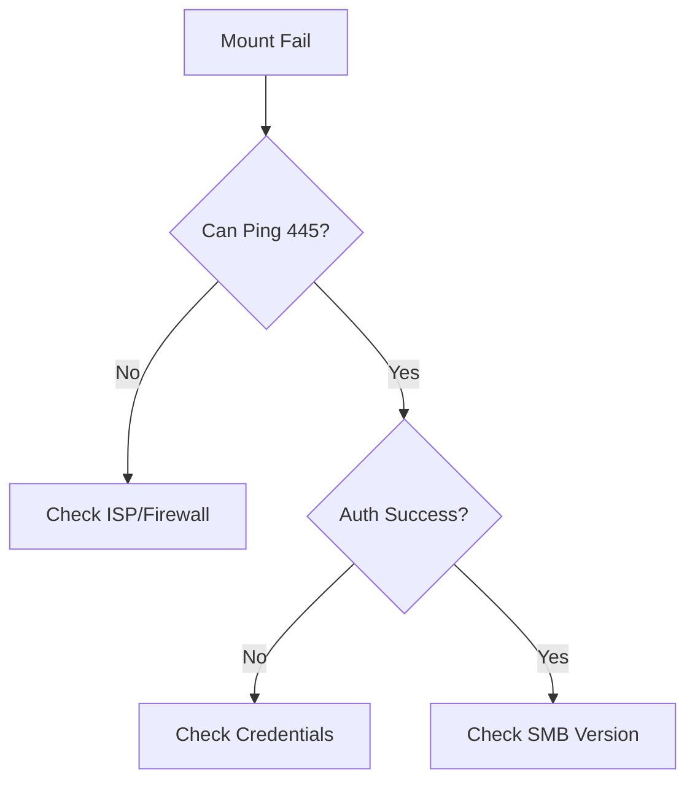

# File Share Mount Issues

Resolve connectivity and authentication problems with Azure File shares.

| Mount Failure | Cause | Resolution |
|---------------|-------|------------|
| Port 445 Blocked | ISP/Firewall | SMB requires port 445; use VPN/ExpressRoute if blocked. |
| NFS Connectivity | Port/path blocked | NFS for Azure Files requires port 2049. |
| DNS Resolution | Wrong share FQDN | Fix client DNS server. |
| Auth Failure | Storage key wrong | Use correct key or RBAC. |
| Network Path | No path to Azure | ExpressRoute or S2S VPN. |
| OS Issue | Outdated client | Update OS/SMB version. |

!!! warning
    SMB uses port 445, NFS uses port 2049, and port 443 applies to Azure Storage REST API access rather than SMB/NFS mounts.

## Mount Triage Checklist

- Validate share protocol: SMB or NFS.
- Validate required ports: SMB 445, NFS 2049.
- Validate DNS resolution for the file endpoint.
- Validate authentication method and identity path.
- Validate routing, NSG rules, and on-prem firewall policies.
- Validate client OS prerequisites and supported dialect/version.

## See Also

- [File Storage Basics](../platform/file-storage-basics.md)
- [File Share Best Practices](../best-practices/file-share-best-practices.md)
- [Manage Containers and Shares](../operations/manage-containers-and-shares.md)

## Sources
- [Troubleshoot Azure Files](https://learn.microsoft.com/en-us/azure/storage/files/storage-troubleshoot-windows-file-connection-problems)
- [Check port 445 connectivity](https://learn.microsoft.com/en-us/azure/storage/files/storage-files-configure-smb-windows-connectivity)
