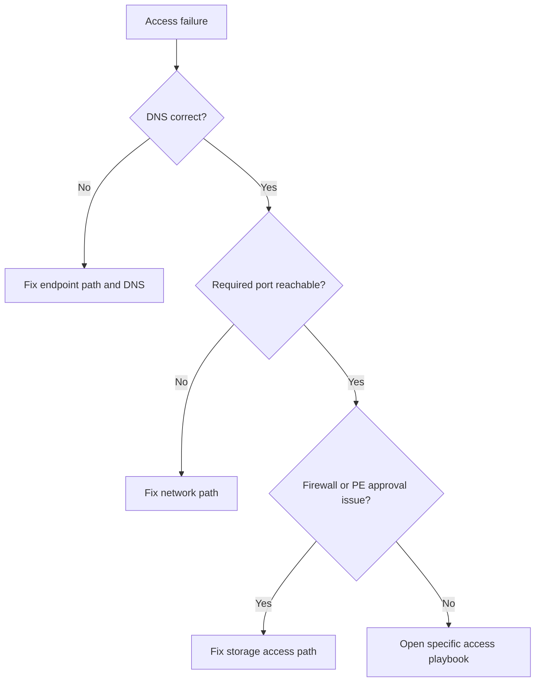

# First 10 Minutes: Access

Use this checklist when the dominant symptom is endpoint reachability, DNS mismatch, private endpoint routing confusion, or file share mount failure.

## Checklist

1. Capture the exact endpoint, protocol, timestamp, and client source network.
2. Run `nslookup` for the target FQDN and confirm whether public or private resolution is expected.
3. Test the required port from the client path: 443 for REST, 445 for SMB, 2049 for NFS.
4. Check storage firewall and public network access state.
5. If private access is expected, verify private endpoint approval, DNS zone name, and VNet link.
6. If the issue is Azure Files specific, confirm protocol prerequisites and OS/client support.

## Route to playbooks

- Generic endpoint access issue → [Cannot Access Storage Account](../playbooks/access/cannot-access-storage-account.md)
- Private DNS or private endpoint issue → [Private Endpoint and DNS Issues](../playbooks/access/private-endpoint-and-dns-issues.md)
- SMB/NFS mount issue → [File Share Mount Issues](../playbooks/access/file-share-mount-issues.md)
- Public/private route confusion → [Public vs Private Access Confusion](../playbooks/access/public-vs-private-access-confusion.md)

## See Also

- [Playbooks: Access](../playbooks/index.md)
- [Decision Tree](../decision-tree.md)
- [Evidence Map](../evidence-map.md)

## Sources

- [Azure Storage firewall rules](https://learn.microsoft.com/en-us/azure/storage/common/storage-network-security)
- [Use private endpoints for Azure Storage](https://learn.microsoft.com/en-us/azure/storage/common/storage-private-endpoints)
- [Troubleshoot Azure Files connectivity and mounting](https://learn.microsoft.com/en-us/troubleshoot/azure/azure-storage/files/connectivity/files-troubleshoot)
