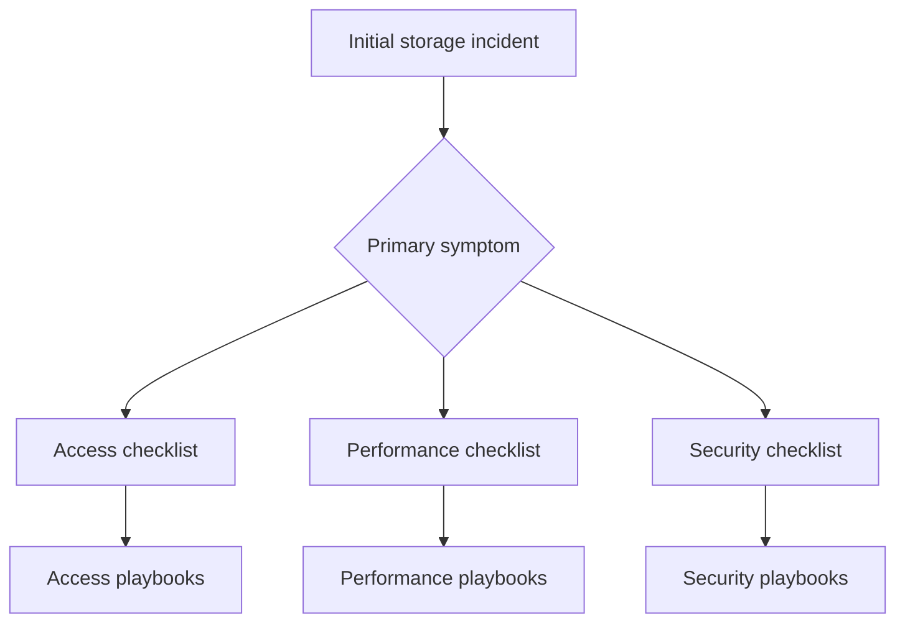

---
hide:
  - toc
---

# First 10 Minutes Checklists

These checklists narrow the problem category fast so you can open the right playbook with evidence already in hand.

| Checklist | Use When |
|---|---|
| [Access](access.md) | Cannot reach endpoint, mount failure, private endpoint route issue |
| [Performance](performance.md) | Slow transfer, throughput drop, 429/503, latency increase |
| [Security](security.md) | 403, SAS rejection, RBAC confusion, shared-key policy mismatch |

## See Also

- [Access Checklist](access.md)
- [Performance Checklist](performance.md)
- [Security Checklist](security.md)
- [Playbooks](../playbooks/index.md)

## Sources

- [Monitor and troubleshoot Azure Storage](https://learn.microsoft.com/en-us/troubleshoot/azure/azure-storage/blobs/alerts/storage-monitoring-diagnosing-troubleshooting)
- [Azure Storage documentation](https://learn.microsoft.com/en-us/azure/storage/)
