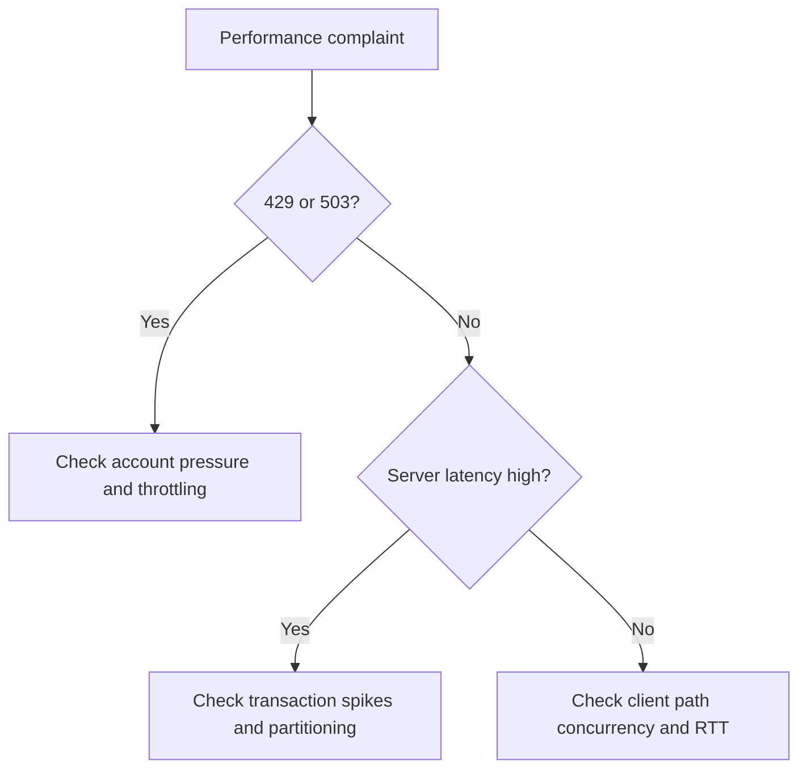

# First 10 Minutes: Performance

Use this checklist when the symptom is slow upload/download, latency growth, reduced throughput, or 429/503 throttling.

## Checklist

1. Capture the operation type, object size profile, concurrency settings, and region pair.
2. Check Azure Monitor metrics for Transactions, SuccessE2ELatency, SuccessServerLatency, Availability, Ingress, and Egress.
3. Separate server-side latency from client-side end-to-end latency.
4. Identify whether 429 or 503 exists; if yes, assume throttling is possible until disproven.
5. Check whether the workload is dominated by many small files, single-thread transfers, or long-distance clients.
6. Re-test with representative transfer tooling such as AzCopy and controlled concurrency.

## Route to playbooks

- Slow throughput without clear throttling → [Slow Upload / Download](../playbooks/performance/slow-upload-download.md)
- 429, 503, or burst-driven account pressure → [Throttling and Performance Issues](../playbooks/performance/throttling-and-performance-issues.md)
- Recovery outcome depends on prior protection settings → [Data Protection and Recovery Issues](../playbooks/performance/data-protection-and-recovery-issues.md)

## See Also

- [Playbooks: Performance](../playbooks/index.md)
- [Evidence Map](../evidence-map.md)
- [Performance Best Practices](../../best-practices/performance-best-practices.md)

## Sources

- [Azure Blob Storage performance checklist](https://learn.microsoft.com/en-us/azure/storage/blobs/storage-performance-checklist)
- [Optimize AzCopy performance](https://learn.microsoft.com/en-us/azure/storage/common/storage-use-azcopy-optimize)
- [Scalability and performance targets for standard storage accounts](https://learn.microsoft.com/en-us/azure/storage/common/scalability-targets-standard-account)
