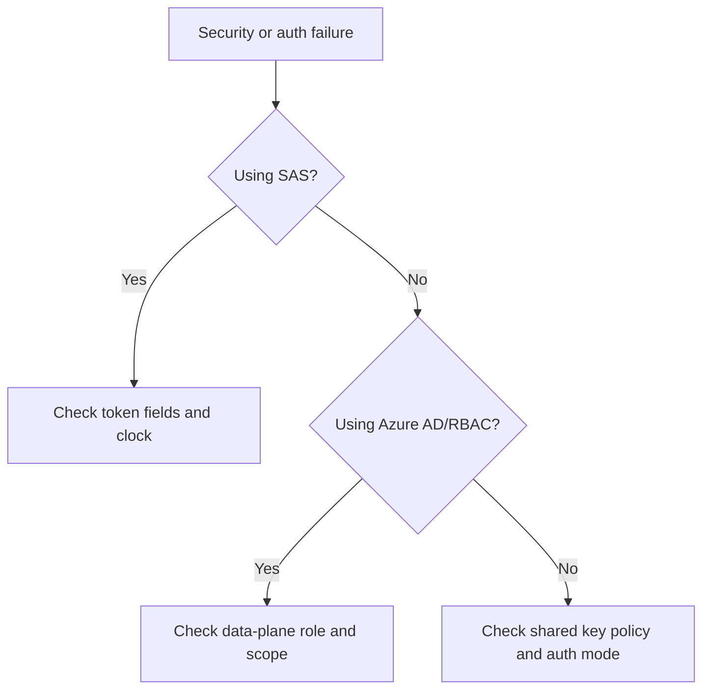

---
hide:
  - toc
content_sources:
  diagrams:
    - id: troubleshooting-first-10-minutes-security
      type: flowchart
      source: mslearn-adapted
      mslearn_url: https://learn.microsoft.com/en-us/azure/storage/common/authorize-data-access
---

# First 10 Minutes: Security

Use this checklist when the main symptom is 403, authorization mismatch, SAS rejection, or identity-policy confusion.

<!-- diagram-id: troubleshooting-first-10-minutes-security -->

## Checklist

1. Capture the exact error code, auth method, target resource, and timestamp.
2. Determine whether the request uses Azure AD, SAS, or shared key.
3. If using Azure AD, verify data-plane role, scope, tenant, and token freshness.
4. If using SAS, inspect `st`, `se`, `sp`, `spr`, `sip`, and resource scope.
5. Confirm account policy: shared key allowed or disabled, public access settings, and any network rules that can masquerade as auth failures.
6. Re-test after only one change at a time.

## Route to playbooks

- RBAC, Azure AD, shared-key policy, or scope mismatch → [Authorization Failures](../playbooks/security/authorization-failures.md)
- SAS time, permission, scope, or IP restriction issue → [SAS and Token Issues](../playbooks/security/sas-and-token-issues.md)

## See Also

- [Playbooks: Security](../playbooks/index.md)
- [Evidence Map](../evidence-map.md)
- [Access Models](../../platform/access-models.md)

## Sources

- [Authorize access to data in Azure Storage](https://learn.microsoft.com/en-us/azure/storage/common/authorize-data-access)
- [Shared Access Signatures overview](https://learn.microsoft.com/en-us/azure/storage/common/storage-sas-overview)
- [Troubleshoot storage client application errors](https://learn.microsoft.com/en-us/troubleshoot/azure/azure-storage/blobs/alerts/troubleshoot-storage-client-application-errors)
