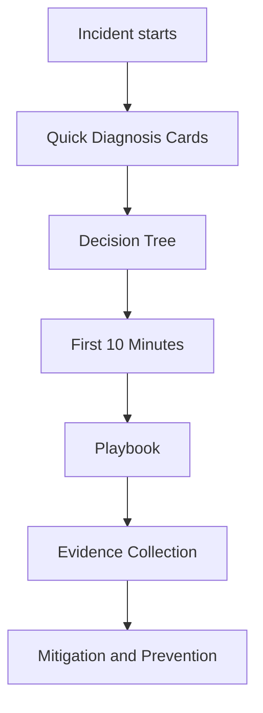

---
content_sources:
  diagrams:
    - id: troubleshooting-index
      type: flowchart
      source: mslearn-adapted
      mslearn_url: https://learn.microsoft.com/en-us/troubleshoot/azure/azure-storage/blobs/alerts/storage-monitoring-diagnosing-troubleshooting
---

# Troubleshooting

Use this section to move from a storage symptom to a validated cause quickly. The structure follows an App Service-style flow: mental model first, first-10-minutes checklists second, detailed playbooks third.

<!-- diagram-id: troubleshooting-index -->

## Start Here

| Need | Open First |
|---|---|
| Understand storage failure surfaces | [Architecture Overview](architecture-overview.md) |
| Route from symptom to the right playbook | [Decision Tree](decision-tree.md) |
| Know what proof to collect | [Evidence Map](evidence-map.md) |
| Build a better investigation mindset | [Mental Model](mental-model.md) |
| Get a 60-second triage summary | [Quick Diagnosis Cards](quick-diagnosis-cards.md) |

## First 10 Minutes

| Checklist | Use When |
|---|---|
| [Access](first-10-minutes/access.md) | Endpoint unreachable, DNS mismatch, mount failure, private endpoint confusion |
| [Performance](first-10-minutes/performance.md) | Slow transfers, latency spikes, 429/503, throughput drop |
| [Security](first-10-minutes/security.md) | 403, token rejection, RBAC/SAS confusion, auth method mismatch |

## Playbooks

### Access
- [Cannot Access Storage Account](playbooks/access/cannot-access-storage-account.md)
- [Private Endpoint and DNS Issues](playbooks/access/private-endpoint-and-dns-issues.md)
- [File Share Mount Issues](playbooks/access/file-share-mount-issues.md)
- [Public vs Private Access Confusion](playbooks/access/public-vs-private-access-confusion.md)

### Performance
- [Slow Upload / Download](playbooks/performance/slow-upload-download.md)
- [Throttling and Performance Issues](playbooks/performance/throttling-and-performance-issues.md)
- [Data Protection and Recovery Issues](playbooks/performance/data-protection-and-recovery-issues.md)

### Security
- [Authorization Failures](playbooks/security/authorization-failures.md)
- [SAS and Token Issues](playbooks/security/sas-and-token-issues.md)

## Investigation Order

1. Classify the symptom as access, performance, or security.
2. Run the matching [first-10-minutes](first-10-minutes/index.md) checklist.
3. Open the most likely [playbook](playbooks/index.md).
4. Collect evidence before making changes.
5. Apply the smallest safe mitigation and re-test.

## See Also

- [Architecture Overview](architecture-overview.md)
- [Decision Tree](decision-tree.md)
- [Evidence Map](evidence-map.md)
- [Mental Model](mental-model.md)
- [Quick Diagnosis Cards](quick-diagnosis-cards.md)
- [Playbooks](playbooks/index.md)

## Sources

- [Monitor and troubleshoot Azure Storage](https://learn.microsoft.com/en-us/troubleshoot/azure/azure-storage/blobs/alerts/storage-monitoring-diagnosing-troubleshooting)
- [Troubleshoot storage client application errors](https://learn.microsoft.com/en-us/troubleshoot/azure/azure-storage/blobs/alerts/troubleshoot-storage-client-application-errors)
- [Azure Storage documentation](https://learn.microsoft.com/en-us/azure/storage/)
