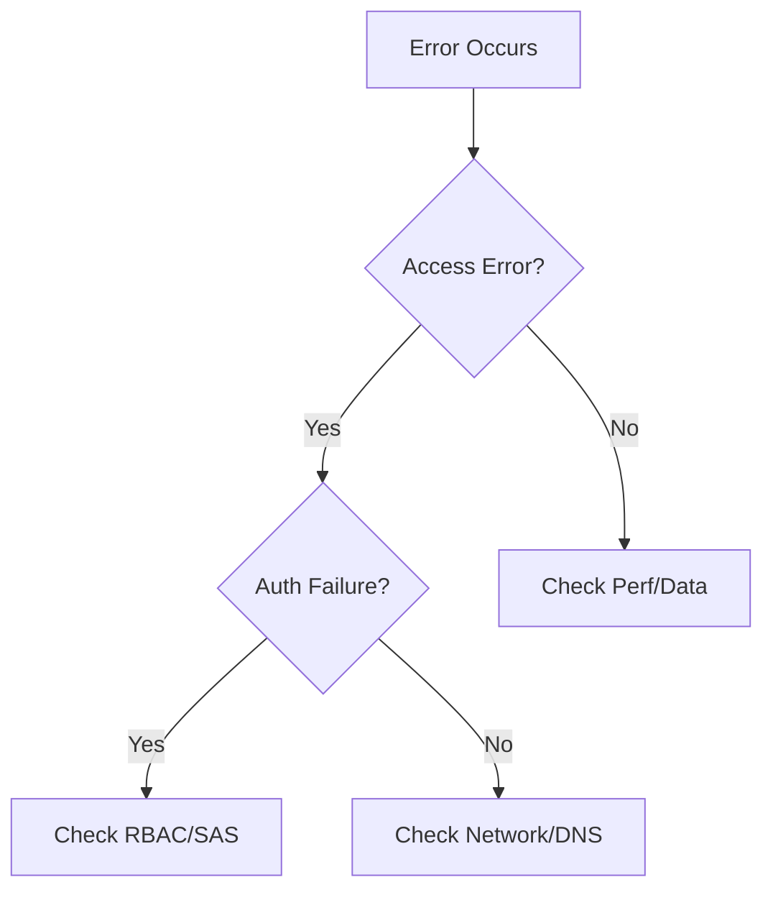

# Troubleshooting

Systematic identification and resolution of common Azure Storage issues.

| Symptom | Guide | Diagnosis |
|---------|-------|-----------|
| No Access | [Cannot Access Account](cannot-access-storage-account.md) | Network, Firewall, DNS |
| Error 403 | [Auth Failures](authorization-failures.md) | RBAC, SAS, Key Disable |
| DNS Resolution | [PE and DNS Issues](private-endpoint-and-dns-issues.md) | Zone Link, nslookup |
| Slow Transfers | [Slow Upload/Download](slow-upload-download.md) | Throttling, Latency |
| SMB Fails | [File Share Issues](file-share-mount-issues.md) | Port 445, SMB Auth |
| SAS Expired | [SAS and Token Issues](sas-and-token-issues.md) | Time, Clock Skew |
| HTTP 429/503 | [Throttling Issues](throttling-and-performance-issues.md) | Limits, Concurrency |
| Missing Data | [Protection Issues](data-protection-and-recovery-issues.md) | Deleted, Corrupted |
| PE/Public Mix | [Access Confusion](public-vs-private-access-confusion.md) | Endpoint Path, DNS |

## Sources
- [Troubleshoot Azure Storage](https://learn.microsoft.com/en-us/azure/storage/common/storage-troubleshoot-guide)
- [Diagnostic metrics for troubleshooting](https://learn.microsoft.com/en-us/azure/storage/common/storage-monitoring-diagnosing)
