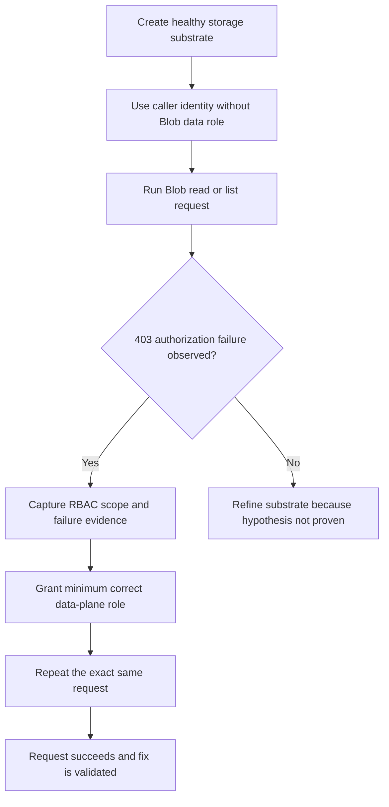

# Authorization-failure scope

This scoping page plans the future second Azure Storage troubleshooting lab in the repository. The intended lab stays deliberately narrow: reproduce a Blob data-plane authorization failure where the caller authenticates successfully with Microsoft Entra ID but lacks the required Azure RBAC data-plane role, so Blob read or list operations return HTTP 403 with an authorization error such as `AuthorizationPermissionMismatch`.

## Lab Metadata

| Field | Value |
|---|---|
| Scenario | Blob read or list request fails because the caller lacks the required Azure RBAC data-plane role |
| Planned lab ID | ZLR-storage-04 |
| Difficulty | Intermediate |
| Estimated duration | 30-45 minutes for a future live run |
| Azure services | Azure Storage, Microsoft Entra ID, Azure RBAC |
| Planned substrate path | `labs/authorization-failure/` |
| Recommended failure mode | Omit `Storage Blob Data Reader` (or equivalent data-plane role) from the caller scope and trigger Blob read or list requests |
| Expected error family | Primary expected result is HTTP 403 with `AuthorizationPermissionMismatch`; adjacent variants such as `AuthorizationFailure` or `AuthenticationFailed` should be recorded only if the live substrate proves them |
| Live Azure status | Documentation-only scoping in this PR; no deployment, validation run, or evidence capture happened here |

## 1) Background

The future lab should isolate authorization from networking so the reader can prove that the failure is not caused by DNS, firewall rules, or private-endpoint routing. Microsoft Learn states that Blob data access through Microsoft Entra ID requires an Azure RBAC data-access role, and that users are not automatically granted Blob data permissions when a storage account is created. Microsoft Learn also documents `AuthorizationPermissionMismatch` as a common Blob 403 when the caller lacks the required permissions, including cases where a read operation is attempted without `Storage Blob Data Reader`.

The planned reader takeaway is simple: a principal can be able to discover or manage the storage account and still fail every Blob data request if the data-plane role assignment is missing or scoped too narrowly.

<!-- diagram-id: troubleshooting-lab-guides-authorization-failure-scope-flow -->

## 2) Hypothesis

If a caller uses Microsoft Entra ID to access Blob data but does not have `Storage Blob Data Reader` or another role that includes the required Blob data action at the correct scope, then the Blob service will reject the request with an authorization-oriented 403 even when the network path and endpoint selection are healthy.

Predictions for the future live run:

- The caller can authenticate and obtain a token, but the Blob read or list operation still fails.
- The failing response includes a Blob authorization error consistent with missing data-plane permissions, with `AuthorizationPermissionMismatch` as the primary expected result.
- Granting the minimum correct role at the intended scope and then repeating the same request causes the request to succeed after RBAC propagation completes.

## 3) Intended substrate outline

The future substrate should stay as small as possible so the failure cannot be misread as a network or DNS problem.

- One general-purpose storage account with Blob service enabled.
- One Blob container plus a known sample blob that the lab attempts to read.
- One caller identity, preferably a managed identity attached to a simple client host or workload, so the lab can prove token-based access without embedding secrets.
- One observer/operator identity with enough permissions to inspect role assignments and apply the recovery role assignment during the fix phase.
- A healthy baseline path that deliberately avoids unrelated controls unless they are required for realism; public endpoint access is acceptable for this lab if that keeps the reproduction focused on authorization only.

Recommended fault shape for the first live implementation:

1. Deploy the storage account, container, sample blob, and caller runtime.
2. Confirm the caller identity is authenticated but intentionally missing `Storage Blob Data Reader` at the storage account or container scope.
3. Trigger a Blob list or read operation from the caller path and capture the 403 failure.
4. Grant the minimum correct data-plane role.
5. Repeat the exact same request until the failure disappears, treating that recovery as the falsification step.

## 4) Planned evidence and falsification

The future lab should collect evidence that distinguishes missing data-plane authorization from every adjacent failure class.

- [Not Proven] Sanitized request output showing HTTP 403 and the exact Blob error code returned during the faulted state.
- [Not Proven] Sanitized role-assignment evidence proving the caller lacks the required Blob data role at the tested scope before the fix.
- [Not Proven] A control showing that the same endpoint, DNS path, and network path are healthy, so the failure remains attributable to authorization.
- [Not Proven] Role-assignment evidence showing when `Storage Blob Data Reader` (or the chosen least-privilege equivalent) is added.
- [Not Proven] A successful rerun of the exact same Blob request after propagation, which confirms the missing-role hypothesis and validates the fix.

Preferred future evidence set:

- CLI or SDK error output from the caller path.
- Azure Activity evidence for the role-assignment write operation.
- Optional Portal captures for storage account IAM scope, container view, and the post-fix successful request path.

## Out of scope

This scoping page does not author the full lab substrate, does not deploy any Azure resources, and does not claim live evidence. It also does not cover SAS-specific failures, shared-key-disabled policy scenarios, cross-tenant token problems, Azure Files authorization, or broader-repo changes that are unrelated to planning this second troubleshooting lab.

## Related Playbook

- [Authorization Failures](../playbooks/security/authorization-failures.md)

## See Also

- [Lab Guides](index.md)
- [Private-endpoint DNS failure](private-endpoint-dns-failure.md)
- [Troubleshooting Home](../index.md)
- [Cannot Access Storage Account](../playbooks/access/cannot-access-storage-account.md)

## Sources

- [Authorize access to blobs by using Microsoft Entra ID](https://learn.microsoft.com/en-us/azure/storage/blobs/authorize-access-azure-active-directory)
- [Assign an Azure role for access to blob data](https://learn.microsoft.com/en-us/azure/storage/blobs/assign-azure-role-data-access)
- [Troubleshoot 403 errors in Azure Blob Storage](https://learn.microsoft.com/en-us/troubleshoot/azure/azure-storage/blobs/authentication/storage-troubleshoot-403-errors)
