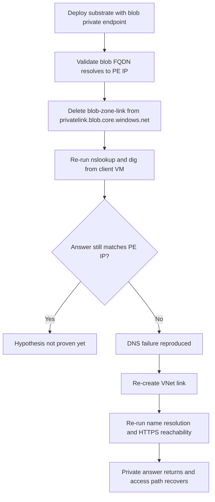

# Private-endpoint DNS failure

This lab documents the first Azure Storage troubleshooting substrate in the repository: a storage account with blob private access, a blob private endpoint, a `privatelink.blob.core.windows.net` zone, a VNet link, and a client VM that tests name resolution from the private path. The failure model is deliberately narrow: delete the private DNS VNet link, prove that blob resolution no longer returns the private endpoint IP, then restore the link and falsify the failure hypothesis.

## Lab Metadata

| Field | Value |
|---|---|
| Scenario | Blob storage account behind a private endpoint becomes unreachable because the client VNet loses its private DNS zone link |
| Lab ID | ZLR-storage-03 |
| Difficulty | Intermediate |
| Estimated duration | 45-60 minutes for a future live run |
| Azure services | Azure Storage, Azure Private Endpoint, Azure Private DNS, Azure Virtual Machines |
| Substrate path | `labs/private-endpoint-dns-failure/` |
| Fault injection | Delete the `blob-zone-link` virtual network link from `privatelink.blob.core.windows.net` |
| Recovery action | Re-create the private DNS VNet link and confirm blob FQDN resolution returns to the private endpoint IP |
| Live Azure status | Documentation only in this PR; live deployment, evidence capture, and validation remain deferred |

## 1) Background

The substrate in `labs/private-endpoint-dns-failure/` provisions these components:

- A StorageV2 account with `publicNetworkAccess` disabled and blob access exposed through a private endpoint.
- A virtual network with a client subnet and a dedicated private-endpoint subnet.
- A `privatelink.blob.core.windows.net` private DNS zone plus a VNet link named `blob-zone-link`.
- A Linux VM that installs `dnsutils` and `curl` so the lab can run `nslookup`, `dig`, and HTTPS reachability checks from the same private path that an application would use.

In the healthy state, `${STORAGE_NAME}.blob.core.windows.net` should resolve on the client VM to the private endpoint IP that Azure assigned to the blob private endpoint. The substrate's fault injection step removes the only DNS link that lets the client VNet resolve the `privatelink` zone, so the same lookup should fall back to a public or otherwise non-private answer.

<!-- diagram-id: troubleshooting-lab-guides-private-endpoint-dns-failure-flow -->


## 2) Hypothesis

If the `privatelink.blob.core.windows.net` VNet link is deleted, then the client VM will stop resolving `${STORAGE_NAME}.blob.core.windows.net` to the private endpoint IP. Because the storage account disables public network access, requests that no longer follow the private path will fail until the private DNS VNet link is restored.

Predictions for a future live run:

- Before fault injection, `nslookup` and `dig` from the client VM return the blob private endpoint IP.
- After the VNet link is deleted, the same commands no longer return that private IP.
- After the VNet link is recreated, the blob FQDN again resolves to the private endpoint IP and HTTPS requests once again reach the storage service endpoint.

## 3) Runbook

This page is documentation-only. Do not treat the commands below as already executed in this PR; they are the exact future live-run sequence grounded in the substrate.

### Deploy the healthy baseline

Use the substrate exactly as authored. Set `INJECT_FAULT="false"` so you can measure the healthy state before deleting the DNS link.

```bash
export RG="rg-storage-pe-dns-lab"
export LOCATION="koreacentral"
export INJECT_FAULT="false"

bash labs/private-endpoint-dns-failure/scripts/reproduce.sh
```

### Record the deployed names

```bash
export DEPLOYMENT_NAME="private-endpoint-dns-failure"

export STORAGE_NAME="$(az deployment group show \
    --resource-group "$RG" \
    --name "$DEPLOYMENT_NAME" \
    --query properties.outputs.storageAccountName.value \
    --output tsv)"

export VM_NAME="$(az deployment group show \
    --resource-group "$RG" \
    --name "$DEPLOYMENT_NAME" \
    --query properties.outputs.clientVmName.value \
    --output tsv)"
```

| Command | Purpose |
| --- | --- |
| `az deployment group show` | Read deployment outputs without hard-coding the storage account or VM names. |
| `--resource-group` | Scope the query to the resource group created for the lab. |
| `--name` | Select the deployment instance that published the lab outputs. |
| `--query` | Extract either `storageAccountName` or `clientVmName` from the deployment outputs. |
| `--output` | Return a shell-friendly TSV value for environment-variable assignment. |


### Inject the DNS fault

```bash
export ZONE_LINK_NAME="blob-zone-link"

az network private-dns link vnet delete \
    --resource-group "$RG" \
    --zone-name privatelink.blob.core.windows.net \
    --name "$ZONE_LINK_NAME" \
    --yes
```

| Command | Purpose |
| --- | --- |
| `az network private-dns link vnet delete` | Remove the client VNet link from the blob private DNS zone to reproduce the DNS-path failure. |
| `--resource-group` | Scope the delete operation to the lab resource group. |
| `--zone-name` | Target the blob private DNS zone used by the storage private endpoint. |
| `--name` | Identify the specific virtual network link deployed by the substrate. |
| `--yes` | Skip the confirmation prompt during the reproducible fault-injection step. |


### Restore the DNS path

```bash
export VNET_NAME="$(az deployment group show \
    --resource-group "$RG" \
    --name "$DEPLOYMENT_NAME" \
    --query properties.outputs.clientVnetName.value \
    --output tsv)"

az network private-dns link vnet create \
    --resource-group "$RG" \
    --zone-name privatelink.blob.core.windows.net \
    --name "$ZONE_LINK_NAME" \
    --virtual-network "$VNET_NAME" \
    --registration-enabled false
```

| Command | Purpose |
| --- | --- |
| `az deployment group show` | Read the client VNet name from the original deployment outputs so the recovery step recreates the correct link. |
| `az network private-dns link vnet create` | Re-create the private DNS VNet link that the fault injection removed. |
| `--resource-group` | Scope the recovery action to the lab resource group. |
| `--zone-name` | Reconnect the client VNet to the blob `privatelink` zone. |
| `--name` | Recreate the original link name so the substrate returns to its expected state. |
| `--virtual-network` | Point the DNS link at the client VNet that consumes the storage private endpoint. |
| `--registration-enabled` | Keep autoregistration disabled because this zone is used for private endpoint resolution, not host registration. |


## 4) Experiment Log

This PR does not include a live Azure run. The log below captures the intended experiment phases and the evidence standard for the later validation pass.

1. **Healthy baseline**
    - [Not Proven] Deploy the substrate with `INJECT_FAULT="false"`.
    - [Not Proven] Capture the blob private endpoint IP, the VNet link state, and client-VM `nslookup` / `dig` output proving the blob FQDN resolves privately before fault injection.
2. **Faulted state**
    - [Not Proven] Delete `blob-zone-link` from `privatelink.blob.core.windows.net`.
    - [Not Proven] Re-run the same queries from the client VM and confirm that the blob FQDN no longer resolves to the private endpoint IP.
3. **Post-fix falsification**
    - [Not Proven] Re-create `blob-zone-link`.
    - [Not Proven] Re-run the exact same verification set and confirm the blob FQDN again resolves to the private endpoint IP.
    - [Not Proven] Treat the hypothesis as falsified only when the same client path that failed during the faulted state now resolves and reaches the private endpoint correctly.

## 5) Verification Queries

Use the same checks three times during a future live run: healthy baseline, faulted state, and post-fix falsification. Record the private endpoint IP first, then compare every later lookup against that baseline value.

### Query set A: Capture the authoritative private endpoint IP and DNS-link state

```bash
az network private-endpoint show \
    --resource-group "$RG" \
    --name pednslab-blob-pe \
    --query 'customDnsConfigs[].ipAddresses[]' \
    --output tsv

az network private-dns link vnet show \
    --resource-group "$RG" \
    --zone-name privatelink.blob.core.windows.net \
    --name "$ZONE_LINK_NAME" \
    --output jsonc
```

| Command | Purpose |
| --- | --- |
| `az network private-endpoint show` | Return the private IP that the blob private endpoint publishes for later DNS comparison. |
| `az network private-dns link vnet show` | Confirm whether the client VNet is currently linked to the blob private DNS zone. |
| `--resource-group` | Scope each query to the lab resource group. |
| `--name` | Select either the private endpoint resource or the VNet link being verified. |
| `--query` | Extract only the private endpoint IP values from the control-plane response. |
| `--zone-name` | Target the blob private DNS zone that should resolve the storage account privately. |
| `--output` | Render shell-friendly TSV for IP capture or readable JSONC for link-state review. |


### Query set B: Prove name resolution from the client VM

```bash
az vm run-command invoke \
    --resource-group "$RG" \
    --name "$VM_NAME" \
    --command-id RunShellScript \
    --scripts "nslookup ${STORAGE_NAME}.blob.core.windows.net"

az vm run-command invoke \
    --resource-group "$RG" \
    --name "$VM_NAME" \
    --command-id RunShellScript \
    --scripts "dig +short ${STORAGE_NAME}.blob.core.windows.net"
```

| Command | Purpose |
| --- | --- |
| `az vm run-command invoke` | Execute DNS checks inside the client VM so the result reflects the same VNet path as the workload. |
| `--resource-group` | Scope the run-command invocation to the lab resource group. |
| `--name` | Identify the client VM that the substrate deployed for DNS tests. |
| `--command-id` | Use the built-in shell runner for the Linux VM. |
| `--scripts` | Run either `nslookup` or `dig +short` against the blob endpoint FQDN from inside the private network. |


### Query set C: Prove the data path recovers after the DNS fix

```bash
az vm run-command invoke \
    --resource-group "$RG" \
    --name "$VM_NAME" \
    --command-id RunShellScript \
    --scripts "curl -I --max-time 10 https://${STORAGE_NAME}.blob.core.windows.net/"
```

| Command | Purpose |
| --- | --- |
| `az vm run-command invoke` | Execute an HTTPS reachability test from the same client VM after DNS is validated. |
| `--resource-group` | Scope the request to the lab resource group. |
| `--name` | Identify the client VM that consumes the private endpoint. |
| `--command-id` | Use the Linux shell runner for the one-off curl check. |
| `--scripts` | Send an HTTPS HEAD request to the blob endpoint to confirm that traffic again reaches the storage service after the DNS fix. |


### Query set D: Correlate the fault and fix in Azure Activity

```kusto
AzureActivity
| where ResourceGroup == "<resource-group>"
| where OperationNameValue in (
    "Microsoft.Network/privateDnsZones/virtualNetworkLinks/delete",
    "Microsoft.Network/privateDnsZones/virtualNetworkLinks/write"
)
| where ResourceProviderValue == "MICROSOFT.NETWORK"
| project TimeGenerated, OperationNameValue, ActivityStatusValue, Resource
| order by TimeGenerated asc
```

### Pass / fail rules

| Check | Healthy baseline | Faulted state | Post-fix falsification |
|---|---|---|---|
| Private endpoint IP (`az network private-endpoint show`) | Record the blob private endpoint IP for comparison. | Should still report the same private endpoint IP because the endpoint itself was not deleted. | Should still report the same private endpoint IP. |
| DNS link state (`az network private-dns link vnet show`) | Command succeeds and shows the client VNet link. | Command fails with not found or otherwise proves the link is absent. | Command succeeds again after re-creation. |
| Client `nslookup` / `dig` | Returned address matches the recorded private endpoint IP. | Returned address does not match the recorded private endpoint IP, or resolution otherwise fails. | Returned address again matches the recorded private endpoint IP. |
| Client `curl -I` | Reaches the blob endpoint over the private path and returns an HTTP response from Azure Storage. | Fails because the request no longer reaches the intended private endpoint path. | Reaches the blob endpoint again after the DNS link is restored. |
| Activity Log KQL | No delete event yet. | Shows the VNet-link delete event for the fault injection window. | Shows both delete and write events in chronological order, proving the recovery action happened. |

## 6) Portal Evidence

Status: **pending live capture**.

When this lab is executed against a real Azure environment, capture Portal evidence into `docs/assets/troubleshooting/private-endpoint-dns-failure/` and verify the final rendered images before merge.

Recommended captures for the live follow-up:

- Storage account **Networking** blade showing public network access disabled and the blob private endpoint connection present.
- Private endpoint **Overview** blade showing the approved blob private endpoint and its private IP.
- Private DNS zone **Virtual network links** blade before fault injection, after deletion, and after the link is recreated.
- VM **Run command** or equivalent evidence proving the client-side `nslookup` result before fault injection and after the fix.

Do not reference image files from this page until those captures actually exist.

## Clean Up

```bash
export RG="rg-storage-pe-dns-lab"

bash labs/private-endpoint-dns-failure/scripts/cleanup.sh
```

## Related Playbook

- [Private Endpoint and DNS Issues](../playbooks/access/private-endpoint-and-dns-issues.md)

## See Also

- [Lab Guides](index.md)
- [Troubleshooting Home](../index.md)
- [Cannot Access Storage Account](../playbooks/access/cannot-access-storage-account.md)
- [Use Private Endpoints](../../operations/use-private-endpoints.md)

## Sources

- [Use private endpoints for Azure Storage](https://learn.microsoft.com/en-us/azure/storage/common/storage-private-endpoints)
- [Azure Private Endpoint private DNS zone values](https://learn.microsoft.com/en-us/azure/private-link/private-endpoint-dns)
- [Troubleshoot Azure Private Endpoint connectivity problems](https://learn.microsoft.com/en-us/troubleshoot/azure/private-link/troubleshoot-private-endpoint-connectivity-problems)
