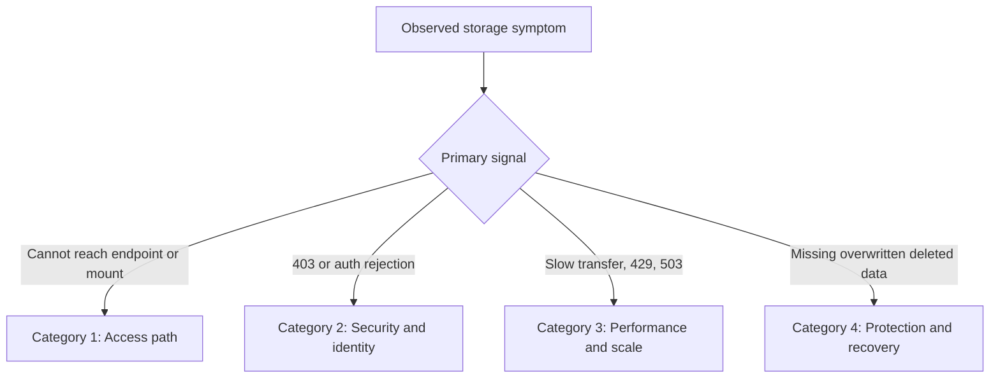
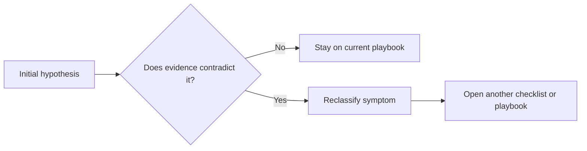

# Troubleshooting Mental Model

The core storage troubleshooting rule is simple: **classify the failure surface first, then collect evidence from that surface before changing configuration**.

## Classification model

## Category summary

| Category | Typical Symptoms | First Thing to Verify | Common Mistake |
|---|---|---|---|
| Access path | timeout, unreachable endpoint, mount failure, private endpoint confusion | DNS answer and network path | changing RBAC before validating endpoint reachability |
| Security and identity | 403, authorization mismatch, SAS rejected | auth method and scope | assuming Contributor is enough for data-plane access |
| Performance and scale | slow upload, latency spike, 429/503 | server latency vs end-to-end latency | calling every slow transfer a throttle event |
| Protection and recovery | deleted, overwritten, cannot restore | protection state before incident | assuming retention can be enabled after impact and still help |

## Practical thinking rules

1. **Path before permission**: confirm where traffic is going before debating who can access it.
2. **Evidence before remediation**: capture error text, timestamp, DNS result, and current config before changing anything.
3. **Server latency vs end-to-end latency**: low server latency with slow transfers usually points away from account saturation.
4. **Feature state before incident matters**: recovery depends on what was enabled earlier, not what is enabled now.

## Reclassification trigger points

Reclassify immediately when:

- a 403 turns out to be a network rule denial on the wrong endpoint path,
- a throttling hypothesis shows low server latency and no 429/503,
- a restore request reveals that soft delete or versioning was never enabled.

## Good incident notes format

- **Primary symptom**: what the user sees.
- **Classification**: access, security, performance, or recovery.
- **Evidence collected**: exact command output or metric snapshot.
- **Hypotheses still alive**: two or three, not ten.

## See Also

- [Architecture Overview](architecture-overview.md)
- [Decision Tree](decision-tree.md)
- [Evidence Map](evidence-map.md)
- [Quick Diagnosis Cards](quick-diagnosis-cards.md)
- [Playbooks](playbooks/index.md)

## Sources

- [Monitor and troubleshoot Azure Storage](https://learn.microsoft.com/en-us/troubleshoot/azure/azure-storage/blobs/alerts/storage-monitoring-diagnosing-troubleshooting)
- [Authorize access to data in Azure Storage](https://learn.microsoft.com/en-us/azure/storage/common/authorize-data-access)
- [Azure Blob Storage performance checklist](https://learn.microsoft.com/en-us/azure/storage/blobs/storage-performance-checklist)
- [Recovering deleted blobs](https://learn.microsoft.com/en-us/azure/storage/blobs/soft-delete-blob-overview#restoring-soft-deleted-blobs)
