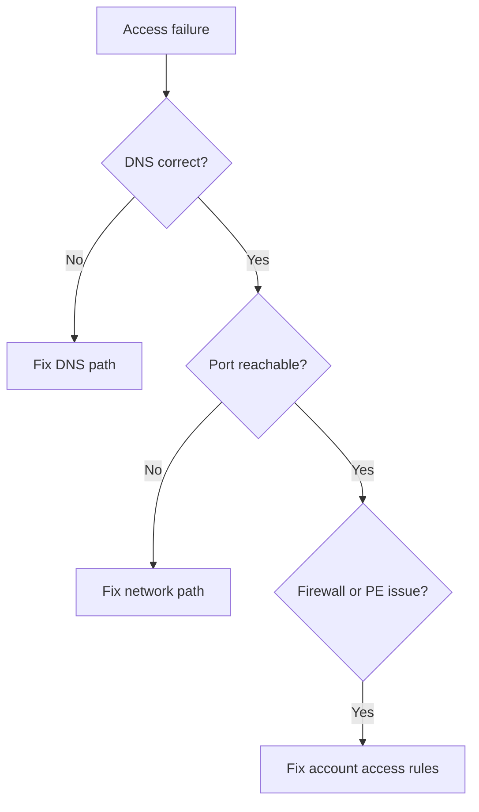

---
content_sources:
  diagrams:
    - id: troubleshooting-playbooks-access-cannot-access-storage-account
      type: flowchart
      source: mslearn-adapted
      mslearn_url: https://learn.microsoft.com/en-us/azure/storage/common/storage-network-security
---

# Cannot Access Storage Account

## 1. Summary

When a client cannot reach a storage account at all, the first question is whether the client is taking the intended public or private path.

<!-- diagram-id: troubleshooting-playbooks-access-cannot-access-storage-account -->

## 2. Common Misreadings

- Assuming every access failure is an RBAC issue.
- Changing firewall rules before validating DNS resolution.
- Forgetting that Azure Files SMB needs port 445 and NFS needs 2049.

## 3. Competing Hypotheses

- **H1**: DNS resolves to the wrong endpoint.
- **H2**: Client network cannot reach the required port.
- **H3**: Storage firewall or public network access setting blocks the source.
- **H4**: Private endpoint exists but is not approved or routable.

## 4. What to Check First

- Exact endpoint format for Blob, Files, Queue, or Table.
- `nslookup` result for the target FQDN.
- Required port from the client network.
- Storage firewall rules and default action.
- Private endpoint approval state when private access is expected.

## 5. Evidence to Collect

- Target FQDN and service type.
- DNS answer and whether public/private path is intended.
- Port test result from the source network.
- Sanitized storage account network rule output.

## 6. Validation and Disproof by Hypothesis

### H1: Wrong DNS path
- **Support**: public IP returned for a private-only design, or private zone missing.
- **Weaken**: DNS returns the expected IP path consistently.

### H2: Network path blocked
- **Support**: port 443, 445, or 2049 is unreachable from the client.
- **Weaken**: port test succeeds and only one auth method fails.

### H3: Firewall block
- **Support**: source IP/subnet is not allowed or public network access is disabled.
- **Weaken**: same source can reach the same endpoint when using identical path.

### H4: Private endpoint issue
- **Support**: connection pending, DNS not linked, or route points away from PE NIC.
- **Weaken**: PE approved, private IP resolves correctly, and path is routable.

## 7. Likely Root Cause Patterns

- Wrong public/private DNS answer.
- Missing firewall allow rule.
- Private endpoint approved late or not linked to client DNS path.
- Protocol-specific port block for Azure Files.

## 8. Immediate Mitigations

- Correct the endpoint path and DNS configuration.
- Open the required outbound port on the client path.
- Add the source to the correct storage firewall rule set.
- Approve or repair the private endpoint configuration.

## 9. Prevention

- Document which workloads must use public versus private access.
- Validate DNS and port reachability during deployment changes.
- Keep firewall and private endpoint changes coupled with test evidence.

## See Also

- [Private Endpoint and DNS Issues](private-endpoint-and-dns-issues.md)
- [Public vs Private Access Confusion](public-vs-private-access-confusion.md)
- [Configure Network Rules](../../../operations/configure-network-rules.md)

## Sources

- [Azure Storage firewall rules](https://learn.microsoft.com/en-us/azure/storage/common/storage-network-security)
- [Troubleshoot Azure Files connectivity](https://learn.microsoft.com/en-us/troubleshoot/azure/azure-storage/files/connectivity/files-troubleshoot)
