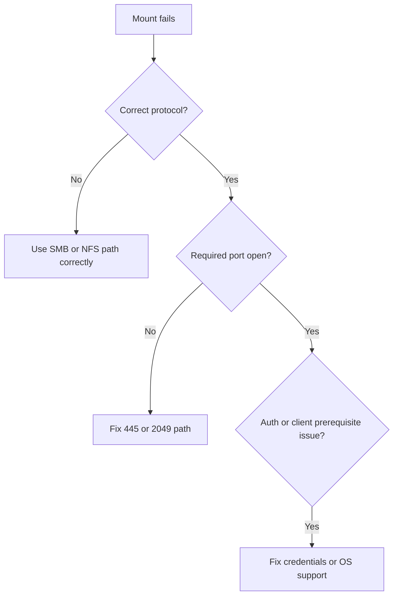

# File Share Mount Issues

## 1. Summary

Azure Files mount failures usually come from protocol prerequisites, network path, or auth mismatches rather than from the storage account being generally down.

## 2. Common Misreadings

- Testing only HTTPS 443 when the workload is SMB.
- Assuming all Azure Files problems are DNS problems.
- Ignoring client OS and SMB/NFS capability requirements.

## 3. Competing Hypotheses

- **H1**: Port 445 or 2049 is blocked.
- **H2**: Wrong endpoint or DNS answer is used.
- **H3**: Credentials or auth method are wrong.
- **H4**: Client OS or protocol prerequisites are missing.

## 4. What to Check First

- Whether the share uses SMB or NFS.
- Reachability of port 445 or 2049.
- File endpoint DNS answer.
- Authentication method and supplied credentials.
- Client OS support and version prerequisites.

## 5. Evidence to Collect

- Mount command and returned error text.
- Port test output.
- DNS result for `<account>.file.core.windows.net`.
- Client OS version and protocol configuration.

## 6. Validation and Disproof by Hypothesis

### H1: Port blocked
- **Support**: port test fails from the client network.
- **Weaken**: port succeeds and issue persists only for one identity or one share.

### H2: DNS or endpoint problem
- **Support**: file endpoint resolves unexpectedly or to the wrong network path.
- **Weaken**: DNS consistently resolves as designed.

### H3: Auth mismatch
- **Support**: mount reaches the endpoint but returns permission or credential errors.
- **Weaken**: anonymous network-level timeout occurs before auth exchange.

### H4: Client prerequisite problem
- **Support**: outdated SMB dialect, unsupported NFS client, or OS-specific limitation.
- **Weaken**: same client build mounts other Azure Files shares successfully.

## 7. Likely Root Cause Patterns

- ISP or corporate firewall blocking SMB 445.
- Incorrect auth material or identity path.
- Wrong DNS or endpoint selection.
- Unsupported or outdated client configuration.

## 8. Immediate Mitigations

- Use a network path that allows the required protocol.
- Correct the file endpoint and DNS configuration.
- Recreate the mount with the correct credentials.
- Patch or reconfigure the client OS and protocol settings.

## 9. Prevention

- Validate SMB/NFS prerequisites before rollout.
- Test mounts from each major client network segment.
- Keep protocol-specific runbooks separate from generic REST access checks.

## See Also

- [Cannot Access Storage Account](cannot-access-storage-account.md)
- [File Storage Basics](../../../platform/file-storage-basics.md)
- [File Share Best Practices](../../../best-practices/file-share-best-practices.md)

## Sources

- [Troubleshoot Azure Files on Windows](https://learn.microsoft.com/en-us/azure/storage/files/storage-troubleshoot-windows-file-connection-problems)
- [Troubleshoot Azure Files connectivity and mounting](https://learn.microsoft.com/en-us/troubleshoot/azure/azure-storage/files/connectivity/files-troubleshoot)
