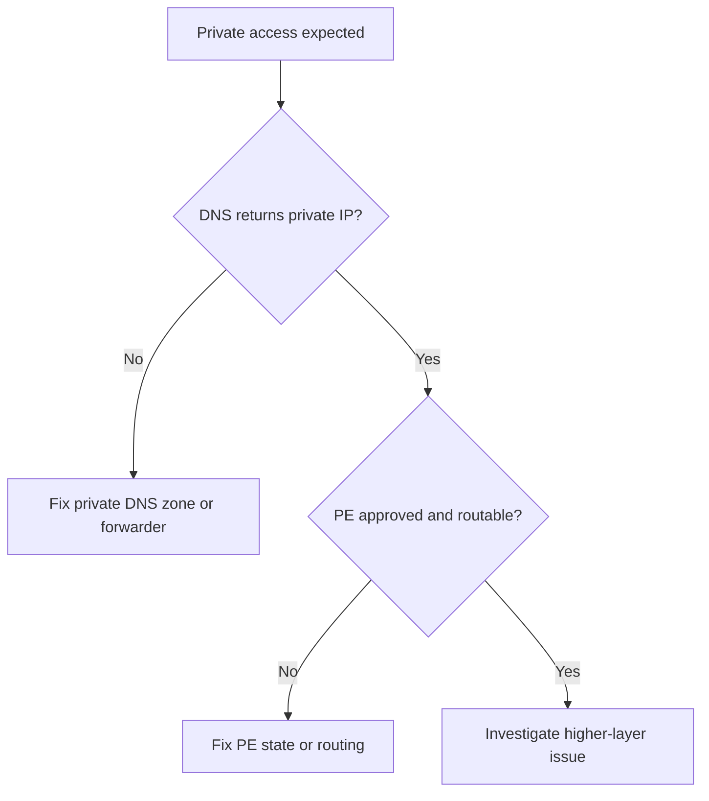

---
content_sources:
  diagrams:
    - id: troubleshooting-playbooks-access-private-endpoint-and-dns-issues
      type: flowchart
      source: mslearn-adapted
      mslearn_url: https://learn.microsoft.com/en-us/azure/private-link/troubleshoot-private-endpoint-connectivity
---

# Private Endpoint and DNS Issues

## 1. Summary

Most private endpoint incidents are actually DNS path incidents: traffic resolves to the wrong IP and never reaches the intended private route.

<!-- diagram-id: troubleshooting-playbooks-access-private-endpoint-and-dns-issues -->

## 2. Common Misreadings

- Treating private endpoint setup as complete without checking name resolution.
- Assuming one private DNS zone covers all storage services.
- Investigating RBAC first when traffic still resolves public IP.

## 3. Competing Hypotheses

- **H1**: Private DNS zone is missing, wrong, or not linked.
- **H2**: Custom DNS forwarder does not resolve `privatelink` zones correctly.
- **H3**: Private endpoint connection is not approved.
- **H4**: NSG or route table blocks the private path.

## 4. What to Check First

- Service-specific private DNS zone name.
- `nslookup` output from the affected network.
- VNet link status for the private DNS zone.
- Private endpoint approval and NIC IP.
- NSG and route behavior on the client subnet.

## 5. Evidence to Collect

- Returned IP for the normal and `privatelink` FQDNs.
- Zone names in use for Blob, Files, Queue, or Table.
- VNet link list and status.
- Private endpoint connection state.

## 6. Validation and Disproof by Hypothesis

### H1: Zone missing or wrong
- **Support**: DNS returns public IP or NXDOMAIN when private resolution is expected.
- **Weaken**: zone exists, linked, and records point to PE private IP.

### H2: Forwarder problem
- **Support**: Azure DNS works but on-prem/custom DNS returns stale or public answer.
- **Weaken**: all resolvers return the same correct private result.

### H3: PE not approved
- **Support**: connection is pending or rejected.
- **Weaken**: PE approved and DNS points to the correct NIC IP.

### H4: Routing block
- **Support**: DNS is correct but connectivity still fails over the private path.
- **Weaken**: same subnet can reach other private endpoints with identical controls.

## 7. Likely Root Cause Patterns

- Missing `privatelink.<service>.core.windows.net` zone.
- VNet link absent for the client network.
- Hybrid DNS forwarder not forwarding private zones.
- PE approved but route/NSG still blocks access.

## 8. Immediate Mitigations

- Create or correct the service-specific private DNS zone.
- Link the right VNets and update custom DNS forwarding.
- Approve the private endpoint connection.
- Fix NSG or UDR rules on the client path.

## 9. Prevention

- Treat DNS validation as part of every private endpoint rollout.
- Keep separate validation for Blob, Files, Queue, and Table endpoints.
- Record expected private IP resolution from each consuming network.

## See Also

- [Cannot Access Storage Account](cannot-access-storage-account.md)
- [Public vs Private Access Confusion](public-vs-private-access-confusion.md)
- [Use Private Endpoints](../../../operations/use-private-endpoints.md)

## Sources

- [Troubleshoot Private Endpoint connectivity](https://learn.microsoft.com/en-us/azure/private-link/troubleshoot-private-endpoint-connectivity)
- [DNS configuration for Azure Storage private endpoints](https://learn.microsoft.com/en-us/azure/storage/common/storage-private-endpoints#dns-configuration)
