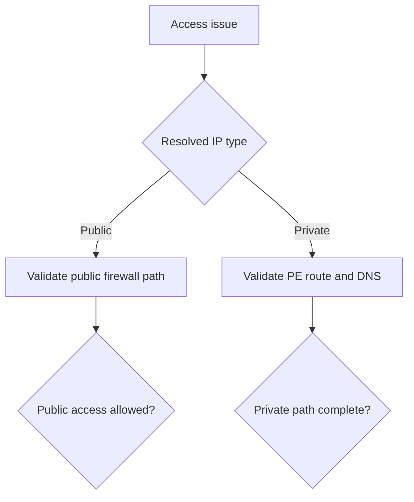

---
hide:
  - toc
---

# Public vs Private Access Confusion

## 1. Summary

This scenario happens when the intended access model and the actual DNS-routed path do not match, making the incident look random or policy-related.

## 2. Common Misreadings

- Assuming private endpoint traffic wins automatically when both paths exist.
- Looking only at firewall settings without checking DNS.
- Treating mixed public/private behavior as intermittent platform instability.

## 3. Competing Hypotheses

- **H1**: Client resolves the public endpoint even though private access is expected.
- **H2**: Client resolves the private endpoint but private path is incomplete.
- **H3**: Policy and network design disagree on whether public access should remain enabled.

## 4. What to Check First

- Returned IP type for the target endpoint.
- Intended access model for the workload.
- Firewall rules for public access.
- Private endpoint DNS zone links and approval.

## 5. Evidence to Collect

- DNS result from each affected network segment.
- Storage account public network access setting.
- Firewall rule set and private endpoint state.
- Affected workloads and which path they were expected to use.

## 6. Validation and Disproof by Hypothesis

### H1: Public resolution is wrong
- **Support**: client resolves public IP while design requires private access.
- **Weaken**: public access is intentionally allowed and source IP is whitelisted.

### H2: Private path incomplete
- **Support**: private IP resolves but connection still fails due to PE, NSG, or DNS link issue.
- **Weaken**: PE path fully works from the same subnet for equivalent workloads.

### H3: Design mismatch
- **Support**: one team expects public access while another has disabled it or moved traffic to PE.
- **Weaken**: documented path is clear and matches current DNS behavior.

## 7. Likely Root Cause Patterns

- Public DNS answer from networks that were never linked to private DNS.
- Public network access disabled before all clients moved to private path.
- Split-brain DNS in hybrid environments.

## 8. Immediate Mitigations

- Force the correct DNS path for the affected workload.
- Restore the expected public allow rule temporarily if safe and approved.
- Complete private endpoint rollout before removing public reachability.

## 9. Prevention

- Document target access model per workload.
- Validate DNS answers from every client network after PE rollout.
- Avoid leaving ambiguous mixed-access states without explicit ownership.

## See Also

- [Cannot Access Storage Account](cannot-access-storage-account.md)
- [Private Endpoint and DNS Issues](private-endpoint-and-dns-issues.md)
- [Networking and Private Access](../../../platform/networking-and-private-access.md)

## Sources

- [Use private endpoints for Azure Storage](https://learn.microsoft.com/en-us/azure/storage/common/storage-private-endpoints)
- [Azure Storage firewall rules](https://learn.microsoft.com/en-us/azure/storage/common/storage-network-security)
