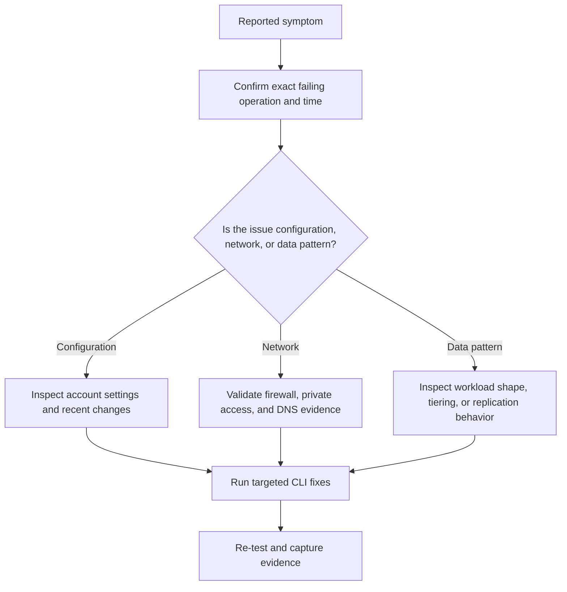

---
content_sources:
  diagrams:
    - id: troubleshooting-playbooks-blob-access-denied
      type: flowchart
      source: mslearn-adapted
      mslearn_url: https://learn.microsoft.com/en-us/azure/storage/common/storage-network-security
---

# Blob Access Denied

Use this playbook when Blob operations return 403, AuthorizationPermissionMismatch, AuthenticationFailed, or a misleading “resource not found” symptom caused by blocked network paths. The most common root causes are SAS scope drift, missing RBAC assignments, firewall rules, or unresolved Private Endpoint DNS.

## Symptoms

- Applications receive HTTP 403 when listing containers or reading blobs.
- AzCopy works from one subnet but not another.
- Portal browsing succeeds for admins but workloads fail through code or automation.
- Requests suddenly fail after a SAS rotation, RBAC change, or private networking rollout.

## Diagnostic Flowchart

<!-- diagram-id: troubleshooting-playbooks-blob-access-denied -->


## Step-by-Step Resolution

1. Identify the exact storage account, container or share, operation, time window, and calling identity.
2. Confirm whether the symptom is isolated to one client, one subnet, one prefix, or the whole account.
3. Check the current storage account configuration and compare it with the last known-good state.
4. Use KQL to collect evidence before making changes so the eventual root cause is explainable.
5. Apply the smallest safe fix first and re-test from the original failing path.
6. Update long-term controls so the incident does not recur silently.

### Resolution detail

- Validate that the issue is reproducible now, not only historical.
- Compare management-plane changes in Azure Activity with the incident timeline.
- Review whether a security, lifecycle, replication, or performance assumption changed without broad communication.
- Prefer reversible changes first, especially during business hours.
- After recovery, capture the design or governance control that would have prevented the issue.

## KQL Queries for Diagnostics

### Recent 403 blob operations

```kusto
StorageBlobLogs
| where TimeGenerated > ago(4h)
| where StatusCode == 403
| project TimeGenerated, AccountName, AuthenticationType, OperationName, StatusText, CallerIpAddress, Uri
| order by TimeGenerated desc
```

**How to read it**:

- Focus on AuthenticationType to distinguish SAS, OAuth, or account key paths.
- Compare CallerIpAddress with the expected source network.
- Correlate the time range with the exact complaint window and any recent configuration change.
### Firewall and deny trend

```kusto
StorageBlobLogs
| where TimeGenerated > ago(24h)
| where StatusCode in (403, 409)
| summarize Count=count() by StatusText, CallerIpAddress, bin(TimeGenerated, 30m)
| order by TimeGenerated desc
```

**How to read it**:

- A spike from a single IP often indicates firewall or route changes.
- Mixed StatusText values can mean both auth and network controls are involved.
- Correlate the time range with the exact complaint window and any recent configuration change.
### RBAC-related control plane changes

```kusto
AzureActivity
| where TimeGenerated > ago(7d)
| where OperationNameValue has_any ("roleAssignments/write", "storageAccounts/write")
| project TimeGenerated, OperationNameValue, ActivityStatusValue, Caller, ResourceGroup, ResourceId
| order by TimeGenerated desc
```

**How to read it**:

- Use this to correlate role assignment changes with the first failure time.
- Storage account writes often reveal public-network-access or firewall changes.
- Correlate the time range with the exact complaint window and any recent configuration change.

## CLI Commands for Fixes

### Fix step 1: Inspect current network and auth posture

```bash
az storage account show \
    --resource-group $RG \
    --name $STORAGE_NAME \
    --query "{publicNetworkAccess:publicNetworkAccess,allowBlobPublicAccess:allowBlobPublicAccess,defaultAction:networkRuleSet.defaultAction}" \
    --output json
```

- Record the command output in the incident timeline.
- Re-test from the same client identity and network path that originally failed.
- If the change is temporary, document the rollback and a permanent follow-up action.
### Fix step 2: Assign a Blob data role to the workload identity

```bash
az role assignment create \
    --assignee-object-id $PRINCIPAL_ID \
    --assignee-principal-type ServicePrincipal \
    --role "Storage Blob Data Reader" \
    --scope $(az storage account show --resource-group $RG --name $STORAGE_NAME --query id --output tsv) \
    --output json
```

- Record the command output in the incident timeline.
- Re-test from the same client identity and network path that originally failed.
- If the change is temporary, document the rollback and a permanent follow-up action.
### Fix step 3: Allow the expected subnet when public access remains enabled by policy

```bash
az storage account network-rule add \
    --resource-group $RG \
    --account-name $STORAGE_NAME \
    --subnet $SUBNET_ID \
    --output json
```

- Record the command output in the incident timeline.
- Re-test from the same client identity and network path that originally failed.
- If the change is temporary, document the rollback and a permanent follow-up action.
### Fix step 4: Generate a user delegation SAS for short-lived troubleshooting validation

```bash
az storage container generate-sas \
    --as-user \
    --auth-mode login \
    --account-name $STORAGE_NAME \
    --name $CONTAINER_NAME \
    --permissions rl \
    --expiry 2026-12-31T23:00Z \
    --https-only \
    --output tsv
```

- Record the command output in the incident timeline.
- Re-test from the same client identity and network path that originally failed.
- If the change is temporary, document the rollback and a permanent follow-up action.

## Prevention Checklist

- [ ] The ownership of this storage account and its policies is documented.
- [ ] Monitoring exists for the symptom class described in this playbook.
- [ ] Teams use long-lived credentials only by exception and with review.
- [ ] Private networking, DNS, and route dependencies are documented where relevant.
- [ ] Blob lifecycle and access tier behavior are explained to data owners.
- [ ] Premium storage or scale-out decisions are backed by measured evidence.
- [ ] Change control captures storage account setting updates that alter runtime behavior.
- [ ] The runbook includes validation and rollback steps.

## See Also

- [Security Best Practices](../../best-practices/security-best-practices.md)
- [Networking Best Practices](../../best-practices/networking-best-practices.md)
- [Authorization Failures](security/authorization-failures.md)

## Sources

- [azure/storage/common/storage-network-security](https://learn.microsoft.com/en-us/azure/storage/common/storage-network-security)
- [azure/storage/common/storage-private-endpoints](https://learn.microsoft.com/en-us/azure/storage/common/storage-private-endpoints)
- [azure/storage/blobs/security-recommendations](https://learn.microsoft.com/en-us/azure/storage/blobs/security-recommendations)
