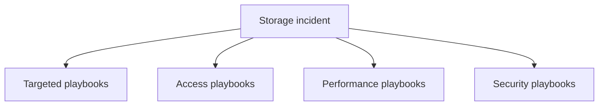

---
content_sources:
  diagrams:
    - id: troubleshooting-playbooks-index
      type: flowchart
      source: mslearn-adapted
      mslearn_url: https://learn.microsoft.com/en-us/azure/storage/
---

# Playbooks

These playbooks give operators focused, symptom-first guidance for recurring Azure Storage incidents. Start with the targeted playbooks below when the failure mode is already known, then move into the broader access, performance, or security collections if you need deeper branching guidance.

<!-- diagram-id: troubleshooting-playbooks-index -->

## Targeted Playbooks

| Playbook | Primary symptom | First things to verify |
|---|---|---|
| [Blob Access Denied](blob-access-denied.md) | 403, blocked SAS, RBAC, firewall, or private access failures | Identity path, SAS scope, firewall, DNS |
| [Storage Throttling](storage-throttling.md) | ServerBusy, 503, latency spikes, IOPS or throughput pressure | Metrics, request distribution, concurrency |
| [Replication Lag Issues](replication-lag-issues.md) | Secondary reads appear stale or DR expectations are unclear | Replication model, primary write health, failover readiness |
| [Lifecycle Policy Not Working](lifecycle-policy-not-working.md) | Tier moves or deletes do not happen on schedule | Policy scope, blob age, recovery features |

## Access

| Playbook | Primary Symptom |
|---|---|
| [Cannot Access Storage Account](access/cannot-access-storage-account.md) | endpoint cannot be reached |
| [Private Endpoint and DNS Issues](access/private-endpoint-and-dns-issues.md) | private path resolves or routes incorrectly |
| [File Share Mount Issues](access/file-share-mount-issues.md) | SMB or NFS mount fails |
| [Public vs Private Access Confusion](access/public-vs-private-access-confusion.md) | wrong route chosen between public and private access |

## Performance

| Playbook | Primary Symptom |
|---|---|
| [Slow Upload / Download](performance/slow-upload-download.md) | transfer throughput is unexpectedly low |
| [Throttling and Performance Issues](performance/throttling-and-performance-issues.md) | 429, 503, or burst-driven latency |
| [Data Protection and Recovery Issues](performance/data-protection-and-recovery-issues.md) | deleted or overwritten data needs recovery |

## Security

| Playbook | Primary Symptom |
|---|---|
| [Authorization Failures](security/authorization-failures.md) | 403 or data-plane permission failure |
| [SAS and Token Issues](security/sas-and-token-issues.md) | SAS or token-specific rejection |

## See Also

- [Troubleshooting Home](../index.md)
- [First 10 Minutes Checklists](../first-10-minutes/index.md)
- [Decision Tree](../decision-tree.md)
- [Evidence Map](../evidence-map.md)

## Sources

- [azure/storage/](https://learn.microsoft.com/en-us/azure/storage/)
- [troubleshoot/azure/azure-storage/blobs/alerts/storage-monitoring-diagnosing-troubleshooting](https://learn.microsoft.com/en-us/troubleshoot/azure/azure-storage/blobs/alerts/storage-monitoring-diagnosing-troubleshooting)
