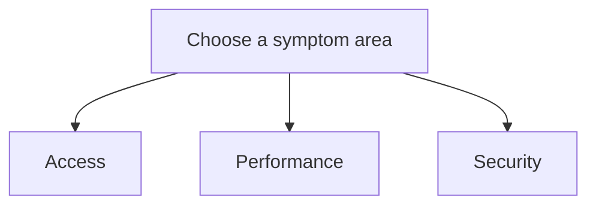

# Playbooks

These are the canonical troubleshooting playbooks for Azure Storage. Each one is symptom-first, hypothesis-driven, and structured for evidence-backed mitigation.

## Access

| Playbook | Primary Symptom |
|---|---|
| [Cannot Access Storage Account](access/cannot-access-storage-account.md) | endpoint cannot be reached |
| [Private Endpoint and DNS Issues](access/private-endpoint-and-dns-issues.md) | private path resolves or routes incorrectly |
| [File Share Mount Issues](access/file-share-mount-issues.md) | SMB or NFS mount fails |
| [Public vs Private Access Confusion](access/public-vs-private-access-confusion.md) | wrong route chosen between public and private access |

## Performance

| Playbook | Primary Symptom |
|---|---|
| [Slow Upload / Download](performance/slow-upload-download.md) | transfer throughput is unexpectedly low |
| [Throttling and Performance Issues](performance/throttling-and-performance-issues.md) | 429, 503, or burst-driven latency |
| [Data Protection and Recovery Issues](performance/data-protection-and-recovery-issues.md) | deleted or overwritten data needs recovery |

## Security

| Playbook | Primary Symptom |
|---|---|
| [Authorization Failures](security/authorization-failures.md) | 403 or data-plane permission failure |
| [SAS and Token Issues](security/sas-and-token-issues.md) | SAS or token-specific rejection |

## See Also

- [Troubleshooting Home](../index.md)
- [First 10 Minutes Checklists](../first-10-minutes/index.md)
- [Decision Tree](../decision-tree.md)
- [Evidence Map](../evidence-map.md)

## Sources

- [Monitor and troubleshoot Azure Storage](https://learn.microsoft.com/en-us/troubleshoot/azure/azure-storage/blobs/alerts/storage-monitoring-diagnosing-troubleshooting)
- [Troubleshoot storage client application errors](https://learn.microsoft.com/en-us/troubleshoot/azure/azure-storage/blobs/alerts/troubleshoot-storage-client-application-errors)
