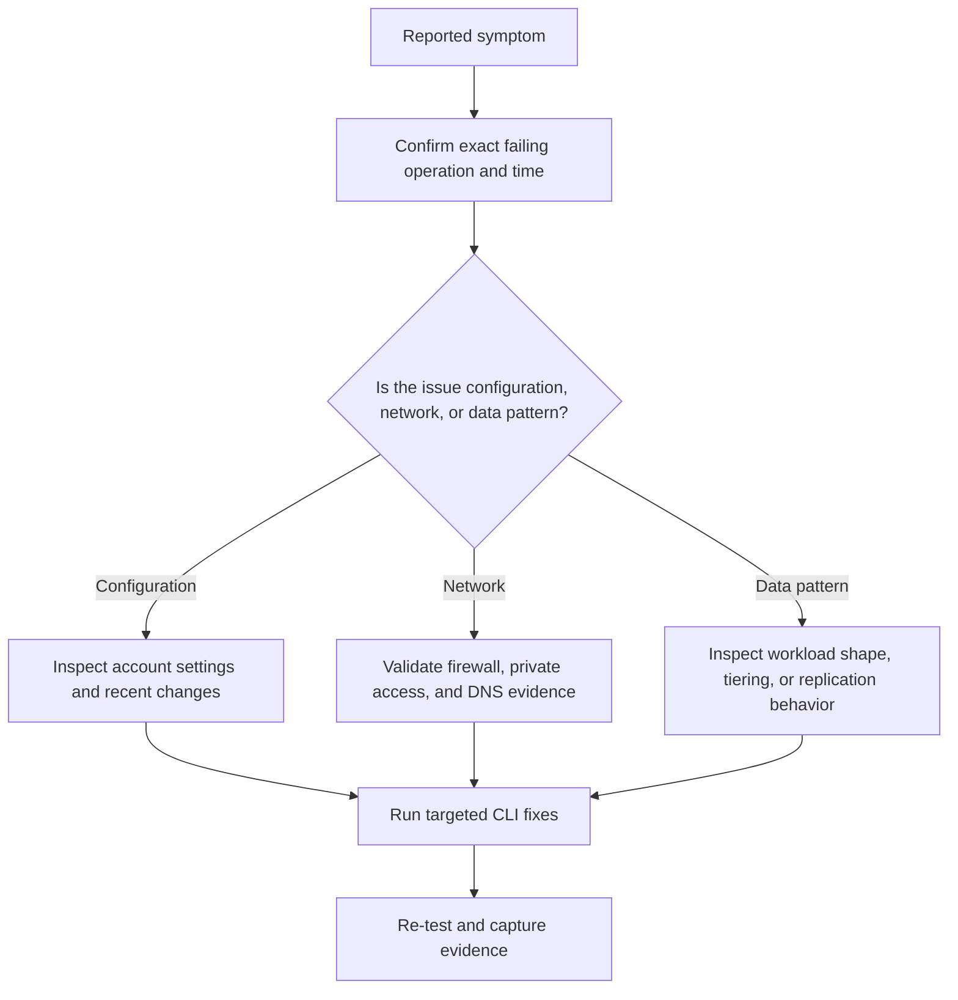

---
hide:
  - toc
content_sources:
  diagrams:
    - id: troubleshooting-playbooks-lifecycle-policy-not-working
      type: flowchart
      source: mslearn-adapted
      mslearn_url: https://learn.microsoft.com/en-us/azure/storage/blobs/lifecycle-management-overview
---

# Lifecycle Policy Not Working

Use this playbook when Blob management policies were created successfully but objects do not transition tiers or delete on the expected schedule. In most cases the policy is valid, yet the scope, blob type, age condition, last-access assumptions, or recovery controls were misunderstood.

## Symptoms

- Blobs remain in Hot even though a move-to-Cool or move-to-Archive policy exists.
- Deletion never happens for expired objects.
- A test object moved but the production dataset did not because the prefix or tags did not match.
- Policy changes were made, but teams expected immediate retroactive movement rather than periodic evaluation.

## Diagnostic Flowchart

<!-- diagram-id: troubleshooting-playbooks-lifecycle-policy-not-working -->


## Step-by-Step Resolution

1. Identify the exact storage account, container or share, operation, time window, and calling identity.
2. Confirm whether the symptom is isolated to one client, one subnet, one prefix, or the whole account.
3. Check the current storage account configuration and compare it with the last known-good state.
4. Use KQL to collect evidence before making changes so the eventual root cause is explainable.
5. Apply the smallest safe fix first and re-test from the original failing path.
6. Update long-term controls so the incident does not recur silently.

### Resolution detail

- Validate that the issue is reproducible now, not only historical.
- Compare management-plane changes in Azure Activity with the incident timeline.
- Review whether a security, lifecycle, replication, or performance assumption changed without broad communication.
- Prefer reversible changes first, especially during business hours.
- After recovery, capture the design or governance control that would have prevented the issue.

## KQL Queries for Diagnostics

### Policy-related control-plane writes

```kusto
AzureActivity
| where TimeGenerated > ago(7d)
| where OperationNameValue has_any ("managementPolicies/write", "storageAccounts/write")
| project TimeGenerated, OperationNameValue, ActivityStatusValue, Caller, ResourceId
| order by TimeGenerated desc
```

**How to read it**:

- Use this to confirm when the policy was last changed.
- Unexpected recent updates may explain why behavior differs from documentation.
- Correlate the time range with the exact complaint window and any recent configuration change.
### Candidate blobs that still look active

```kusto
StorageBlobLogs
| where TimeGenerated > ago(30d)
| summarize LastSeen=max(TimeGenerated) by Uri
| order by LastSeen desc
```

**How to read it**:

- Objects touched recently may not satisfy age-based lifecycle rules.
- Use with prefix knowledge to compare expected versus actual scope.
- Correlate the time range with the exact complaint window and any recent configuration change.
### Tier distribution snapshot

```kusto
StorageBlobLogs
| where TimeGenerated > ago(14d)
| summarize Requests=count() by AccessTier=tostring(parse_url(Uri).Path), StatusCode
| order by Requests desc
```

**How to read it**:

- This is a coarse operational signal to see whether tier transitions changed observed access patterns.
- Combine with direct CLI inspection of blob properties for precise evidence.
- Correlate the time range with the exact complaint window and any recent configuration change.

## CLI Commands for Fixes

### Fix step 1: Inspect the active management policy

```bash
az storage account management-policy show \
    --resource-group $RG \
    --account-name $STORAGE_NAME \
    --output json
```

- Record the command output in the incident timeline.
- Re-test from the same client identity and network path that originally failed.
- If the change is temporary, document the rollback and a permanent follow-up action.
### Fix step 2: Apply a corrected management policy file

```bash
az storage account management-policy create \
    --resource-group $RG \
    --account-name $STORAGE_NAME \
    --policy @lifecycle-policy.json \
    --output json
```

- Record the command output in the incident timeline.
- Re-test from the same client identity and network path that originally failed.
- If the change is temporary, document the rollback and a permanent follow-up action.
### Fix step 3: Inspect a sample blob for tier, last-modified, and rehydration state

```bash
az storage blob show \
    --account-name $STORAGE_NAME \
    --container-name $CONTAINER_NAME \
    --name $BLOB_NAME \
    --auth-mode login \
    --output json
```

- Record the command output in the incident timeline.
- Re-test from the same client identity and network path that originally failed.
- If the change is temporary, document the rollback and a permanent follow-up action.
### Fix step 4: Verify recovery features before enabling delete rules

```bash
az storage account blob-service-properties show \
    --account-name $STORAGE_NAME \
    --resource-group $RG \
    --output json
```

- Record the command output in the incident timeline.
- Re-test from the same client identity and network path that originally failed.
- If the change is temporary, document the rollback and a permanent follow-up action.

## Prevention Checklist

- [ ] The ownership of this storage account and its policies is documented.
- [ ] Monitoring exists for the symptom class described in this playbook.
- [ ] Teams use long-lived credentials only by exception and with review.
- [ ] Private networking, DNS, and route dependencies are documented where relevant.
- [ ] Blob lifecycle and access tier behavior are explained to data owners.
- [ ] Premium storage or scale-out decisions are backed by measured evidence.
- [ ] Change control captures storage account setting updates that alter runtime behavior.
- [ ] The runbook includes validation and rollback steps.

## See Also

- [Lifecycle Management Best Practices](../../best-practices/lifecycle-management-best-practices.md)
- [Manage Lifecycle Policies](../../operations/manage-lifecycle-policies.md)
- [Blob Best Practices](../../best-practices/blob-best-practices.md)

## Sources

- [azure/storage/blobs/lifecycle-management-overview](https://learn.microsoft.com/en-us/azure/storage/blobs/lifecycle-management-overview)
- [azure/storage/blobs/storage-lifecycle-management-concepts](https://learn.microsoft.com/en-us/azure/storage/blobs/storage-lifecycle-management-concepts)
- [azure/storage/blobs/soft-delete-blob-overview](https://learn.microsoft.com/en-us/azure/storage/blobs/soft-delete-blob-overview)
