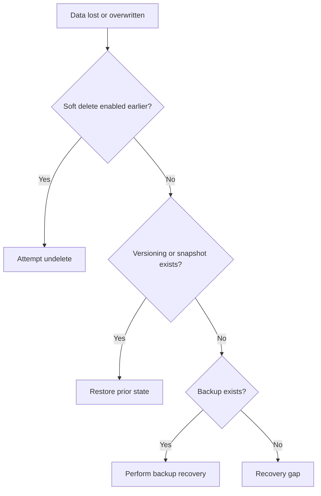

---
content_sources:
  diagrams:
    - id: troubleshooting-playbooks-performance-data-protection-and-recovery-issues
      type: flowchart
      source: mslearn-adapted
      mslearn_url: https://learn.microsoft.com/en-us/azure/storage/blobs/soft-delete-blob-overview#restoring-soft-deleted-blobs
---

# Data Protection and Recovery Issues

## 1. Summary

Recovery incidents are decided less by the current outage state and more by whether protective features such as soft delete, versioning, snapshots, or backup were enabled before data loss.

<!-- diagram-id: troubleshooting-playbooks-performance-data-protection-and-recovery-issues -->

## 2. Common Misreadings

- Assuming recovery can be enabled after the incident and still help.
- Confusing redundancy with backup.
- Restoring in place without validating overwrite risk.

## 3. Competing Hypotheses

- **H1**: Soft delete retention still covers the deleted object.
- **H2**: Versioning or snapshots can restore a previous good state.
- **H3**: Backup or another recovery control is available.
- **H4**: No recovery feature covered the incident window.

## 4. What to Check First

- Exact incident time and affected objects.
- Whether soft delete, versioning, snapshots, or backup were enabled before that time.
- Current retention window.
- Restore target strategy to avoid overwriting healthy data.

## 5. Evidence to Collect

- Object path or share/path impacted.
- Retention and protection settings.
- Available versions, snapshots, or backups.
- Business validation of the last known good state.

## 6. Validation and Disproof by Hypothesis

### H1: Soft delete can recover it
- **Support**: delete occurred inside retention window and object is still recoverable.
- **Weaken**: feature was disabled or retention expired before response.

### H2: Versioning or snapshot exists
- **Support**: previous version/snapshot matches the needed recovery point.
- **Weaken**: no usable previous state exists.

### H3: Backup is available
- **Support**: backup policy covered the data and restore points exist.
- **Weaken**: backup scope excluded the affected data or restore point is too old.

### H4: Recovery gap
- **Support**: none of the required protections existed at incident time.
- **Weaken**: any confirmed recoverable artifact is available.

## 7. Likely Root Cause Patterns

- Soft delete or versioning not enabled in advance.
- Retention too short for operational recovery needs.
- Confusion between durability and recoverability.
- Restore attempted without isolating current valid data.

## 8. Immediate Mitigations

- Recover using the safest available mechanism.
- Restore to an alternate location if overwrite risk exists.
- Freeze further destructive changes until validation is complete.

## 9. Prevention

- Enable and periodically test the right protection features.
- Align retention windows with business recovery objectives.
- Treat backup, versioning, and soft delete as design decisions, not emergency switches.

## See Also

- [Backup and Data Protection](../../../operations/backup-and-data-protection.md)
- [Redundancy and DR Best Practices](../../../best-practices/redundancy-and-dr-best-practices.md)
- [Redundancy Options](../../../reference/redundancy-options.md)

## Sources

- [Recovering deleted blobs](https://learn.microsoft.com/en-us/azure/storage/blobs/soft-delete-blob-overview#restoring-soft-deleted-blobs)
- [Overview of Azure Blobs backup](https://learn.microsoft.com/en-us/azure/backup/blob-backup-overview)
