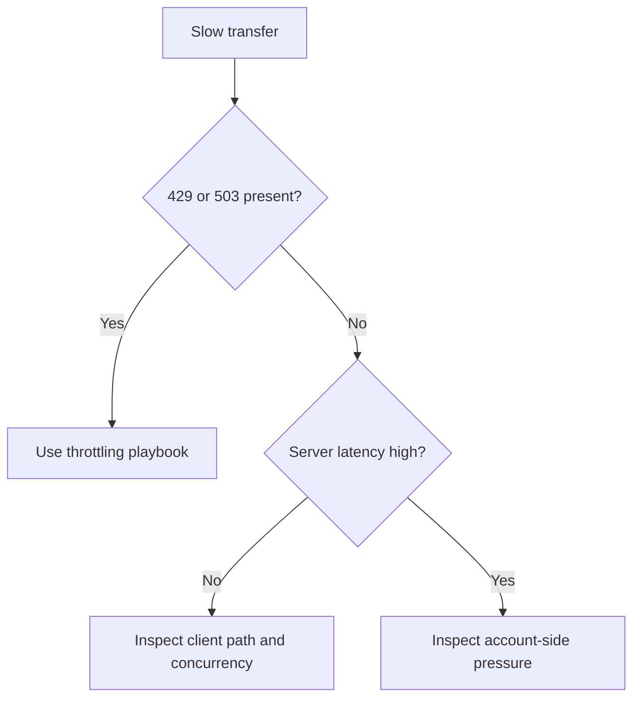

# Slow Upload / Download

## 1. Summary

Slow transfer problems are often caused by client-side design choices such as low concurrency, many small files, or long RTT rather than by storage account throttling.

## 2. Common Misreadings

- Assuming low throughput always means the account is throttling.
- Measuring only average speed without checking object size mix.
- Using a single-thread copy test to judge platform capacity.

## 3. Competing Hypotheses

- **H1**: Client network or regional distance is the bottleneck.
- **H2**: Transfer design is inefficient for many small objects.
- **H3**: Concurrency is too low.
- **H4**: The storage account is actually under pressure.

## 4. What to Check First

- RTT and location of the client relative to the storage region.
- Whether 429 or 503 exists during the slow transfer window.
- SuccessServerLatency versus end-to-end latency.
- Object count, average object size, and concurrency settings.

## 5. Evidence to Collect

- Metrics for SuccessE2ELatency, SuccessServerLatency, Ingress, and Egress.
- Transfer tool and concurrency configuration.
- Representative file size distribution.
- Sanitized timing for a known sample transfer.

## 6. Validation and Disproof by Hypothesis

### H1: Client path bottleneck
- **Support**: end-to-end latency is high while server latency stays low.
- **Weaken**: server latency and transaction pressure also rise sharply.

### H2: Small-file inefficiency
- **Support**: workload contains many tiny files and performs much better when batched or parallelized.
- **Weaken**: large sequential objects are equally slow.

### H3: Low concurrency
- **Support**: throughput improves significantly after increasing parallelism.
- **Weaken**: higher concurrency produces no meaningful improvement.

### H4: Account pressure
- **Support**: throttling indicators, high server latency, or reduced availability appear.
- **Weaken**: account metrics stay healthy throughout the transfer.

## 7. Likely Root Cause Patterns

- Single-thread or under-parallelized copy.
- Small-file heavy transfer set.
- Region distance and client bandwidth limit.
- Hidden throttling during burst windows.

## 8. Immediate Mitigations

- Increase transfer concurrency carefully.
- Batch or archive small files when possible.
- Move compute closer to the storage region.
- Shift to [throttling investigation](throttling-and-performance-issues.md) if server pressure appears.

## 9. Prevention

- Baseline transfer tooling and concurrency settings.
- Test representative datasets instead of one-file samples.
- Monitor server latency separately from client-perceived latency.

## See Also

- [Throttling and Performance Issues](throttling-and-performance-issues.md)
- [AzCopy and Data Movement](../../../operations/azcopy-and-data-movement.md)
- [Performance Best Practices](../../../best-practices/performance-best-practices.md)

## Sources

- [Azure Blob Storage performance checklist](https://learn.microsoft.com/en-us/azure/storage/blobs/storage-performance-checklist)
- [Optimize AzCopy performance](https://learn.microsoft.com/en-us/azure/storage/common/storage-use-azcopy-optimize)
