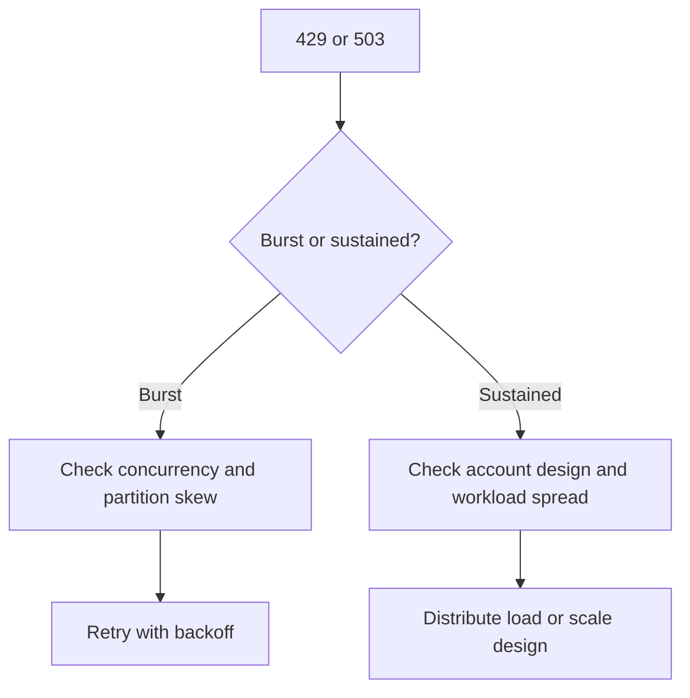

---
hide:
  - toc
content_sources:
  diagrams:
    - id: troubleshooting-playbooks-performance-throttling-and-performance-issues
      type: flowchart
      source: mslearn-adapted
      mslearn_url: https://learn.microsoft.com/en-us/azure/storage/common/scalability-targets-standard-account
---

# Throttling and Performance Issues

## 1. Summary

When Azure Storage returns 429 or 503, the investigation should focus on request shape, burst concurrency, and whether pressure is account-wide or concentrated on a hot path.

<!-- diagram-id: troubleshooting-playbooks-performance-throttling-and-performance-issues -->

## 2. Common Misreadings

- Treating retries as a fix instead of as evidence of pressure.
- Looking only at average latency instead of server latency and transaction bursts.
- Ignoring partition or object hot spots.

## 3. Competing Hypotheses

- **H1**: Burst concurrency is exceeding service tolerance.
- **H2**: Workload is concentrated on hot partitions or objects.
- **H3**: Retry behavior is amplifying pressure.
- **H4**: The issue is really client inefficiency rather than account throttling.

## 4. What to Check First

- Presence of 429 or 503 in the same time window.
- Transaction count and availability trend.
- SuccessServerLatency versus SuccessE2ELatency.
- Retry implementation and burst shape.

## 5. Evidence to Collect

- Metrics around the incident window.
- Request volume pattern and concurrency level.
- Object or partition access concentration.
- Retry policy behavior from client logs or code path.

## 6. Validation and Disproof by Hypothesis

### H1: Burst concurrency pressure
- **Support**: sharp traffic spikes align with 429/503.
- **Weaken**: moderate steady load with no burst pattern.

### H2: Hot partition or object
- **Support**: throttling clusters around one prefix, object, or narrow key range.
- **Weaken**: pressure is evenly distributed.

### H3: Retry amplification
- **Support**: retries multiply immediately after first failures and deepen the spike.
- **Weaken**: well-spaced exponential backoff already exists.

### H4: Not really throttling
- **Support**: 429/503 absent and server latency remains low.
- **Weaken**: explicit throttle codes and server latency growth are present.

## 7. Likely Root Cause Patterns

- Sudden parallel request bursts.
- Uneven workload distribution.
- Aggressive retries without jitter.
- Latency-sensitive and batch workloads sharing the same path.

## 8. Immediate Mitigations

- Add exponential backoff with jitter.
- Reduce burst concurrency.
- Spread load across partitions or accounts where appropriate.
- Isolate batch traffic from latency-sensitive traffic.

## 9. Prevention

- Load test with realistic burst patterns.
- Design object naming and partition use for even distribution.
- Monitor throttle-related metrics continuously.

## See Also

- [Slow Upload / Download](slow-upload-download.md)
- [Monitoring and Alerting](../../../operations/monitoring-and-alerting.md)
- [Performance Terms](../../../reference/performance-terms.md)

## Sources

- [Scalability and performance targets for standard storage accounts](https://learn.microsoft.com/en-us/azure/storage/common/scalability-targets-standard-account)
- [Scalability and performance targets for Blob Storage](https://learn.microsoft.com/en-us/azure/storage/blobs/scalability-targets)
