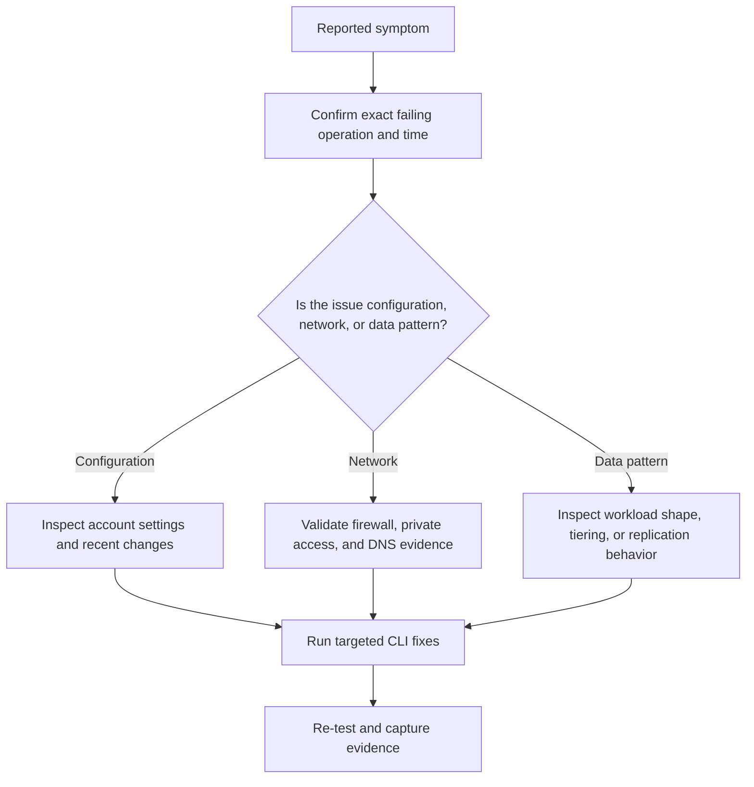

# Replication Lag Issues

Use this playbook when teams expect near-immediate data visibility in a secondary region, read from RA-GRS or RA-GZRS secondaries and see stale results, or question whether failover is safe. Replication is asynchronous for geo-redundant options, so incidents usually come from misunderstanding lag and failover behavior.

## Symptoms

- A blob written in the primary region is not visible yet from the secondary endpoint.
- Disaster recovery tests fail because the application assumed synchronous cross-region replication.
- Teams debate whether to trigger failover without evidence about data freshness and business tolerance.
- Monitoring shows healthy primary writes but DR stakeholders worry about secondary-read consistency.

## Diagnostic Flowchart



## Step-by-Step Resolution

1. Identify the exact storage account, container or share, operation, time window, and calling identity.
2. Confirm whether the symptom is isolated to one client, one subnet, one prefix, or the whole account.
3. Check the current storage account configuration and compare it with the last known-good state.
4. Use KQL to collect evidence before making changes so the eventual root cause is explainable.
5. Apply the smallest safe fix first and re-test from the original failing path.
6. Update long-term controls so the incident does not recur silently.

### Resolution detail

- Validate that the issue is reproducible now, not only historical.
- Compare management-plane changes in Azure Activity with the incident timeline.
- Review whether a security, lifecycle, replication, or performance assumption changed without broad communication.
- Prefer reversible changes first, especially during business hours.
- After recovery, capture the design or governance control that would have prevented the issue.

## KQL Queries for Diagnostics

### Recent storage account configuration changes

```kusto
AzureActivity
| where TimeGenerated > ago(7d)
| where OperationNameValue has "Microsoft.Storage/storageAccounts"
| project TimeGenerated, OperationNameValue, ActivityStatusValue, Caller, ResourceId
| order by TimeGenerated desc
```

**How to read it**:

- Use this to see if replication settings changed before the reported issue.
- Unexpected writes can indicate a planned maintenance or configuration drift event.
- Correlate the time range with the exact complaint window and any recent configuration change.
### Primary write success baseline

```kusto
StorageBlobLogs
| where TimeGenerated > ago(4h)
| where StatusCode between (200 .. 299)
| summarize Writes=countif(OperationName has "Put"), Reads=countif(OperationName has "Get") by bin(TimeGenerated, 15m)
| order by TimeGenerated asc
```

**How to read it**:

- This establishes whether the primary side is healthy.
- If writes are failing in primary, the issue is not replication lag—it is an upstream service problem.
- Correlate the time range with the exact complaint window and any recent configuration change.
### Secondary-read symptom tracking

```kusto
StorageBlobLogs
| where TimeGenerated > ago(4h)
| where Uri has "-secondary" or RequesterAppId != ""
| summarize Requests=count(), Failures=countif(StatusCode >= 400) by StatusText, bin(TimeGenerated, 30m)
| order by TimeGenerated desc
```

**How to read it**:

- Secondary endpoint reads are the key evidence for stale-read complaints.
- Correlate this with application-side timestamps for freshness expectations.
- Correlate the time range with the exact complaint window and any recent configuration change.

## CLI Commands for Fixes

### Fix step 1: Inspect replication SKU and failover readiness

```bash
az storage account show \
    --resource-group $RG \
    --name $STORAGE_NAME \
    --query "{sku:sku.name,primaryLocation:primaryLocation,statusOfPrimary:statusOfPrimary,secondaryLocation:secondaryLocation,statusOfSecondary:statusOfSecondary}" \
    --output json
```

- Record the command output in the incident timeline.
- Re-test from the same client identity and network path that originally failed.
- If the change is temporary, document the rollback and a permanent follow-up action.
### Fix step 2: Use the secondary endpoint intentionally for read-only validation

```bash
az storage blob list \
    --account-name $STORAGE_NAME-secondary \
    --container-name $CONTAINER_NAME \
    --auth-mode login \
    --output table
```

- Record the command output in the incident timeline.
- Re-test from the same client identity and network path that originally failed.
- If the change is temporary, document the rollback and a permanent follow-up action.
### Fix step 3: Trigger account failover only with approved authority and data-loss acceptance

```bash
az storage account failover \
    --resource-group $RG \
    --name $STORAGE_NAME
```

- Record the command output in the incident timeline.
- Re-test from the same client identity and network path that originally failed.
- If the change is temporary, document the rollback and a permanent follow-up action.
### Fix step 4: Document application retry and stale-read handling before the next DR test

```bash
az storage account show \
    --resource-group $RG \
    --name $STORAGE_NAME \
    --output json
```

- Record the command output in the incident timeline.
- Re-test from the same client identity and network path that originally failed.
- If the change is temporary, document the rollback and a permanent follow-up action.

## Prevention Checklist

- [ ] The ownership of this storage account and its policies is documented.
- [ ] Monitoring exists for the symptom class described in this playbook.
- [ ] Teams use long-lived credentials only by exception and with review.
- [ ] Private networking, DNS, and route dependencies are documented where relevant.
- [ ] Blob lifecycle and access tier behavior are explained to data owners.
- [ ] Premium storage or scale-out decisions are backed by measured evidence.
- [ ] Change control captures storage account setting updates that alter runtime behavior.
- [ ] The runbook includes validation and rollback steps.

## See Also

- [Redundancy and DR Best Practices](../../best-practices/redundancy-and-dr-best-practices.md)
- [Redundancy Options](../../reference/redundancy-options.md)
- [Backup and Data Protection](../../operations/backup-and-data-protection.md)

## Sources

- [azure/storage/common/storage-redundancy](https://learn.microsoft.com/en-us/azure/storage/common/storage-redundancy)
- [azure/storage/common/storage-disaster-recovery-guidance](https://learn.microsoft.com/en-us/azure/storage/common/storage-disaster-recovery-guidance)
- [azure/storage/common/storage-designing-ha-apps-with-ragrs](https://learn.microsoft.com/en-us/azure/storage/common/storage-designing-ha-apps-with-ragrs)
