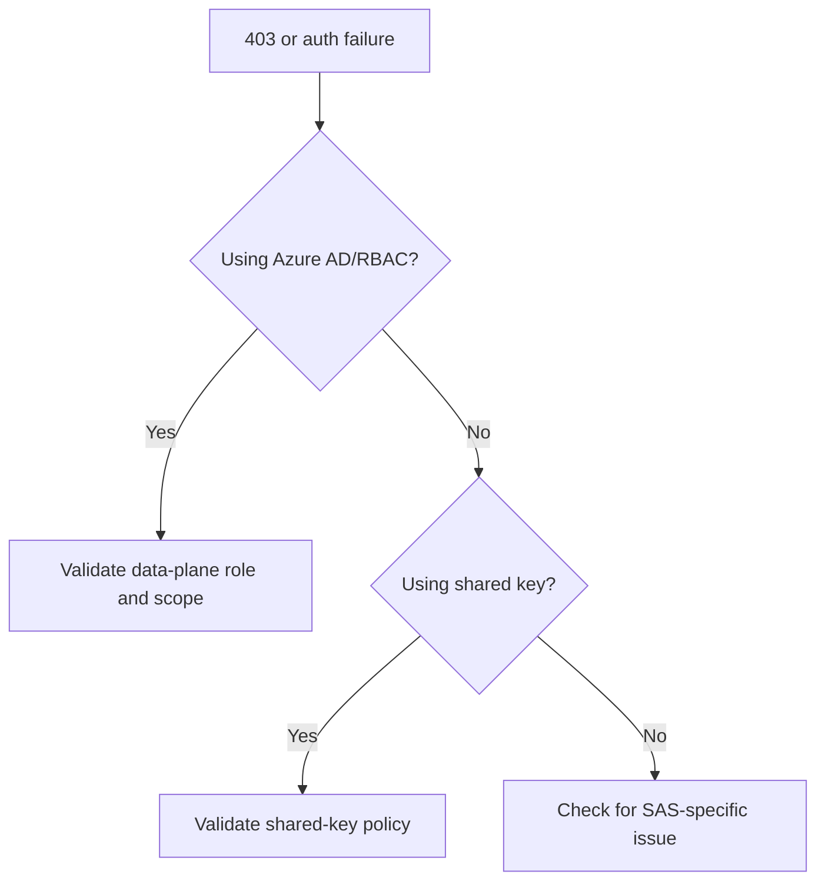

---
content_sources:
  diagrams:
    - id: troubleshooting-playbooks-security-authorization-failures
      type: flowchart
      source: mslearn-adapted
      mslearn_url: https://learn.microsoft.com/en-us/azure/storage/common/authorize-data-access
---

# Authorization Failures

## 1. Summary

Storage authorization failures are often caused by a mismatch between the chosen auth method and the required data-plane scope, not by a total lack of Azure permissions.

<!-- diagram-id: troubleshooting-playbooks-security-authorization-failures -->

## 2. Common Misreadings

- Assuming Contributor grants blob or file data access.
- Treating a network denial on the wrong endpoint as a pure auth issue.
- Forgetting that shared key may be disabled by policy.

## 3. Competing Hypotheses

- **H1**: Principal lacks the right data-plane RBAC role or scope.
- **H2**: Auth method does not match account policy.
- **H3**: Shared key or service policy is disabled or blocked.
- **H4**: Network rules are masking as an auth problem.

## 4. What to Check First

- Exact error code and auth method used.
- Tenant, audience, and token freshness when using Azure AD.
- Role assignment scope for the target container/share/account.
- Shared key access policy on the account.

## 5. Evidence to Collect

- Sanitized response code and message.
- Role assignment output for the principal.
- Account auth-related settings.
- DNS and network path if evidence is ambiguous.

## 6. Validation and Disproof by Hypothesis

### H1: RBAC scope problem
- **Support**: principal has no matching data-plane role at the required scope.
- **Weaken**: same identity succeeds against the same target path.

### H2: Wrong auth method
- **Support**: workload uses shared key where OAuth-only posture is enforced, or vice versa.
- **Weaken**: policy and auth method are aligned.

### H3: Shared key disabled
- **Support**: account policy disallows shared key and workload still relies on it.
- **Weaken**: shared key is allowed and properly configured.

### H4: Network masking
- **Support**: same request works from an allowed source or correct endpoint path.
- **Weaken**: network evidence is clean and auth-only failures remain.

## 7. Likely Root Cause Patterns

- Control-plane role mistaken for data-plane role.
- Wrong scope on a container or share operation.
- Shared key disabled unexpectedly.
- Mixed endpoint path causing misleading 403 interpretation.

## 8. Immediate Mitigations

- Grant the minimum correct data-plane role at the right scope.
- Switch the workload to the approved auth method.
- Restore or reconfigure account policy only if it matches governance intent.
- Re-test from the intended endpoint path.

## 9. Prevention

- Standardize on a preferred auth model per workload.
- Review data-plane role scopes during deployment.
- Validate network path and auth method together in runbooks.

## See Also

- [SAS and Token Issues](sas-and-token-issues.md)
- [Access Models](../../../platform/access-models.md)
- [Configure Access and Identity](../../../operations/configure-access-and-identity.md)

## Sources

- [Authorize access to data in Azure Storage](https://learn.microsoft.com/en-us/azure/storage/common/authorize-data-access)
- [Troubleshoot Azure RBAC for Azure Storage](https://learn.microsoft.com/en-us/azure/storage/common/storage-auth-aad-rbac-portal)
