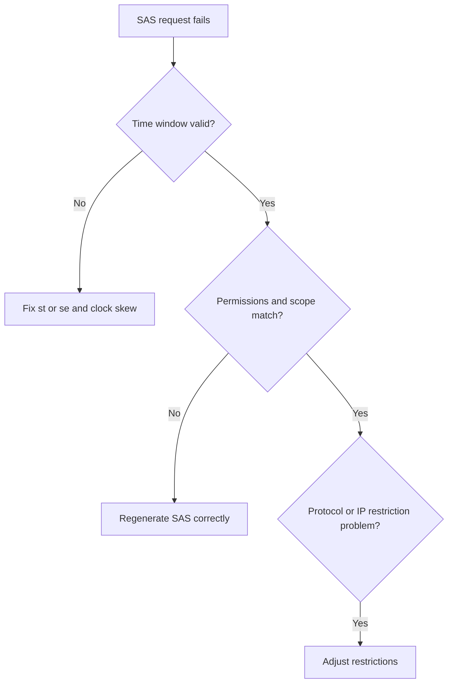

---
content_sources:
  diagrams:
    - id: troubleshooting-playbooks-security-sas-and-token-issues
      type: flowchart
      source: mslearn-adapted
      mslearn_url: https://learn.microsoft.com/en-us/azure/storage/common/storage-sas-overview
---

# SAS and Token Issues

## 1. Summary

SAS failures usually come from time-window, permission, scope, or restriction mismatches. The token often looks valid at a glance but is invalid for the exact request being made.

<!-- diagram-id: troubleshooting-playbooks-security-sas-and-token-issues -->

## 2. Common Misreadings

- Setting the SAS start time to the current second on skewed systems.
- Using a service SAS where account SAS scope is required, or the reverse.
- Forgetting that IP or protocol restrictions can silently invalidate a token.

## 3. Competing Hypotheses

- **H1**: SAS is expired or not yet valid.
- **H2**: Permission set does not match the attempted operation.
- **H3**: Resource scope is wrong.
- **H4**: IP or protocol restriction blocks usage.

## 4. What to Check First

- `st` and `se` values in UTC.
- Client clock skew.
- `sp` permissions and resource scope.
- `sip` and `spr` restrictions.

## 5. Evidence to Collect

- Sanitized SAS field breakdown.
- Error timestamp and client clock.
- Requested operation and target resource path.
- Key rotation or SAS regeneration history if relevant.

## 6. Validation and Disproof by Hypothesis

### H1: Time-window problem
- **Support**: request time falls before `st` or after `se`.
- **Weaken**: same SAS works consistently inside the same time window.

### H2: Permission mismatch
- **Support**: token lacks required `r`, `w`, `d`, or list permissions.
- **Weaken**: permission set clearly covers the attempted operation.

### H3: Scope mismatch
- **Support**: SAS created at account/container scope but used for another target type.
- **Weaken**: scope exactly matches the accessed resource.

### H4: Restriction mismatch
- **Support**: IP or protocol settings exclude the active client path.
- **Weaken**: request path and client source are within allowed limits.

## 7. Likely Root Cause Patterns

- Immediate token use with no clock-skew buffer.
- Wrong SAS type or scope.
- Missing permission flags.
- Hidden IP or HTTPS-only restriction mismatch.

## 8. Immediate Mitigations

- Regenerate SAS with correct scope and permissions.
- Add a safe clock-skew buffer.
- Remove unintended IP/protocol restrictions.
- Re-test with one sanitized known-good token.

## 9. Prevention

- Centralize SAS generation logic.
- Prefer short-lived tokens with tested templates.
- Validate time, permission, scope, and restriction fields in automation.

## See Also

- [Authorization Failures](authorization-failures.md)
- [Access Models](../../../platform/access-models.md)
- [Configure Access and Identity](../../../operations/configure-access-and-identity.md)

## Sources

- [Shared Access Signatures overview](https://learn.microsoft.com/en-us/azure/storage/common/storage-sas-overview)
- [Grant limited access to Azure Storage resources using SAS](https://learn.microsoft.com/en-us/azure/storage/common/storage-sas-overview#best-practices)
