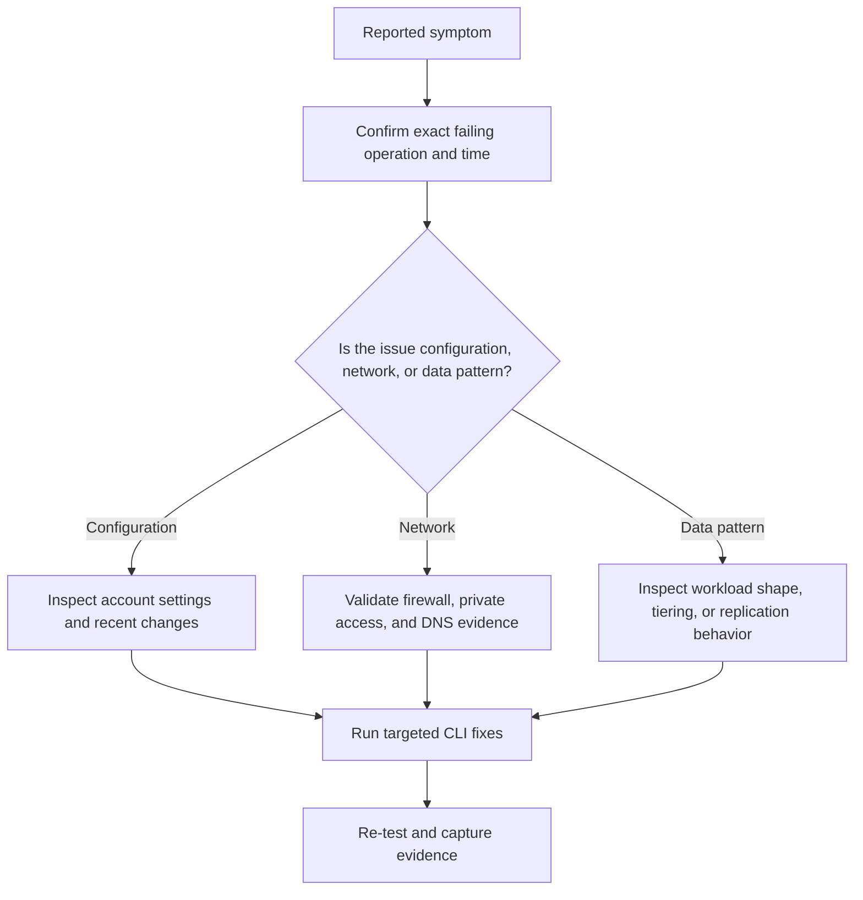

---
content_sources:
  diagrams:
    - id: troubleshooting-playbooks-storage-throttling
      type: flowchart
      source: mslearn-adapted
      mslearn_url: https://learn.microsoft.com/en-us/azure/storage/blobs/storage-performance-checklist
---

# Storage Throttling

Use this playbook when clients report ServerBusy, 429-like retry behavior, 503 responses, or sudden latency spikes during heavy upload, download, or file-share operations. The root cause is usually a mix of account limits, partition hotspots, concurrency overshoot, or cross-region traffic.

## Symptoms

- Latency climbs sharply during peak transfer windows.
- Clients report ServerBusy, 503, or SDK retries.
- One container or prefix performs poorly while the rest of the account looks healthy.
- Premium storage was added but the issue remained because request distribution never changed.

## Diagnostic Flowchart

<!-- diagram-id: troubleshooting-playbooks-storage-throttling -->


## Step-by-Step Resolution

1. Identify the exact storage account, container or share, operation, time window, and calling identity.
2. Confirm whether the symptom is isolated to one client, one subnet, one prefix, or the whole account.
3. Check the current storage account configuration and compare it with the last known-good state.
4. Use KQL to collect evidence before making changes so the eventual root cause is explainable.
5. Apply the smallest safe fix first and re-test from the original failing path.
6. Update long-term controls so the incident does not recur silently.

### Resolution detail

- Validate that the issue is reproducible now, not only historical.
- Compare management-plane changes in Azure Activity with the incident timeline.
- Review whether a security, lifecycle, replication, or performance assumption changed without broad communication.
- Prefer reversible changes first, especially during business hours.
- After recovery, capture the design or governance control that would have prevented the issue.

## KQL Queries for Diagnostics

### Server busy responses

```kusto
StorageBlobLogs
| where TimeGenerated > ago(4h)
| where StatusCode in (500, 503) or StatusText has_any ("ServerBusy", "OperationTimedOut")
| summarize Count=count() by StatusText, OperationName, bin(TimeGenerated, 15m)
| order by TimeGenerated desc
```

**How to read it**:

- Spikes during predictable transfer windows point to workload shape, not random failure.
- Separate read-heavy and write-heavy operation names to find the hot path.
- Correlate the time range with the exact complaint window and any recent configuration change.
### Account-level latency trend

```kusto
AzureMetrics
| where TimeGenerated > ago(6h)
| where ResourceProvider == "MICROSOFT.STORAGE"
| where MetricName in ("SuccessServerLatency", "SuccessE2ELatency", "Transactions")
| summarize AvgValue=avg(Average) by MetricName, bin(TimeGenerated, 15m)
| order by TimeGenerated asc
```

**How to read it**:

- Compare latency against transaction volume to see whether load and slowdowns move together.
- If volume is stable but latency spikes, check client network and region placement.
- Correlate the time range with the exact complaint window and any recent configuration change.
### Prefix or container concentration

```kusto
StorageBlobLogs
| where TimeGenerated > ago(2h)
| extend Container = tostring(split(Uri, "/")[3])
| summarize Requests=count() by Container, OperationName
| order by Requests desc
```

**How to read it**:

- A single container or prefix dominating requests is a hot-partition candidate.
- Use this with application naming analysis for remediation.
- Correlate the time range with the exact complaint window and any recent configuration change.

## CLI Commands for Fixes

### Fix step 1: Measure current SKU and replication configuration

```bash
az storage account show \
    --resource-group $RG \
    --name $STORAGE_NAME \
    --query "{sku:sku.name,kind:kind,accessTier:accessTier,location:primaryLocation}" \
    --output json
```

- Record the command output in the incident timeline.
- Re-test from the same client identity and network path that originally failed.
- If the change is temporary, document the rollback and a permanent follow-up action.
### Fix step 2: Move hot workloads to Premium BlockBlobStorage or Premium FileStorage when justified

```bash
az storage account update \
    --resource-group $RG \
    --name $STORAGE_NAME \
    --access-tier Hot \
    --output json
```

- Record the command output in the incident timeline.
- Re-test from the same client identity and network path that originally failed.
- If the change is temporary, document the rollback and a permanent follow-up action.
### Fix step 3: Use AzCopy with controlled concurrency during bulk transfers

```bash
azcopy copy "./dataset" "https://$STORAGE_NAME.blob.core.windows.net/$CONTAINER_NAME?<sas-token>" --recursive=true --cap-mbps=800
```

- Record the command output in the incident timeline.
- Re-test from the same client identity and network path that originally failed.
- If the change is temporary, document the rollback and a permanent follow-up action.
### Fix step 4: Scale out into separate accounts when limits or hotspots remain

```bash
az storage account create \
    --resource-group $RG \
    --name $STORAGE_NAME_ALT \
    --location $LOCATION \
    --sku Premium_LRS \
    --kind BlockBlobStorage \
    --output json
```

- Record the command output in the incident timeline.
- Re-test from the same client identity and network path that originally failed.
- If the change is temporary, document the rollback and a permanent follow-up action.

## Prevention Checklist

- [ ] The ownership of this storage account and its policies is documented.
- [ ] Monitoring exists for the symptom class described in this playbook.
- [ ] Teams use long-lived credentials only by exception and with review.
- [ ] Private networking, DNS, and route dependencies are documented where relevant.
- [ ] Blob lifecycle and access tier behavior are explained to data owners.
- [ ] Premium storage or scale-out decisions are backed by measured evidence.
- [ ] Change control captures storage account setting updates that alter runtime behavior.
- [ ] The runbook includes validation and rollback steps.

## See Also

- [Performance Best Practices](../../best-practices/performance-best-practices.md)
- [Slow Upload / Download](performance/slow-upload-download.md)
- [Performance and Scaling Basics](../../platform/performance-and-scaling-basics.md)

## Sources

- [azure/storage/blobs/storage-performance-checklist](https://learn.microsoft.com/en-us/azure/storage/blobs/storage-performance-checklist)
- [azure/storage/files/storage-files-scale-targets](https://learn.microsoft.com/en-us/azure/storage/files/storage-files-scale-targets)
- [azure/storage/common/scalability-targets-standard-account](https://learn.microsoft.com/en-us/azure/storage/common/scalability-targets-standard-account)
