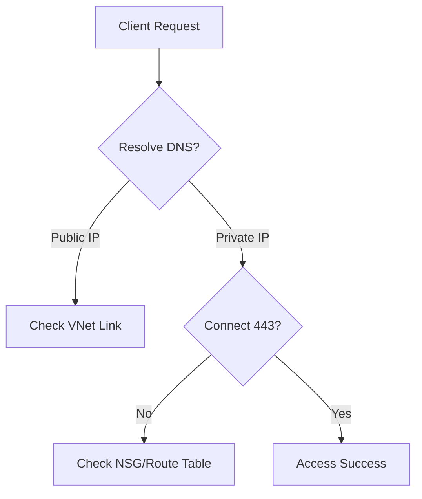

# Private Endpoint and DNS Issues

Troubleshoot Private Link connectivity and DNS resolution.

| DNS Checklist | Expected Result | Resolution |
|---------------|-----------------|------------|
| nslookup | Private IP (e.g., 10.x.x.x) | Link Private DNS Zone to VNet. |
| DNS Zone Name | `privatelink.blob.core.windows.net` | Create correct zone for service. |
| VNet Link | "Completed" status | Link VNet to Private DNS Zone. |
| Client Resolver | VNet DNS or Forwarder | Configure custom DNS forwarder. |

!!! warning
    The majority of Private Endpoint failures are caused by DNS misconfigurations leading to public IP resolution.

## Sources
- [Troubleshoot Private Endpoint DNS](https://learn.microsoft.com/en-us/azure/private-link/troubleshoot-private-endpoint-connectivity)
- [DNS resolution for storage](https://learn.microsoft.com/en-us/azure/storage/common/storage-private-endpoints?tabs=azure-portal#dns-configuration)
