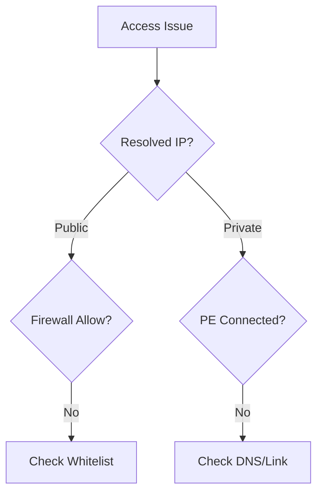

# Public vs Private Access Confusion

Resolve confusion between public and private network access.

| Scenario | Behavior | Diagnosis |
|----------|----------|-----------|
| No Access | Public off, no PE | Network path is blocked. |
| Resolves Public | PE exists, DNS public IP | DNS zone link missing. |
| Firewalled | Firewall + DNS mismatch | Add client IP or use PE. |
| Mixed Access | PE exists, Public on | Traffic routes by DNS. |

!!! tip
    Always check DNS resolution first to see which endpoint (public vs private) the client is trying to reach.

## Routing Validation Checklist

- Resolve endpoint and record returned IP type.
- Confirm whether client path should be public or private.
- Confirm firewall rules for public endpoint traffic.
- Confirm private endpoint DNS zone links and records.
- Confirm hybrid DNS forwarder behavior for privatelink zones.
- Confirm policy alignment for public network access setting.

## See Also

- [Networking and Private Access](../platform/networking-and-private-access.md)
- [Configure Network Rules](../operations/configure-network-rules.md)
- [Networking Best Practices](../best-practices/networking-best-practices.md)

## Sources
- [Configure private endpoints](https://learn.microsoft.com/en-us/azure/storage/common/storage-private-endpoints)
- [Managing storage firewalls](https://learn.microsoft.com/en-us/azure/storage/common/storage-network-security)
