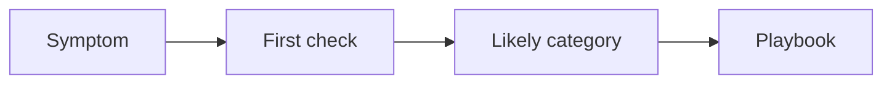

---
hide:
  - toc
---

# Quick Diagnosis Cards

Use these cards when you have less than a minute to decide which storage playbook to open first.

## Card 1: Cannot reach storage endpoint

| Step | Action |
|---|---|
| Symptom | Endpoint unreachable, timeout, or connection failure |
| First check | `nslookup` result and storage firewall rule set |
| What to look for | wrong public/private IP, firewall default deny, unapproved private endpoint |
| Playbook | [Cannot Access Storage Account](playbooks/access/cannot-access-storage-account.md) |

## Card 2: Private endpoint exists but traffic still fails

| Step | Action |
|---|---|
| Symptom | Private endpoint configured, but client still hits public route or fails name resolution |
| First check | private DNS zone, VNet link, returned IP |
| What to look for | public IP returned for a private access expectation |
| Playbook | [Private Endpoint and DNS Issues](playbooks/access/private-endpoint-and-dns-issues.md) |

## Card 3: 403 or permission denied

| Step | Action |
|---|---|
| Symptom | 403, AuthorizationFailure, authentication mismatch |
| First check | auth method, RBAC scope, shared-key policy |
| What to look for | control-plane role mistaken for data-plane role |
| Playbook | [Authorization Failures](playbooks/security/authorization-failures.md) |

## Card 4: SAS rejected

| Step | Action |
|---|---|
| Symptom | SAS token seems valid but request fails |
| First check | `st`, `se`, `sp`, scope, protocol, IP restriction |
| What to look for | expired or not-yet-valid SAS, wrong permissions, wrong resource scope |
| Playbook | [SAS and Token Issues](playbooks/security/sas-and-token-issues.md) |

## Card 5: Slow upload or download

| Step | Action |
|---|---|
| Symptom | Low throughput without obvious auth or DNS errors |
| First check | transfer concurrency, object size mix, regional RTT |
| What to look for | small-file penalty, single-thread transfer, distant client |
| Playbook | [Slow Upload / Download](playbooks/performance/slow-upload-download.md) |

## Card 6: 429 or 503 from storage

| Step | Action |
|---|---|
| Symptom | throttling, server busy, latency spikes under load |
| First check | Transactions, SuccessServerLatency, availability trend |
| What to look for | bursts beyond account or partition tolerance |
| Playbook | [Throttling and Performance Issues](playbooks/performance/throttling-and-performance-issues.md) |

## Card 7: Deleted or overwritten data

| Step | Action |
|---|---|
| Symptom | missing blob/file or need to roll back state |
| First check | soft delete, versioning, backup, retention window |
| What to look for | recovery feature existed before incident |
| Playbook | [Data Protection and Recovery Issues](playbooks/performance/data-protection-and-recovery-issues.md) |

## See Also

- [Decision Tree](decision-tree.md)
- [Evidence Map](evidence-map.md)
- [First 10 Minutes](first-10-minutes/index.md)
- [Playbooks](playbooks/index.md)

## Sources

- [Troubleshoot storage client application errors](https://learn.microsoft.com/en-us/troubleshoot/azure/azure-storage/blobs/alerts/troubleshoot-storage-client-application-errors)
- [Azure Blob Storage performance checklist](https://learn.microsoft.com/en-us/azure/storage/blobs/storage-performance-checklist)
- [Recovering deleted blobs](https://learn.microsoft.com/en-us/azure/storage/blobs/soft-delete-blob-overview#restoring-soft-deleted-blobs)
