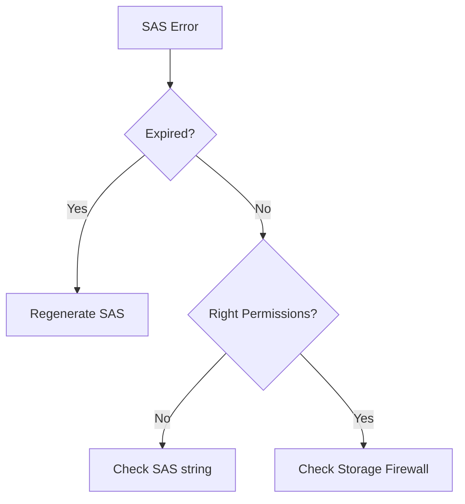

# SAS and Token Issues

Resolve authentication and validation failures with Shared Access Signatures.

!!! warning
    Avoid setting SAS start time to current time on skewed systems; allow a safety window to prevent immediate token rejection.

| SAS Failure | Cause | Resolution |
|-------------|-------|------------|
| Expired | Start/Expiry date | Re-generate SAS. |
| Clock Skew | Client/Server sync | Use +/- 15m buffer. |
| Wrong Permission | Missing 'r/w/d' | Check SAS definition. |
| Path Scope | SAS on wrong container | Re-generate at correct scope. |
| Service Mix | Service SAS vs Account SAS | Use appropriate SAS type. |

## Token Validation Checklist

- Confirm `st` and `se` time window is valid.
- Confirm UTC time sync on client and server.
- Confirm required permissions and resource type flags.
- Confirm SAS scope matches account, service, or object path.
- Confirm protocol and IP restrictions are intentional.
- Confirm signature regeneration after key rotation.

## See Also

- [Access Models](../platform/access-models.md)
- [Configure Access and Identity](../operations/configure-access-and-identity.md)
- [Authorization Failures](authorization-failures.md)

## Sources
- [Shared Access Signatures overview](https://learn.microsoft.com/en-us/azure/storage/common/storage-sas-overview)
- [Troubleshoot SAS errors](https://learn.microsoft.com/en-us/azure/storage/common/storage-sas-overview#best-practices)
