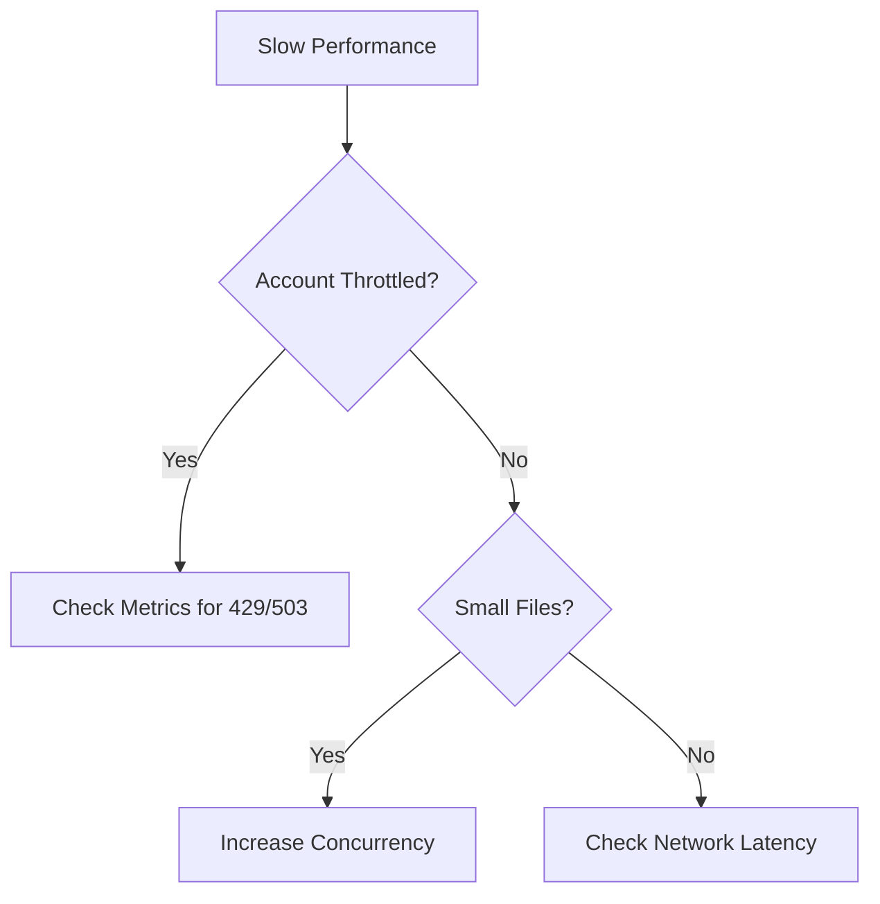

# Slow Upload / Download

Identify and resolve performance bottlenecks in data transfers.

!!! tip
    Measure client-side throughput and RTT first, then compare with storage account metrics to isolate the bottleneck layer.

| Potential Bottleneck | Cause | Resolution |
|----------------------|-------|------------|
| Client Network | Limited outbound BW | Increase client bandwidth. |
| Storage Throttle | Account limits reached | Scalability/Concurrency check. |
| Object Size | Many small files | Parallelize or archive. |
| Parallelism | Single thread usage | Use AzCopy with concurrency. |
| Region Distance | High latency (RTT) | Move client closer to region. |

## Performance Triage Checklist

- Measure baseline latency to target region.
- Check for 429 and 503 server responses.
- Increase transfer concurrency for small-file workloads.
- Validate VM size and disk throughput limits.
- Validate TCP window scaling and MTU path health.
- Test AzCopy tuning options on representative dataset.

## See Also

- [Performance Best Practices](../best-practices/performance-best-practices.md)
- [Performance Terms](../reference/performance-terms.md)
- [AzCopy and Data Movement](../operations/azcopy-and-data-movement.md)

## Sources
- [Storage performance checklist](https://learn.microsoft.com/en-us/azure/storage/blobs/storage-performance-checklist)
- [Optimize AzCopy performance](https://learn.microsoft.com/en-us/azure/storage/common/storage-use-azcopy-optimize)
