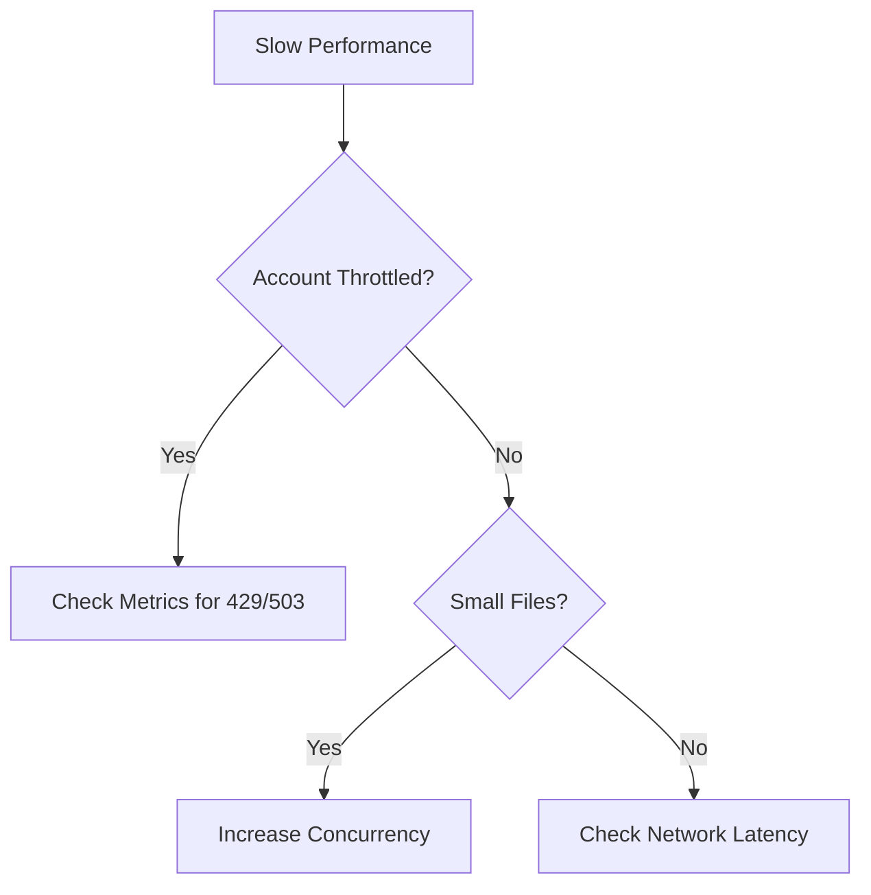

# Slow Upload / Download

Identify and resolve performance bottlenecks in data transfers.

| Potential Bottleneck | Cause | Resolution |
|----------------------|-------|------------|
| Client Network | Limited outbound BW | Increase client bandwidth. |
| Storage Throttle | Account limits reached | Scalability/Concurrency check. |
| Object Size | Many small files | Parallelize or archive. |
| Parallelism | Single thread usage | Use AzCopy with concurrency. |
| Region Distance | High latency (RTT) | Move client closer to region. |

## Sources
- [Storage performance checklist](https://learn.microsoft.com/en-us/azure/storage/blobs/storage-performance-checklist)
- [Optimize AzCopy performance](https://learn.microsoft.com/en-us/azure/storage/common/storage-use-azcopy-optimize)
