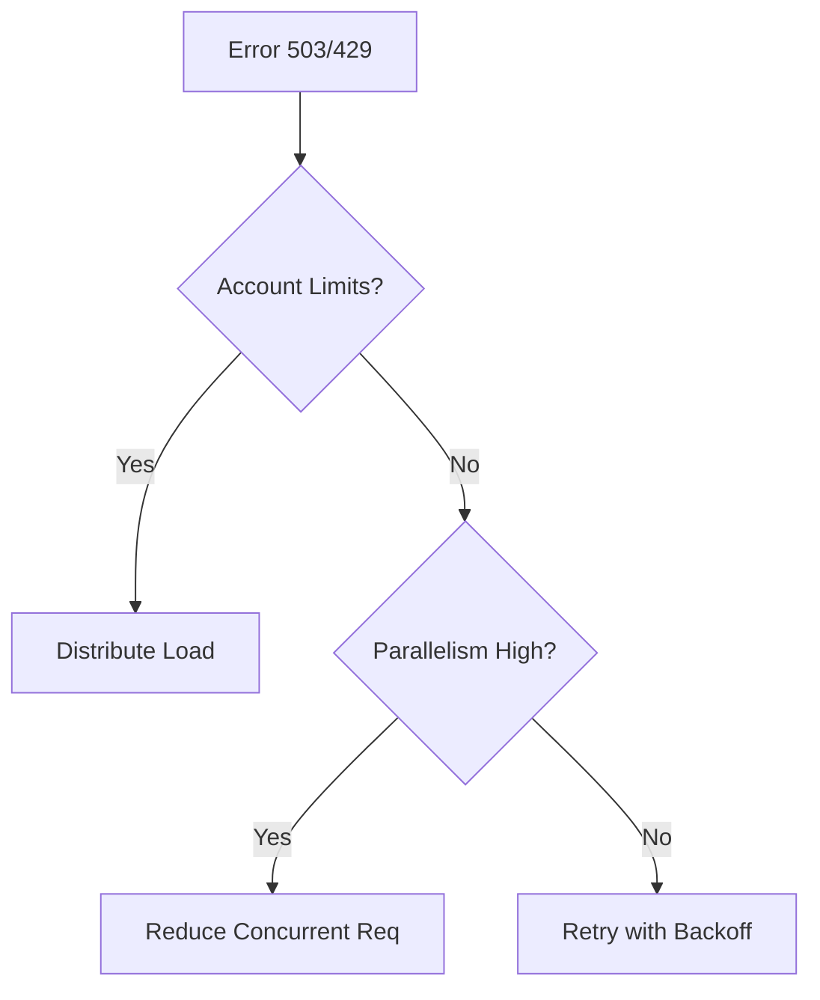

# Throttling and Performance Issues

Address HTTP 503 and 429 errors caused by storage limits.

| Throttling Indicator | Metric | Resolution |
|----------------------|--------|------------|
| HTTP 503 Server Busy | ServerLatency | Retry with backoff. |
| HTTP 429 Too Many Req| SuccessPercentage | Distribute traffic. |
| Latency Spikes | E2E Latency | Check parallelism. |
| Retry Patterns | Transaction count | Scale-out storage accounts. |

!!! note
    Azure Storage is designed to handle high load, but extreme spikes may trigger defensive throttling.

## Throttling Triage Checklist

- Correlate 429 and 503 with transaction spikes.
- Implement exponential backoff with jitter.
- Spread requests across partitions and accounts.
- Reduce burst concurrency during peak windows.
- Separate latency-sensitive and batch workloads.
- Track server latency vs end-to-end latency.

## See Also

- [Performance Best Practices](../best-practices/performance-best-practices.md)
- [Performance Terms](../reference/performance-terms.md)
- [Monitoring and Alerting](../operations/monitoring-and-alerting.md)

## Sources
- [Scalability and performance targets](https://learn.microsoft.com/en-us/azure/storage/common/storage-scalability-targets)
- [Storage throttling overview](https://learn.microsoft.com/en-us/azure/storage/common/storage-throttling-errors)
