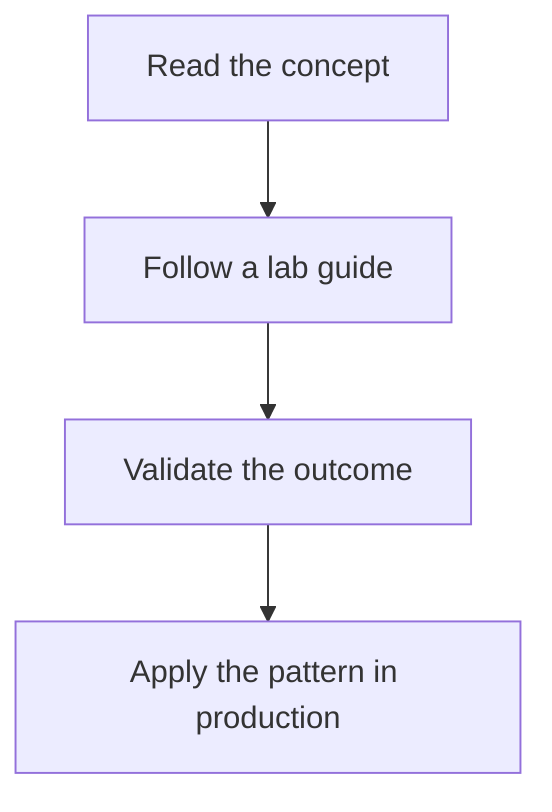

---
content_sources:
  diagrams:
    - id: tutorials-index
      type: flowchart
      source: mslearn-adapted
      mslearn_url: https://learn.microsoft.com/en-us/azure/storage/
---

# Tutorials

This section contains hands-on storage exercises designed to reinforce the best-practices and operations guidance in this repository.

<!-- diagram-id: tutorials-index -->

## Available Tutorial Collections

| Collection | Description |
|---|---|
| [Lab Guides](lab-guides/index.md) | End-to-end guided exercises for lifecycle, networking, Azure Files, replication, and CDN scenarios |

## See Also

- [Start Here](../start-here/index.md)
- [Best Practices](../best-practices/index.md)
- [Operations](../operations/index.md)

## Sources

- [azure/storage/](https://learn.microsoft.com/en-us/azure/storage/)
