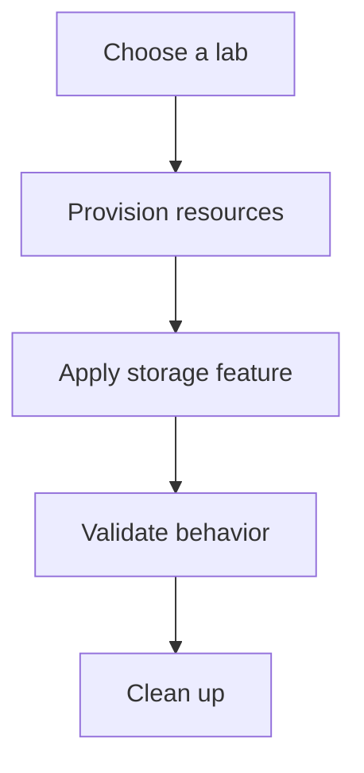

---
hide:
  - toc
---

# Lab Guides

Use these hands-on labs to practice storage configuration patterns in an isolated resource group before applying them to production workloads.

## Available Labs

| Lab | Focus area |
|---|---|
| [Lab 01: Blob Lifecycle Management](lab-01-blob-lifecycle-management.md) | Blob retention, tier movement, and policy validation |
| [Lab 02: Private Endpoint for Storage](lab-02-private-endpoint-storage.md) | Private networking, DNS, and access validation |
| [Lab 03: Azure File Share AD Integration](lab-03-azure-file-share-ad-integration.md) | Azure Files identity-based access planning |
| [Lab 04: Storage Replication and Failover](lab-04-storage-replication-failover.md) | Geo-redundancy and failover readiness |
| [Lab 05: Static Website with CDN](lab-05-static-website-cdn.md) | Blob static website hosting and CDN fronting |

## See Also

- [Tutorials Home](../index.md)
- [Best Practices](../../best-practices/index.md)
- [Operations](../../operations/index.md)

## Sources

- [azure/storage/](https://learn.microsoft.com/en-us/azure/storage/)
