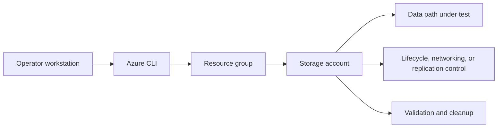

---
hide:
  - toc
---

# Lab 01: Blob Lifecycle Management

Build a StorageV2 account, upload sample blobs into lifecycle-targeted prefixes, apply a management policy, and validate tier movement expectations.

## Prerequisites

- Azure subscription with permission to create storage, networking, and monitoring resources.
- Azure CLI logged in with the correct tenant and subscription.
- Variables defined for `$RG`, `$LOCATION`, `$STORAGE_NAME`, and any lab-specific names.
- A workstation or Cloud Shell session with access to the resource group.
- Optional Log Analytics workspace if you want to capture diagnostics during the lab.

## Architecture Diagram



## Step-by-Step Instructions

### Step 1: Create the resource group and storage account

```bash
az group create \
    --name $RG \
    --location $LOCATION \
    --output json

az storage account create \
    --resource-group $RG \
    --name $STORAGE_NAME \
    --location $LOCATION \
    --sku Standard_LRS \
    --kind StorageV2 \
    --access-tier Hot \
    --allow-blob-public-access false \
    --output json
```

- Record the output and any IDs you will reuse in later steps.
- If the command creates security-sensitive settings, confirm they match policy before moving on.
- Capture screenshots or JSON output for your lab notes if you are building internal training material.
### Step 2: Create the container and upload sample data

```bash
az storage container create \
    --account-name $STORAGE_NAME \
    --name $CONTAINER_NAME \
    --auth-mode login \
    --output json

az storage blob upload-batch \
    --account-name $STORAGE_NAME \
    --destination $CONTAINER_NAME \
    --source ./lab-data/lifecycle \
    --pattern "*.json" \
    --output table
```

- Record the output and any IDs you will reuse in later steps.
- If the command creates security-sensitive settings, confirm they match policy before moving on.
- Capture screenshots or JSON output for your lab notes if you are building internal training material.
### Step 3: Apply a lifecycle policy

```bash
az storage account management-policy create \
    --resource-group $RG \
    --account-name $STORAGE_NAME \
    --policy @lifecycle-policy.json \
    --output json
```

- Record the output and any IDs you will reuse in later steps.
- If the command creates security-sensitive settings, confirm they match policy before moving on.
- Capture screenshots or JSON output for your lab notes if you are building internal training material.
### Step 4: Inspect sample blobs

```bash
az storage blob show \
    --account-name $STORAGE_NAME \
    --container-name $CONTAINER_NAME \
    --name logs/example-001.json \
    --auth-mode login \
    --output json
```

- Record the output and any IDs you will reuse in later steps.
- If the command creates security-sensitive settings, confirm they match policy before moving on.
- Capture screenshots or JSON output for your lab notes if you are building internal training material.

## Validation Steps

1. Confirm the storage account properties match the intended SKU, kind, and access posture.
2. Validate the lab-specific feature from the consumer point of view rather than trusting only control-plane success.
3. Capture one or more JSON outputs that prove the configuration is active.
4. Record any timing behavior that matters, especially for lifecycle or replication scenarios.
5. Note the operational follow-up required before using the same pattern in production.

### Example validation commands

```bash
az storage account show \
    --resource-group $RG \
    --name $STORAGE_NAME \
    --output json
```

```bash
az monitor diagnostic-settings list \
    --resource $(az storage account show --resource-group $RG --name $STORAGE_NAME --query id --output tsv) \
    --output json
```

## Cleanup Instructions

- Delete lab resources when validation is complete to prevent ongoing cost.
- Preserve any JSON output or screenshots you need before deletion.
- If you created role assignments or network links used elsewhere, confirm scope before removing them.

```bash
az group delete \
    --name $RG \
    --yes \
    --no-wait
```

## See Also

- [Lifecycle Management Best Practices](../../best-practices/lifecycle-management-best-practices.md)
- [Manage Lifecycle Policies](../../operations/manage-lifecycle-policies.md)
- [Lifecycle Policy Not Working](../../troubleshooting/playbooks/lifecycle-policy-not-working.md)

## Sources

- [azure/storage/blobs/lifecycle-management-overview](https://learn.microsoft.com/en-us/azure/storage/blobs/lifecycle-management-overview)
- [azure/storage/blobs/storage-lifecycle-management-concepts](https://learn.microsoft.com/en-us/azure/storage/blobs/storage-lifecycle-management-concepts)
