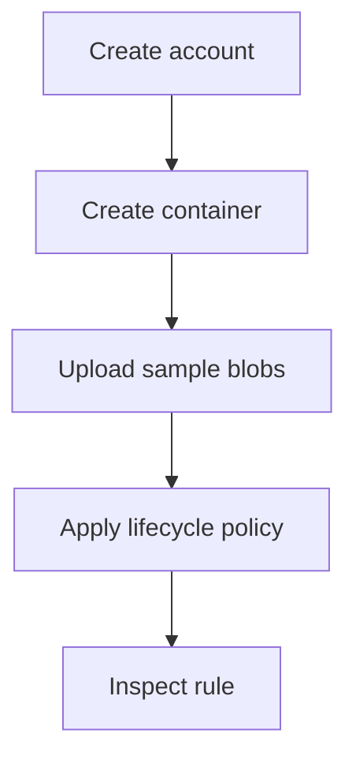

---
content_sources:
  diagrams:
    - id: tutorials-lab-guides-lab-01-blob-lifecycle-management
      type: flowchart
      source: mslearn-adapted
      mslearn_url: https://learn.microsoft.com/en-us/azure/storage/blobs/lifecycle-management-overview
validation:
  az_cli:
    last_tested: null
    cli_version: null
    result: not_tested
  bicep:
    last_tested: null
    result: not_tested
---

# Lab 01: Blob Lifecycle Management

Build a StorageV2 account, upload sample blobs under lifecycle-targeted prefixes, apply a management policy, and inspect the configured rule.

## Lab Metadata

| Field | Value |
|---|---|
| Difficulty | Beginner |
| Duration | 45-60 minutes |
| Services | Blob Storage, Lifecycle Management |
| Validation status | Not tested in a live subscription |

## Prerequisites

- Azure CLI authenticated to the intended tenant and subscription.
- Variables from this lab are set before running commands.
- The resource group is dedicated to the lab so cleanup is safe.
- The lab validation status is intentionally `not_tested` until the full sequence is executed in Azure.

## What You Will Build

<!-- diagram-id: tutorials-lab-guides-lab-01-blob-lifecycle-management -->

```mermaid
flowchart TD
    A[Create account]
    B[Create container]
    A --> B
    C[Upload sample blobs]
    B --> C
    D[Apply lifecycle policy]
    C --> D
    E[Inspect rule]
    D --> E
```

## Steps

### Step 1: Create the account

| Command | Purpose |
|---|---|
| `az group create` | Creates the lab resource group. |
| `az storage account create` | Creates a secure StorageV2 account for lifecycle testing. |

```bash
az group create \
    --name $RG \
    --location $LOCATION \
    --output json

az storage account create \
    --resource-group $RG \
    --name $STORAGE_NAME \
    --location $LOCATION \
    --sku Standard_LRS \
    --kind StorageV2 \
    --access-tier Hot \
    --allow-blob-public-access false \
    --output json
```

### Step 2: Upload lifecycle sample data

| Command | Purpose |
|---|---|
| `az storage container create` | Creates the target container. |
| `az storage blob upload-batch` | Uploads local sample objects used by the policy rule. |

```bash
az storage container create \
    --account-name $STORAGE_NAME \
    --name $CONTAINER_NAME \
    --auth-mode login \
    --output json

az storage blob upload-batch \
    --account-name $STORAGE_NAME \
    --destination $CONTAINER_NAME \
    --source ./lab-data/lifecycle \
    --pattern "*.json" \
    --auth-mode login \
    --output table
```

### Step 3: Apply the lifecycle policy

| Command | Purpose |
|---|---|
| `az storage account management-policy create` | Applies the policy file supplied with this lab. |
| `az storage account management-policy show` | Displays the active policy for inspection. |

```bash
az storage account management-policy create \
    --resource-group $RG \
    --account-name $STORAGE_NAME \
    --policy @lifecycle-policy.json \
    --output json

az storage account management-policy show \
    --resource-group $RG \
    --account-name $STORAGE_NAME \
    --output json
```

## Verification

| Command | Purpose |
|---|---|
| `verification command` | Collects evidence that the lab configuration exists and matches the expected state. |

```bash
az storage blob show \
    --account-name $STORAGE_NAME \
    --container-name $CONTAINER_NAME \
    --name logs/example-001.json \
    --auth-mode login \
    --output json
```

## Next Steps / Clean Up

- Preserve command output needed for your lab notes.
- Do not execute destructive failover or delete commands in shared subscriptions without approval.
- Delete the resource group when the lab is complete if it contains only lab resources.

| Command | Purpose |
|---|---|
| `az group delete` | Deletes lab resources after you confirm the resource group is dedicated to this lab. |

```bash
az group delete \
    --name $RG \
    --yes
```

## See Also

- [Lifecycle Management Best Practices](../../best-practices/lifecycle-management-best-practices.md)
- [Manage Lifecycle Policies](../../operations/manage-lifecycle-policies.md)

## Sources

- [Microsoft Learn source](https://learn.microsoft.com/en-us/azure/storage/blobs/lifecycle-management-overview)
