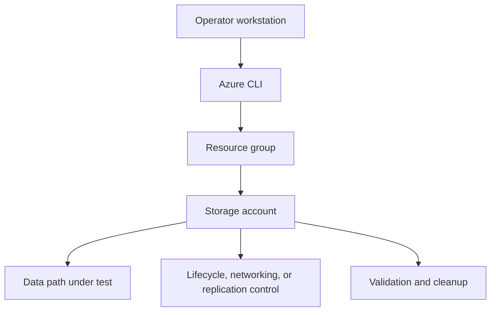

---
content_sources:
  diagrams:
    - id: tutorials-lab-guides-lab-02-private-endpoint-storage
      type: flowchart
      source: mslearn-adapted
      mslearn_url: https://learn.microsoft.com/en-us/azure/storage/common/storage-private-endpoints
---

# Lab 02: Private Endpoint for Storage

Deploy a storage account with a Private Endpoint and Private DNS Zone, then validate that traffic resolves and reaches the service privately.

## Prerequisites

- Azure subscription with permission to create storage, networking, and monitoring resources.
- Azure CLI logged in with the correct tenant and subscription.
- Variables defined for `$RG`, `$LOCATION`, `$STORAGE_NAME`, and any lab-specific names.
- A workstation or Cloud Shell session with access to the resource group.
- Optional Log Analytics workspace if you want to capture diagnostics during the lab.

## Architecture Diagram

<!-- diagram-id: tutorials-lab-guides-lab-02-private-endpoint-storage -->


## Step-by-Step Instructions

### Step 1: Create the storage account and virtual network

```bash
az storage account create \
    --resource-group $RG \
    --name $STORAGE_NAME \
    --location $LOCATION \
    --sku Standard_ZRS \
    --kind StorageV2 \
    --public-network-access Disabled \
    --output json

az network vnet create \
    --resource-group $RG \
    --name $VNET_NAME \
    --address-prefixes 10.40.0.0/16 \
    --subnet-name $SUBNET_NAME \
    --subnet-prefixes 10.40.1.0/24 \
    --output json
```

- Record the output and any IDs you will reuse in later steps.
- If the command creates security-sensitive settings, confirm they match policy before moving on.
- Capture screenshots or JSON output for your lab notes if you are building internal training material.
### Step 2: Create the Private DNS Zone and link the VNet

```bash
az network private-dns zone create \
    --resource-group $RG \
    --name privatelink.blob.core.windows.net \
    --output json

az network private-dns link vnet create \
    --resource-group $RG \
    --zone-name privatelink.blob.core.windows.net \
    --name storage-link \
    --virtual-network $(az network vnet show --resource-group $RG --name $VNET_NAME --query id --output tsv) \
    --registration-enabled false \
    --output json
```

- Record the output and any IDs you will reuse in later steps.
- If the command creates security-sensitive settings, confirm they match policy before moving on.
- Capture screenshots or JSON output for your lab notes if you are building internal training material.
### Step 3: Create the Private Endpoint

```bash
az network private-endpoint create \
    --resource-group $RG \
    --name $PRIVATE_ENDPOINT_NAME \
    --vnet-name $VNET_NAME \
    --subnet $SUBNET_NAME \
    --private-connection-resource-id $(az storage account show --resource-group $RG --name $STORAGE_NAME --query id --output tsv) \
    --group-id blob \
    --connection-name storage-blob-connection \
    --output json
```

- Record the output and any IDs you will reuse in later steps.
- If the command creates security-sensitive settings, confirm they match policy before moving on.
- Capture screenshots or JSON output for your lab notes if you are building internal training material.
### Step 4: Create the DNS zone group

```bash
az network private-endpoint dns-zone-group create \
    --resource-group $RG \
    --endpoint-name $PRIVATE_ENDPOINT_NAME \
    --name default \
    --private-dns-zone privatelink.blob.core.windows.net \
    --zone-name privatelink.blob.core.windows.net \
    --output json
```

- Record the output and any IDs you will reuse in later steps.
- If the command creates security-sensitive settings, confirm they match policy before moving on.
- Capture screenshots or JSON output for your lab notes if you are building internal training material.

## Validation Steps

1. Confirm the storage account properties match the intended SKU, kind, and access posture.
2. Validate the lab-specific feature from the consumer point of view rather than trusting only control-plane success.
3. Capture one or more JSON outputs that prove the configuration is active.
4. Record any timing behavior that matters, especially for lifecycle or replication scenarios.
5. Note the operational follow-up required before using the same pattern in production.

### Example validation commands

```bash
az storage account show \
    --resource-group $RG \
    --name $STORAGE_NAME \
    --output json
```

```bash
az monitor diagnostic-settings list \
    --resource $(az storage account show --resource-group $RG --name $STORAGE_NAME --query id --output tsv) \
    --output json
```

## Cleanup Instructions

- Delete lab resources when validation is complete to prevent ongoing cost.
- Preserve any JSON output or screenshots you need before deletion.
- If you created role assignments or network links used elsewhere, confirm scope before removing them.

```bash
az group delete \
    --name $RG \
    --yes \
    --no-wait
```

## See Also

- [Networking Best Practices](../../best-practices/networking-best-practices.md)
- [Use Private Endpoints](../../operations/use-private-endpoints.md)
- [Blob Access Denied](../../troubleshooting/playbooks/blob-access-denied.md)

## Sources

- [azure/storage/common/storage-private-endpoints](https://learn.microsoft.com/en-us/azure/storage/common/storage-private-endpoints)
- [azure/storage/common/storage-network-security](https://learn.microsoft.com/en-us/azure/storage/common/storage-network-security)
