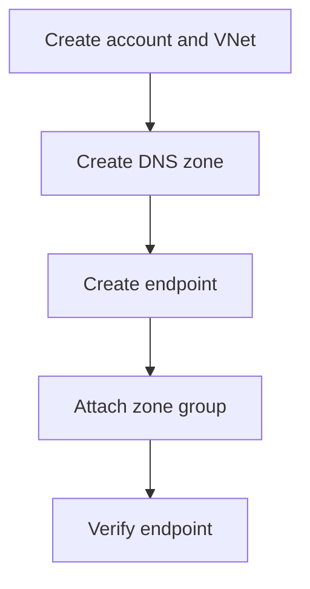

---
content_sources:
  diagrams:
    - id: tutorials-lab-guides-lab-02-private-endpoint-storage
      type: flowchart
      source: mslearn-adapted
      mslearn_url: https://learn.microsoft.com/en-us/azure/storage/common/storage-private-endpoints
validation:
  az_cli:
    last_tested: null
    cli_version: null
    result: not_tested
  bicep:
    last_tested: null
    result: not_tested
---

# Lab 02: Private Endpoint for Storage

Deploy a storage account with a Blob private endpoint and private DNS zone, then verify that the endpoint is approved.

## Lab Metadata

| Field | Value |
|---|---|
| Difficulty | Intermediate |
| Duration | 60-75 minutes |
| Services | Storage Account, Private Link, Private DNS |
| Validation status | Not tested in a live subscription |

## Prerequisites

- Azure CLI authenticated to the intended tenant and subscription.
- Variables from this lab are set before running commands.
- The resource group is dedicated to the lab so cleanup is safe.
- The lab validation status is intentionally `not_tested` until the full sequence is executed in Azure.

## What You Will Build

<!-- diagram-id: tutorials-lab-guides-lab-02-private-endpoint-storage -->

```mermaid
flowchart TD
    A[Create account and VNet]
    B[Create DNS zone]
    A --> B
    C[Create endpoint]
    B --> C
    D[Attach zone group]
    C --> D
    E[Verify endpoint]
    D --> E
```

## Steps

### Step 1: Create the storage account and virtual network

| Command | Purpose |
|---|---|
| `az storage account create` | Creates the storage account with public network access disabled. |
| `az network vnet create` | Creates an isolated VNet and subnet for the private endpoint. |

```bash
az storage account create \
    --resource-group $RG \
    --name $STORAGE_NAME \
    --location $LOCATION \
    --sku Standard_ZRS \
    --kind StorageV2 \
    --public-network-access Disabled \
    --output json

az network vnet create \
    --resource-group $RG \
    --name $VNET_NAME \
    --address-prefixes 10.40.0.0/16 \
    --subnet-name $SUBNET_NAME \
    --subnet-prefixes 10.40.1.0/24 \
    --output json
```

### Step 2: Create the private DNS zone

| Command | Purpose |
|---|---|
| `az network private-dns zone create` | Creates the Blob private DNS zone. |
| `az network private-dns link vnet create` | Links the zone to the client VNet. |

```bash
az network private-dns zone create \
    --resource-group $RG \
    --name privatelink.blob.core.windows.net \
    --output json

az network private-dns link vnet create \
    --resource-group $RG \
    --zone-name privatelink.blob.core.windows.net \
    --name storage-link \
    --virtual-network $(az network vnet show --resource-group $RG --name $VNET_NAME --query id --output tsv) \
    --registration-enabled false \
    --output json
```

### Step 3: Create the private endpoint and DNS zone group

| Command | Purpose |
|---|---|
| `az network private-endpoint create` | Creates the Blob private endpoint connection. |
| `az network private-endpoint dns-zone-group create` | Attaches private DNS registration to the endpoint. |

```bash
az network private-endpoint create \
    --resource-group $RG \
    --name $PRIVATE_ENDPOINT_NAME \
    --vnet-name $VNET_NAME \
    --subnet $SUBNET_NAME \
    --private-connection-resource-id $(az storage account show --resource-group $RG --name $STORAGE_NAME --query id --output tsv) \
    --group-id blob \
    --connection-name storage-blob-connection \
    --output json

az network private-endpoint dns-zone-group create \
    --resource-group $RG \
    --endpoint-name $PRIVATE_ENDPOINT_NAME \
    --name default \
    --private-dns-zone privatelink.blob.core.windows.net \
    --zone-name privatelink.blob.core.windows.net \
    --output json
```

## Verification

| Command | Purpose |
|---|---|
| `verification command` | Collects evidence that the lab configuration exists and matches the expected state. |

```bash
az network private-endpoint show \
    --resource-group $RG \
    --name $PRIVATE_ENDPOINT_NAME \
    --query "{state:provisioningState,connections:privateLinkServiceConnections[].privateLinkServiceConnectionState.status}" \
    --output json
```

## Next Steps / Clean Up

- Preserve command output needed for your lab notes.
- Do not execute destructive failover or delete commands in shared subscriptions without approval.
- Delete the resource group when the lab is complete if it contains only lab resources.

| Command | Purpose |
|---|---|
| `az group delete` | Deletes lab resources after you confirm the resource group is dedicated to this lab. |

```bash
az group delete \
    --name $RG \
    --yes
```

## See Also

- [Use Private Endpoints](../../operations/use-private-endpoints.md)
- [Networking Best Practices](../../best-practices/networking-best-practices.md)

## Sources

- [Microsoft Learn source](https://learn.microsoft.com/en-us/azure/storage/common/storage-private-endpoints)
