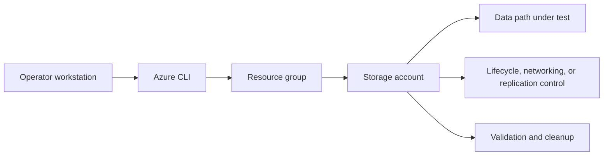

---
hide:
  - toc
---

# Lab 03: Azure File Share AD Integration

Create an Azure Files share and configure identity-based access planning steps for SMB using Active Directory integration placeholders.

## Prerequisites

- Azure subscription with permission to create storage, networking, and monitoring resources.
- Azure CLI logged in with the correct tenant and subscription.
- Variables defined for `$RG`, `$LOCATION`, `$STORAGE_NAME`, and any lab-specific names.
- A workstation or Cloud Shell session with access to the resource group.
- Optional Log Analytics workspace if you want to capture diagnostics during the lab.

## Architecture Diagram



## Step-by-Step Instructions

### Step 1: Create a Premium FileStorage account and share

```bash
az storage account create \
    --resource-group $RG \
    --name $STORAGE_NAME \
    --location $LOCATION \
    --sku Premium_LRS \
    --kind FileStorage \
    --allow-blob-public-access false \
    --output json

az storage share-rm create \
    --resource-group $RG \
    --storage-account $STORAGE_NAME \
    --name $SHARE_NAME \
    --quota 1024 \
    --enabled-protocols SMB \
    --output json
```

- Record the output and any IDs you will reuse in later steps.
- If the command creates security-sensitive settings, confirm they match policy before moving on.
- Capture screenshots or JSON output for your lab notes if you are building internal training material.
### Step 2: Configure Azure Files identity settings with placeholder domain values

```bash
az storage account update \
    --resource-group $RG \
    --name $STORAGE_NAME \
    --enable-files-aadds true \
    --domain-name contoso.com \
    --net-bios-domain-name CONTOSO \
    --forest-name contoso.com \
    --domain-guid <domain-guid> \
    --domain-sid <domain-sid> \
    --azure-storage-sid <azure-storage-sid> \
    --sam-account-name $STORAGE_NAME \
    --output json
```

- Record the output and any IDs you will reuse in later steps.
- If the command creates security-sensitive settings, confirm they match policy before moving on.
- Capture screenshots or JSON output for your lab notes if you are building internal training material.
### Step 3: Assign share-level RBAC

```bash
az role assignment create \
    --assignee-object-id $PRINCIPAL_ID \
    --assignee-principal-type User \
    --role "Storage File Data SMB Share Contributor" \
    --scope $(az storage share-rm show --resource-group $RG --storage-account $STORAGE_NAME --name $SHARE_NAME --query id --output tsv) \
    --output json
```

- Record the output and any IDs you will reuse in later steps.
- If the command creates security-sensitive settings, confirm they match policy before moving on.
- Capture screenshots or JSON output for your lab notes if you are building internal training material.
### Step 4: Inspect share properties

```bash
az storage share-rm show \
    --resource-group $RG \
    --storage-account $STORAGE_NAME \
    --name $SHARE_NAME \
    --output json
```

- Record the output and any IDs you will reuse in later steps.
- If the command creates security-sensitive settings, confirm they match policy before moving on.
- Capture screenshots or JSON output for your lab notes if you are building internal training material.

## Validation Steps

1. Confirm the storage account properties match the intended SKU, kind, and access posture.
2. Validate the lab-specific feature from the consumer point of view rather than trusting only control-plane success.
3. Capture one or more JSON outputs that prove the configuration is active.
4. Record any timing behavior that matters, especially for lifecycle or replication scenarios.
5. Note the operational follow-up required before using the same pattern in production.

### Example validation commands

```bash
az storage account show \
    --resource-group $RG \
    --name $STORAGE_NAME \
    --output json
```

```bash
az monitor diagnostic-settings list \
    --resource $(az storage account show --resource-group $RG --name $STORAGE_NAME --query id --output tsv) \
    --output json
```

## Cleanup Instructions

- Delete lab resources when validation is complete to prevent ongoing cost.
- Preserve any JSON output or screenshots you need before deletion.
- If you created role assignments or network links used elsewhere, confirm scope before removing them.

```bash
az group delete \
    --name $RG \
    --yes \
    --no-wait
```

## See Also

- [File Share Best Practices](../../best-practices/file-share-best-practices.md)
- [Manage Containers and Shares](../../operations/manage-containers-and-shares.md)
- [File Share Mount Issues](../../troubleshooting/playbooks/access/file-share-mount-issues.md)

## Sources

- [azure/storage/files/storage-files-active-directory-overview](https://learn.microsoft.com/en-us/azure/storage/files/storage-files-active-directory-overview)
- [azure/storage/files/storage-files-planning](https://learn.microsoft.com/en-us/azure/storage/files/storage-files-planning)
