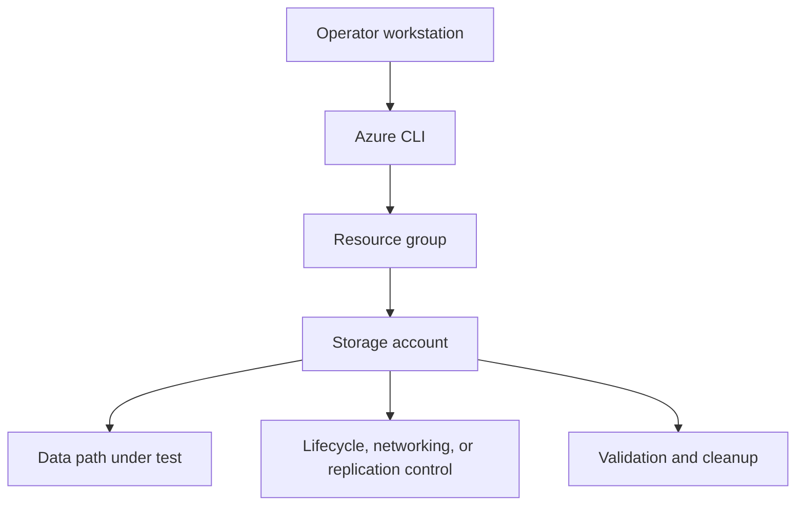

---
content_sources:
  diagrams:
    - id: tutorials-lab-guides-lab-03-azure-file-share-ad-integration
      type: flowchart
      source: mslearn-adapted
      mslearn_url: https://learn.microsoft.com/en-us/azure/storage/files/storage-files-active-directory-overview
validation:
  az_cli:
    last_tested:
    result: not_tested
  bicep:
    last_tested:
    result: not_tested
---

# Lab 03: Azure File Share AD Integration

Create an Azure Files share and configure identity-based access planning steps for SMB using Active Directory integration placeholders.

## Prerequisites

- Azure subscription with permission to create storage, networking, and monitoring resources.
- Azure CLI logged in with the correct tenant and subscription.
- Variables defined for `$RG`, `$LOCATION`, `$STORAGE_NAME`, and any lab-specific names.
- A workstation or Cloud Shell session with access to the resource group.
- Optional Log Analytics workspace if you want to capture diagnostics during the lab.

## Architecture Diagram

<!-- diagram-id: tutorials-lab-guides-lab-03-azure-file-share-ad-integration -->

```mermaid
flowchart TD
    A[Operator workstation] --> B[Azure CLI]
    B --> C[Resource group]
    C --> D[Storage account]
    D --> E[Data path under test]
    D --> F[Lifecycle, networking, or replication control]
    D --> G[Validation and cleanup]
```

## Step-by-Step Instructions

### Step 1: Create a Premium FileStorage account and share

```bash
az storage account create \
    --resource-group $RG \
    --name $STORAGE_NAME \
    --location $LOCATION \
    --sku Premium_LRS \
    --kind FileStorage \
    --allow-blob-public-access false \
    --output json

az storage share-rm create \
    --resource-group $RG \
    --storage-account $STORAGE_NAME \
    --name $SHARE_NAME \
    --quota 1024 \
    --enabled-protocols SMB \
    --output json
```

| Command | Purpose |
| --- | --- |
| `az storage account create` | Create a premium file storage account. |
| `--resource-group` | Resource group that will contain the account. |
| `--name` | Globally unique name of the storage account. |
| `--location` | Azure region for the account. |
| `--sku` | Redundancy tier, locally redundant Premium (`Premium_LRS`). |
| `--kind` | Account kind, `FileStorage` for premium SMB/NFS shares. |
| `--allow-blob-public-access` | Disable anonymous public blob access when `false`. |
| `--output` | Output format for the result. |
| `az storage share-rm create` | Create an Azure file share via the management plane. |
| `--resource-group` | Resource group that contains the storage account. |
| `--storage-account` | Name of the storage account hosting the share. |
| `--name` | Name of the file share to create. |
| `--quota` | Provisioned share size in GiB (`1024`). |
| `--enabled-protocols` | File share protocol (`SMB`). |
| `--output` | Output format for the result. |


After this step, confirm the account `kind` is `FileStorage` on the Premium SKU and record the share name — the RBAC assignment in Step 3 targets this share.

### Step 2: Configure Azure Files identity settings with placeholder domain values

```bash
az storage account update \
    --resource-group $RG \
    --name $STORAGE_NAME \
    --enable-files-aadds true \
    --domain-name contoso.com \
    --net-bios-domain-name CONTOSO \
    --forest-name contoso.com \
    --domain-guid <domain-guid> \
    --domain-sid <domain-sid> \
    --azure-storage-sid <azure-storage-sid> \
    --sam-account-name $STORAGE_NAME \
    --output json
```

| Command | Purpose |
| --- | --- |
| `az storage account update` | Enable identity-based access for Azure Files on the account. |
| `--resource-group` | Resource group that contains the account. |
| `--name` | Name of the storage account to update. |
| `--enable-files-aadds` | Enable Microsoft Entra Domain Services authentication for files. |
| `--domain-name` | Primary domain name for the directory. |
| `--net-bios-domain-name` | NetBIOS name of the domain. |
| `--forest-name` | Active Directory forest name. |
| `--domain-guid` | GUID of the domain. |
| `--domain-sid` | Security identifier of the domain. |
| `--azure-storage-sid` | Security identifier assigned to the storage account. |
| `--sam-account-name` | SAM account name registered for the account. |
| `--output` | Output format for the result. |


After this step, verify the directory-service identity settings were accepted; the placeholder domain values are intentional for this lab and are not expected to resolve.

### Step 3: Assign share-level RBAC

```bash
az role assignment create \
    --assignee-object-id $PRINCIPAL_ID \
    --assignee-principal-type User \
    --role "Storage File Data SMB Share Contributor" \
    --scope $(az storage share-rm show --resource-group $RG --storage-account $STORAGE_NAME --name $SHARE_NAME --query id --output tsv) \
    --output json
```

| Command | Purpose |
| --- | --- |
| `az role assignment create` | Assign an Azure RBAC role to a principal. |
| `--assignee-object-id` | Object ID of the user receiving the role. |
| `--assignee-principal-type` | Principal type of the assignee (`User`). |
| `--role` | RBAC role granted, `Storage File Data SMB Share Contributor` for share read/write. |
| `--scope` | Resource scope of the assignment, here the file share ID. |
| `--output` | Output format for the result. |


After this step, confirm the role assignment returns a valid `principalId` and `roleDefinitionId` scoped to the file share.

### Step 4: Inspect share properties

```bash
az storage share-rm show \
    --resource-group $RG \
    --storage-account $STORAGE_NAME \
    --name $SHARE_NAME \
    --output json
```

| Command | Purpose |
| --- | --- |
| `az storage share-rm show` | Show properties of an Azure file share via the management plane. |
| `--resource-group` | Resource group that contains the storage account. |
| `--storage-account` | Name of the storage account hosting the share. |
| `--name` | Name of the file share to inspect. |
| `--output` | Output format for the result. |


After this step, note the share quota and provisioned tier so later capacity checks have a baseline to compare against.

## Validation Steps

1. Confirm the storage account properties match the intended SKU, kind, and access posture.
2. Validate the lab-specific feature from the consumer point of view rather than trusting only control-plane success.
3. Capture one or more JSON outputs that prove the configuration is active.
4. Record any timing behavior that matters, especially for lifecycle or replication scenarios.
5. Note the operational follow-up required before using the same pattern in production.

### Example validation commands

```bash
az storage account show \
    --resource-group $RG \
    --name $STORAGE_NAME \
    --output json
```

| Command | Purpose |
| --- | --- |
| `az storage account show` | Show full properties of the storage account. |
| `--resource-group` | Resource group that contains the account. |
| `--name` | Name of the storage account to inspect. |
| `--output` | Output format for the result. |


```bash
az monitor diagnostic-settings list \
    --resource $(az storage account show --resource-group $RG --name $STORAGE_NAME --query id --output tsv) \
    --output json
```

| Command | Purpose |
| --- | --- |
| `az monitor diagnostic-settings list` | List diagnostic settings configured on a resource. |
| `--resource` | Resource ID being inspected, here the storage account. |
| `--output` | Output format for the result. |


## Cleanup Instructions

- Delete lab resources when validation is complete to prevent ongoing cost.
- Preserve any JSON output or screenshots you need before deletion.
- If you created role assignments or network links used elsewhere, confirm scope before removing them.

```bash
az group delete \
    --name $RG \
    --yes \
    --no-wait
```

| Command | Purpose |
| --- | --- |
| `az group delete` | Delete a resource group and all resources in it. |
| `--name` | Name of the resource group to delete. |
| `--yes` | Skip the interactive confirmation prompt. |
| `--no-wait` | Return immediately without waiting for deletion to finish. |


## See Also

- [File Share Best Practices](../../best-practices/file-share-best-practices.md)
- [Manage Containers and Shares](../../operations/manage-containers-and-shares.md)
- [File Share Mount Issues](../../troubleshooting/playbooks/access/file-share-mount-issues.md)

## Sources

- [azure/storage/files/storage-files-active-directory-overview](https://learn.microsoft.com/en-us/azure/storage/files/storage-files-active-directory-overview)
- [azure/storage/files/storage-files-planning](https://learn.microsoft.com/en-us/azure/storage/files/storage-files-planning)
