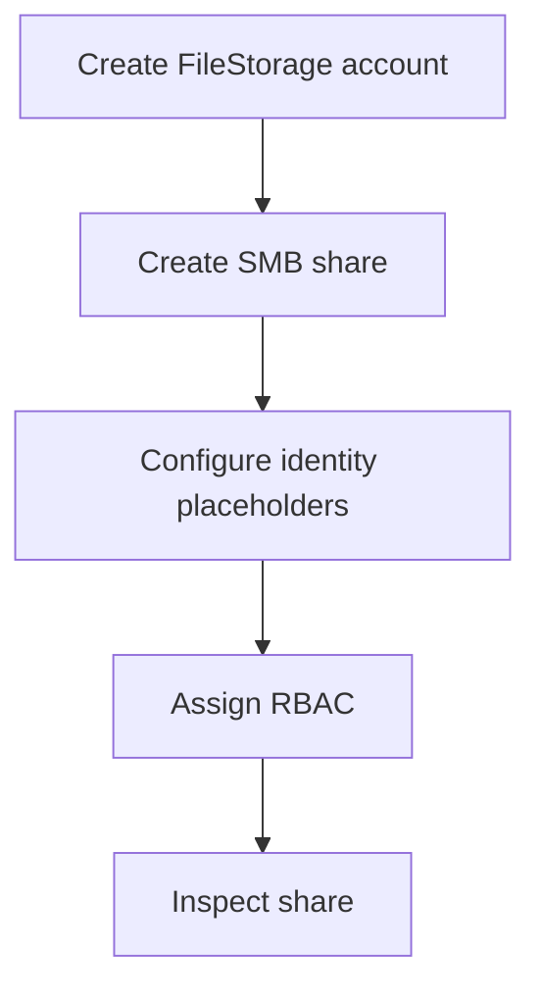

---
content_sources:
  diagrams:
    - id: tutorials-lab-guides-lab-03-azure-file-share-ad-integration
      type: flowchart
      source: mslearn-adapted
      mslearn_url: https://learn.microsoft.com/en-us/azure/storage/files/storage-files-active-directory-overview
validation:
  az_cli:
    last_tested: null
    cli_version: null
    result: not_tested
  bicep:
    last_tested: null
    result: not_tested
---

# Lab 03: Azure File Share AD Integration

Create a Premium Azure Files share and walk through the control-plane checks used before enabling identity-based SMB access.

## Lab Metadata

| Field | Value |
|---|---|
| Difficulty | Intermediate |
| Duration | 45-60 minutes |
| Services | Azure Files, RBAC, SMB |
| Validation status | Not tested in a live subscription |

## Prerequisites

- Azure CLI authenticated to the intended tenant and subscription.
- Variables from this lab are set before running commands.
- The resource group is dedicated to the lab so cleanup is safe.
- The lab validation status is intentionally `not_tested` until the full sequence is executed in Azure.

## What You Will Build

<!-- diagram-id: tutorials-lab-guides-lab-03-azure-file-share-ad-integration -->

```mermaid
flowchart TD
    A[Create FileStorage account]
    B[Create SMB share]
    A --> B
    C[Configure identity placeholders]
    B --> C
    D[Assign RBAC]
    C --> D
    E[Inspect share]
    D --> E
```

## Steps

### Step 1: Create a Premium FileStorage account and share

| Command | Purpose |
|---|---|
| `az storage account create` | Creates a Premium FileStorage account. |
| `az storage share-rm create` | Creates an SMB file share. |

```bash
az storage account create \
    --resource-group $RG \
    --name $STORAGE_NAME \
    --location $LOCATION \
    --sku Premium_LRS \
    --kind FileStorage \
    --output json

az storage share-rm create \
    --resource-group $RG \
    --storage-account $STORAGE_NAME \
    --name $SHARE_NAME \
    --quota 1024 \
    --enabled-protocols SMB \
    --output json
```

### Step 2: Document identity settings before applying them

| Command | Purpose |
|---|---|
| `az storage account update` | Shows the shape of identity configuration with placeholders that must be replaced in a real domain. |
| `az storage share-rm show` | Confirms the share exists before RBAC testing. |

```bash
az storage account update \
    --resource-group $RG \
    --name $STORAGE_NAME \
    --enable-files-aadds true \
    --domain-name contoso.com \
    --net-bios-domain-name CONTOSO \
    --forest-name contoso.com \
    --domain-guid <domain-guid> \
    --domain-sid <domain-sid> \
    --azure-storage-sid <azure-storage-sid> \
    --sam-account-name $STORAGE_NAME \
    --output json

az storage share-rm show \
    --resource-group $RG \
    --storage-account $STORAGE_NAME \
    --name $SHARE_NAME \
    --output json
```

### Step 3: Assign share-level RBAC

| Command | Purpose |
|---|---|
| `az role assignment create` | Grants SMB share data access at the share scope. |

```bash
az role assignment create \
    --assignee-object-id $PRINCIPAL_ID \
    --assignee-principal-type User \
    --role "Storage File Data SMB Share Contributor" \
    --scope $(az storage share-rm show --resource-group $RG --storage-account $STORAGE_NAME --name $SHARE_NAME --query id --output tsv) \
    --output json
```

## Verification

| Command | Purpose |
|---|---|
| `verification command` | Collects evidence that the lab configuration exists and matches the expected state. |

```bash
az role assignment list \
    --assignee $PRINCIPAL_ID \
    --scope $(az storage share-rm show --resource-group $RG --storage-account $STORAGE_NAME --name $SHARE_NAME --query id --output tsv) \
    --output table
```

## Next Steps / Clean Up

- Preserve command output needed for your lab notes.
- Do not execute destructive failover or delete commands in shared subscriptions without approval.
- Delete the resource group when the lab is complete if it contains only lab resources.

| Command | Purpose |
|---|---|
| `az group delete` | Deletes lab resources after you confirm the resource group is dedicated to this lab. |

```bash
az group delete \
    --name $RG \
    --yes
```

## See Also

- [File Share Best Practices](../../best-practices/file-share-best-practices.md)
- [Configure Access And Identity](../../operations/configure-access-and-identity.md)

## Sources

- [Microsoft Learn source](https://learn.microsoft.com/en-us/azure/storage/files/storage-files-active-directory-overview)
