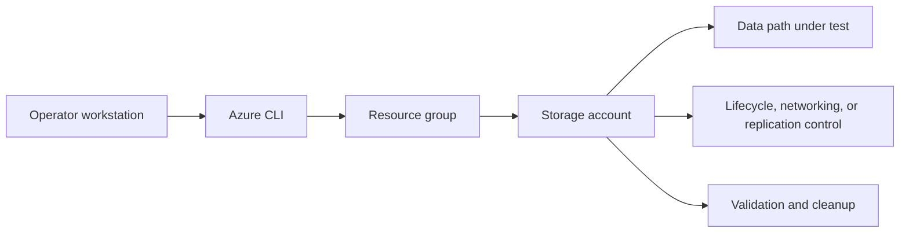

---
hide:
  - toc
---

# Lab 04: Storage Replication and Failover

Create a geo-redundant storage account, record the baseline replication configuration, and practice the operational checklist that precedes a failover decision.

## Prerequisites

- Azure subscription with permission to create storage, networking, and monitoring resources.
- Azure CLI logged in with the correct tenant and subscription.
- Variables defined for `$RG`, `$LOCATION`, `$STORAGE_NAME`, and any lab-specific names.
- A workstation or Cloud Shell session with access to the resource group.
- Optional Log Analytics workspace if you want to capture diagnostics during the lab.

## Architecture Diagram



## Step-by-Step Instructions

### Step 1: Create a geo-redundant account

```bash
az storage account create \
    --resource-group $RG \
    --name $STORAGE_NAME \
    --location $LOCATION \
    --sku Standard_GRS \
    --kind StorageV2 \
    --allow-blob-public-access false \
    --output json
```

- Record the output and any IDs you will reuse in later steps.
- If the command creates security-sensitive settings, confirm they match policy before moving on.
- Capture screenshots or JSON output for your lab notes if you are building internal training material.
### Step 2: Inspect replication status

```bash
az storage account show \
    --resource-group $RG \
    --name $STORAGE_NAME \
    --query "{sku:sku.name,primaryLocation:primaryLocation,secondaryLocation:secondaryLocation,statusOfPrimary:statusOfPrimary,statusOfSecondary:statusOfSecondary}" \
    --output json
```

- Record the output and any IDs you will reuse in later steps.
- If the command creates security-sensitive settings, confirm they match policy before moving on.
- Capture screenshots or JSON output for your lab notes if you are building internal training material.
### Step 3: Upload sample content and validate the primary path

```bash
az storage container create \
    --account-name $STORAGE_NAME \
    --name $CONTAINER_NAME \
    --auth-mode login \
    --output json

az storage blob upload \
    --account-name $STORAGE_NAME \
    --container-name $CONTAINER_NAME \
    --name dr-test.txt \
    --file ./lab-data/dr/dr-test.txt \
    --auth-mode login \
    --output json
```

- Record the output and any IDs you will reuse in later steps.
- If the command creates security-sensitive settings, confirm they match policy before moving on.
- Capture screenshots or JSON output for your lab notes if you are building internal training material.
### Step 4: Review the failover command without executing it until approved

```bash
az storage account failover \
    --resource-group $RG \
    --name $STORAGE_NAME
```

- Record the output and any IDs you will reuse in later steps.
- If the command creates security-sensitive settings, confirm they match policy before moving on.
- Capture screenshots or JSON output for your lab notes if you are building internal training material.

## Validation Steps

1. Confirm the storage account properties match the intended SKU, kind, and access posture.
2. Validate the lab-specific feature from the consumer point of view rather than trusting only control-plane success.
3. Capture one or more JSON outputs that prove the configuration is active.
4. Record any timing behavior that matters, especially for lifecycle or replication scenarios.
5. Note the operational follow-up required before using the same pattern in production.

### Example validation commands

```bash
az storage account show \
    --resource-group $RG \
    --name $STORAGE_NAME \
    --output json
```

```bash
az monitor diagnostic-settings list \
    --resource $(az storage account show --resource-group $RG --name $STORAGE_NAME --query id --output tsv) \
    --output json
```

## Cleanup Instructions

- Delete lab resources when validation is complete to prevent ongoing cost.
- Preserve any JSON output or screenshots you need before deletion.
- If you created role assignments or network links used elsewhere, confirm scope before removing them.

```bash
az group delete \
    --name $RG \
    --yes \
    --no-wait
```

## See Also

- [Redundancy and DR Best Practices](../../best-practices/redundancy-and-dr-best-practices.md)
- [Backup and Data Protection](../../operations/backup-and-data-protection.md)
- [Replication Lag Issues](../../troubleshooting/playbooks/replication-lag-issues.md)

## Sources

- [azure/storage/common/storage-redundancy](https://learn.microsoft.com/en-us/azure/storage/common/storage-redundancy)
- [azure/storage/common/storage-disaster-recovery-guidance](https://learn.microsoft.com/en-us/azure/storage/common/storage-disaster-recovery-guidance)
