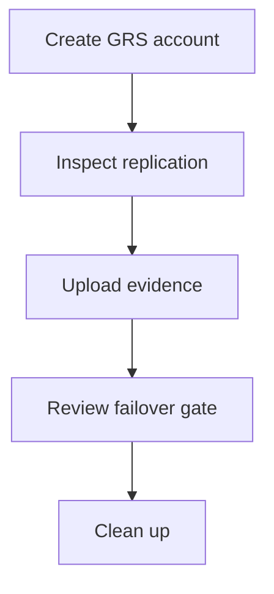

---
content_sources:
  diagrams:
    - id: tutorials-lab-guides-lab-04-storage-replication-failover
      type: flowchart
      source: mslearn-adapted
      mslearn_url: https://learn.microsoft.com/en-us/azure/storage/common/storage-redundancy
validation:
  az_cli:
    last_tested: null
    cli_version: null
    result: not_tested
  bicep:
    last_tested: null
    result: not_tested
---

# Lab 04: Storage Replication and Failover

Create a geo-redundant storage account, inspect replication status, upload a sample object, and review the failover command without executing it by default.

## Lab Metadata

| Field | Value |
|---|---|
| Difficulty | Intermediate |
| Duration | 45-60 minutes |
| Services | Storage redundancy, Blob Storage |
| Validation status | Not tested in a live subscription |

## Prerequisites

- Azure CLI authenticated to the intended tenant and subscription.
- Variables from this lab are set before running commands.
- The resource group is dedicated to the lab so cleanup is safe.
- The lab validation status is intentionally `not_tested` until the full sequence is executed in Azure.

## What You Will Build

<!-- diagram-id: tutorials-lab-guides-lab-04-storage-replication-failover -->

```mermaid
flowchart TD
    A[Create GRS account]
    B[Inspect replication]
    A --> B
    C[Upload evidence]
    B --> C
    D[Review failover gate]
    C --> D
    E[Clean up]
    D --> E
```

## Steps

### Step 1: Create a geo-redundant account

| Command | Purpose |
|---|---|
| `az storage account create` | Creates a GRS StorageV2 account for replication inspection. |

```bash
az storage account create \
    --resource-group $RG \
    --name $STORAGE_NAME \
    --location $LOCATION \
    --sku Standard_GRS \
    --kind StorageV2 \
    --allow-blob-public-access false \
    --output json
```

### Step 2: Upload sample content

| Command | Purpose |
|---|---|
| `az storage container create` | Creates the test container. |
| `az storage blob upload` | Uploads a sample object used as failover evidence. |

```bash
az storage container create \
    --account-name $STORAGE_NAME \
    --name $CONTAINER_NAME \
    --auth-mode login \
    --output json

az storage blob upload \
    --account-name $STORAGE_NAME \
    --container-name $CONTAINER_NAME \
    --name dr-test.txt \
    --file ./lab-data/dr/dr-test.txt \
    --auth-mode login \
    --output json
```

### Step 3: Review failover state and command gate

| Command | Purpose |
|---|---|
| `az storage account show` | Shows geo-replication fields before any failover decision. |
| `az storage account failover` | Initiates account failover only after explicit approval. |

```bash
az storage account show \
    --resource-group $RG \
    --name $STORAGE_NAME \
    --query "{sku:sku.name,primaryLocation:primaryLocation,secondaryLocation:secondaryLocation,lastSync:geoReplicationStats.lastSyncTime,status:geoReplicationStats.status}" \
    --output json

az storage account failover \
    --resource-group $RG \
    --name $STORAGE_NAME
```

## Verification

| Command | Purpose |
|---|---|
| `verification command` | Collects evidence that the lab configuration exists and matches the expected state. |

```bash
az storage account show \
    --resource-group $RG \
    --name $STORAGE_NAME \
    --query "{statusOfPrimary:statusOfPrimary,statusOfSecondary:statusOfSecondary,geo:geoReplicationStats}" \
    --output json
```

## Next Steps / Clean Up

- Preserve command output needed for your lab notes.
- Do not execute destructive failover or delete commands in shared subscriptions without approval.
- Delete the resource group when the lab is complete if it contains only lab resources.

| Command | Purpose |
|---|---|
| `az group delete` | Deletes lab resources after you confirm the resource group is dedicated to this lab. |

```bash
az group delete \
    --name $RG \
    --yes
```

## See Also

- [Redundancy And Durability](../../platform/redundancy-and-durability.md)
- [Redundancy And Dr Best Practices](../../best-practices/redundancy-and-dr-best-practices.md)

## Sources

- [Microsoft Learn source](https://learn.microsoft.com/en-us/azure/storage/common/storage-redundancy)
